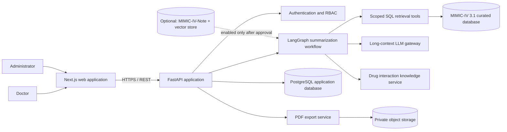
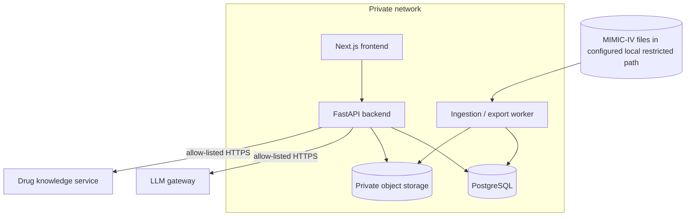
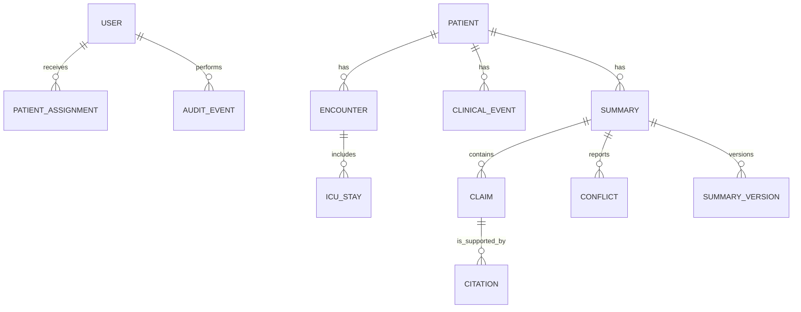
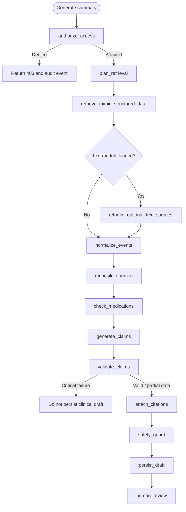
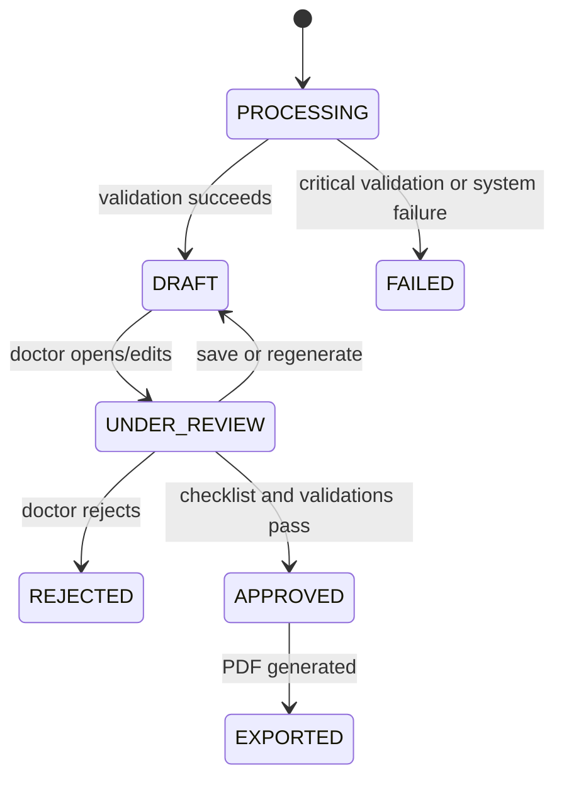

# Architecture — Clinical Record Summarization Agent

**Document version:** 1.0

**Status:** Proposed MVP architecture
**Source of truth:** `Gate 1/PRD.md`, `Gate 1/brief.md`, and `Gate 1/Wireframe_UI FLow.md`

## 1. Purpose and scope

The product helps an authorized doctor review a de-identified patient's longitudinal MIMIC-IV 3.1 record. It retrieves structured evidence, produces a structured clinical **draft**, and lets the doctor inspect citations, edit, resolve conflicts, and approve the result.

The MVP uses MIMIC-IV 3.1 `hosp` and `icu` structured tables. It does **not** ingest MIMIC-IV-Note or MIMIC-IV-ED, infer missing data, create diagnoses or treatment plans, or write to an external EHR. Every clinical claim must be traceable to source evidence before it is shown.

## 2. Architecture principles

| Principle | Architectural consequence |
|---|---|
| Evidence first | Retrieve and normalize source rows before generating claims. |
| Claim-level citations | Persist a citation-to-source-row relationship for every clinical claim. |
| Human authority | Agent output is always `DRAFT`; only an assigned doctor can approve it. |
| Least privilege | Enforce RBAC and patient assignment in the backend and data-access layer. |
| Visible uncertainty | Missing, unavailable, or conflicting evidence is represented explicitly, never filled in by the LLM. |
| Reproducibility | Store dataset version, input checksum, pipeline version, trace ID, and source lineage. |
| Restricted-data safety | Raw MIMIC files, restricted excerpts, credentials, and access paths never enter Git, public logs, or unapproved LLM prompts. |

## 3. System context

### Trust boundaries

- The browser is an untrusted client. Authorization is decided only by the backend.
- The MIMIC data environment is restricted. The agent receives only the minimum, authorized structured evidence needed for its task.
- The LLM is an external dependency. Prompts contain no credentials, no unrestricted records, and only approved, de-identified evidence.
- Object storage is private and used for approved PDF exports and permitted artifacts; it is not a repository for raw MIMIC archives.

## 4. Logical components

| Component | Responsibility | MVP status |
|---|---|---|
| Next.js frontend | Login, assigned-patient dashboard, workspace, source panel, review workflow, admin pages. | To implement |
| FastAPI API | REST API, request validation, backend authorization, orchestration entry points, status and error responses. | Skeleton exists |
| Identity and access | Session/token validation, `DOCTOR` / `ADMIN` roles, patient-assignment checks, lockout and audit events. | To implement |
| Ingestion pipeline | Validate `csv.gz` files, checksums, schemas and foreign keys; load a reproducible cohort; preserve source keys. | To implement |
| Curated clinical store | PostgreSQL tables/indexes for permitted MIMIC-derived records and normalized clinical events. | To implement |
| LangGraph agent | Build retrieval plan, fetch evidence, normalize/reconcile it, generate and validate claims, create a draft. | Skeleton exists |
| Citation validator | Blocks claims without evidence/lineage and verifies numeric value, unit and timestamp against source. | To implement |
| Drug interaction adapter | Calls a versioned specialist source after drug-name normalization; never lets the LLM infer an interaction. | To implement |
| Review and versioning | Stores AI original, doctor edits, review state, approval checklist and immutable history. | To implement |
| PDF exporter | Exports approved summaries; drafts receive a `DRAFT — NOT FOR CLINICAL USE` watermark. | To implement |
| Observability | Internal trace, latency, error, citation-validation and audit events without restricted-data leakage. | To implement |

## 5. Deployment topology

Development may use SQLite and local `./data` for the existing template. The target MVP deployment uses PostgreSQL, encrypted private storage, Docker containers, and secrets injected through a secret manager/environment variables. Production must not mount raw MIMIC data into the web container.

## 6. Data architecture

### 6.1 Ingestion and lineage

Raw MIMIC-IV files live outside the repository at a configured restricted path (for example, `MIMIC_DATA_PATH`). The ingestion job:

1. Reads only the configured selected cohort from MIMIC-IV 3.1 `hosp` and `icu` CSV.GZ files.
2. Verifies SHA-256 when checksums are supplied, validates schema and foreign-key relationships, and rejects invalid rows with a reason.
3. Preserves `subject_id`, `hadm_id`, `stay_id`, `itemid`, `emar_id`, `poe_id`, `pharmacy_id`, and relevant sequence IDs.
4. Creates normalized records without losing `source_dataset`, `source_version`, `source_module`, `source_table`, `source_row_key`, event time, and encounter linkage.
5. Records ingestion run ID, checksum, pipeline version, loaded modules, row counts, and errors.

The MVP cohort is 20–50 patients selected reproducibly by script. It should include multi-admission or ICU cases, diagnoses, repeated labs, medication evidence, and intentional missing/ambiguous cases for guardrail testing. The selected data rows themselves must not be committed.

### 6.2 Source coverage

| Product evidence | Primary MIMIC-IV 3.1 sources |
|---|---|
| Patient and encounters | `hosp.patients`, `hosp.admissions`, `hosp.transfers`, `hosp.services` |
| Diagnoses and procedures | `hosp.diagnoses_icd`, `hosp.d_icd_diagnoses`, `hosp.procedures_icd`, `hosp.d_icd_procedures`, `hosp.hcpcsevents`, `icu.procedureevents` |
| Laboratory and microbiology | `hosp.labevents`, `hosp.d_labitems`, `hosp.microbiologyevents` |
| Medication evidence | `hosp.prescriptions`, `hosp.pharmacy`, `hosp.emar`, `hosp.emar_detail`, `icu.inputevents` |
| OMR and ICU observations | `hosp.omr`, `icu.icustays`, `icu.chartevents`, `icu.datetimeevents`, `icu.d_items`, `icu.outputevents`, `icu.ingredientevents` |

`MIMIC-IV-Note` and `MIMIC-IV-ED` are explicitly `NOT_LOADED` in the MVP. Text RAG and vector search remain disabled unless the relevant data is licensed, ingested, and represented in data availability status.

### 6.3 Core application entities

| Entity | Essential fields |
|---|---|
| `Patient` | Internal ID, `subject_id`, de-identified demographics. |
| `Encounter` / `ICUStay` | Internal ID plus `hadm_id` / `stay_id`, patient key, start and end times. |
| `ClinicalEvent` | Event type/time, raw and normalized value, unit, source module/table/row key, source version, patient/encounter keys. |
| `MedicationEvent` | Drug/dose/route/time, evidence source, supported status (`ACTIVE`, `RECENT`, `HISTORICAL`, `UNKNOWN_STATUS`). |
| `Summary` | Patient, selected encounter, status, agent trace ID, dataset/pipeline version. |
| `Claim` | Section, text, confidence, validation result; never visible as clinical content without valid citations. |
| `Citation` | Claim, MIMIC dataset/version/module/table, row key, patient/encounter keys, timestamp, value/excerpt, item metadata. |
| `Conflict` | Compared sources, field/type, default `UNRESOLVED`, doctor resolution/note. |
| `SummaryVersion` | AI original, doctor-edited content, actor, reason, status, timestamps. |
| `AuditEvent` | Actor, action, patient/summary reference, timestamp, trace ID, result, request metadata. |

## 7. Agent workflow

### Agent state and controls

The workflow state contains the requesting user, authorized patient/encounter scope, data availability, retrieval plan, normalized events with lineage, conflicts, medication tool result, candidate claims, validation results, citations, limitations, trace ID, and error status. It must not expose internal reasoning or system prompts to the client.

Controls at each stage:

- `authorize_access` verifies role and assignment before retrieval.
- Retrieval tools use parameterized queries and require an authorized `subject_id`; they return only allow-listed fields.
- Normalization keeps source values; conversions, if any, retain `raw_value`, `normalized_value`, unit, and conversion metadata.
- Reconciliation presents competing evidence rather than choosing a clinical truth.
- Claim generation is constrained to the supported summary sections: overview, relevant history, timeline, diagnoses, medication evidence, laboratory trends, procedures/coded events, conflicts, and limitations.
- The validator rejects unsupported claims and checks numeric value, unit, time, source row and lineage. Invalid claims are removed or rendered as “Không đủ dữ liệu để kết luận”.
- The safety guard prohibits new diagnoses, prescriptions, treatment recommendations, fabricated interaction warnings, and claims from unavailable modules.
- `persist_draft` only stores a reviewable draft when critical citation validation succeeds.

## 8. API boundary

All endpoints are versioned under `/api/v1`, use Pydantic request/response models, enforce authentication, and return correlation/trace IDs.

| Resource | Example operations | Authorization |
|---|---|---|
| Auth | login, logout, refresh session | Public / authenticated as appropriate |
| Patients | list assigned patients; get workspace and data availability | Assigned doctor or admin |
| Summaries | start generation; get processing status; retrieve draft | Assigned doctor or admin read access |
| Citations | resolve citation to permitted source-record view | Assigned doctor or admin |
| Review | edit, revalidate, reject, approve, list versions | Assigned doctor; approval only by assigned doctor |
| Exports | create/download PDF | Assigned doctor; official output only if approved |
| Admin | users, assignments, system status, audit logs | Admin |

The existing `/chat` endpoint is template code and is not the target clinical contract. It should be replaced or retained only for non-clinical development testing; it must not become an unrestricted path to MIMIC data.

## 9. Security, privacy, and safety

- Use TLS in transit, encryption at rest for PostgreSQL/backups/object storage, and private service networking.
- Store API keys, database URLs, JWT/session secrets, and MIMIC paths only in environment variables or a secret manager. Never log them.
- Enforce server-side RBAC plus patient assignment on every patient, source, summary, review, export, and admin route. Unauthorized requests return `403` and create an audit event.
- Keep audit events append-only at the application layer. Audit data contains identifiers/references and outcome, not raw restricted record content.
- Use prepared SQL and an allow-list of retrievable tables/fields. Do not allow LLM-generated SQL to run directly.
- Restrict LLM prompts to the minimum evidence already authorized for the current request. Do not send raw files, unrelated patients, secrets, or public development logs.
- Rate-limit authentication and generation endpoints; lock or temporarily suspend repeated failed login attempts.
- Require the review checklist, zero blocking citation errors, and an assigned doctor before transition to `APPROVED`.
- Display the clinical-decision-support disclaimer in workspace, approval, and PDF views.

## 10. Reliability and observability

Each generation has an internal trace ID and records: requesting user, authorized scope, dataset version, ingestion run/checksum, pipeline version, node timings, tool availability, validation outcome, and final status. Logs and traces must redact clinical values/excerpts unless they remain in the restricted internal environment.

| Concern | Design response |
|---|---|
| LLM / tool transient failures | Bounded retry with timeout; surface a clear failure or limitation. |
| Citation validator failure | Block clinical draft persistence and require retry/correction. |
| Partial source availability | Persist availability and limitations; do not fabricate replacement data. |
| Invalid ingestion input | Reject the batch, preserve reason and checksum/run metadata. |
| Unavailable drug tool | State that interaction checking was unavailable; emit no inferred warning. |
| Source record missing | Mark citation unavailable and prevent approval when it invalidates a required claim. |

Performance targets for indexed data are under 2 seconds for dashboard/source-panel views and under 60 seconds for an MVP summary; thresholds should be re-baselined after cohort benchmarks.

## 11. Summary lifecycle

The system stores the original AI draft separately from doctor edits. Every state transition and version action is auditable. A doctor may leave conflicts unresolved, but the unresolved state and limitation must remain visible; policy on whether specific conflict types block approval is a clinical-governance decision.

## 12. Key design decisions

| ID | Decision | Rationale |
|---|---|---|
| ADR-01 | SQL/tool retrieval is the MVP evidence path. | MIMIC `hosp`/`icu` sources are structured and retain deterministic lineage. |
| ADR-02 | PostgreSQL is the target application and curated-data database; SQLite remains local-dev only. | Supports indexing, concurrency, relational integrity, and audit/versioning needs. |
| ADR-03 | Citation is a first-class persisted entity. | A generated link or end-of-paragraph reference cannot meet claim-level traceability. |
| ADR-04 | The agent cannot execute free-form SQL. | Prevents excessive retrieval, injection, and unauthorized data access. |
| ADR-05 | Human approval is a state transition, not a UI-only control. | Ensures an approved export cannot bypass backend policy. |
| ADR-06 | Vector database/RAG is optional and feature-flagged. | MIMIC-IV-Note is not a current MVP dependency. |
| ADR-07 | Drug interactions come only from a provenance-aware specialist tool. | Prevents LLM hallucination in a safety-critical output. |
| ADR-08 | Docker is the deployment unit. | Matches the repository template and supports reproducible environment configuration. |

## 13. Implementation gap versus repository skeleton

The repository currently provides a FastAPI/LangGraph template, a basic `/chat` route, configuration defaults, Docker, and tests. The architecture above is the intended MVP; it still requires implementation of authentication, PostgreSQL/Alembic models, ingestion, retrieval tools, the clinical LangGraph nodes, citation validation, frontend, PDF export, audit trail, and production observability.

## 14. Decisions required before production implementation

The PRD is sufficient to document the architecture. Before building/deploying the production version, the team must confirm:

1. The identity provider and session strategy (e.g. managed OIDC versus application-managed JWT).
2. The approved LLM provider/model, data-retention/no-training terms, region, rate limits, and budget.
3. The deployment environment, network boundary, database/object-storage provider, backup and retention policy.
4. The licensed drug-interaction source/API and its permitted use, versioning, and failure behavior.
5. The approved MIMIC data location, cohort-selection rules, ingestion owner, and access-control process.
6. Clinical governance rules: required reviewer credentials, approval/override policy, and which unresolved conflicts prevent approval.
