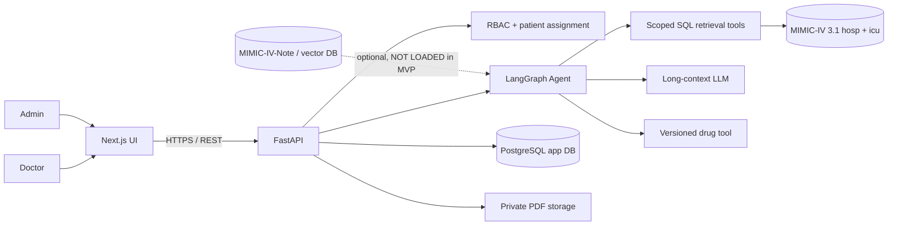
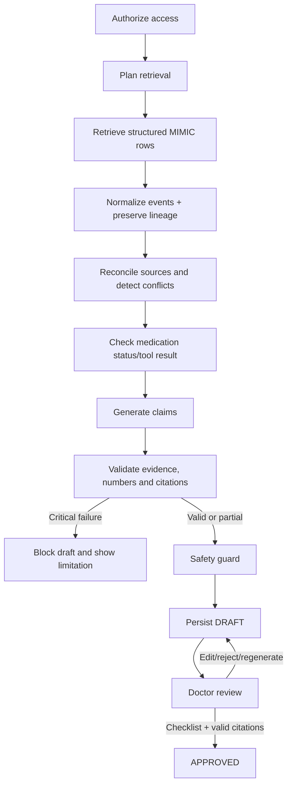
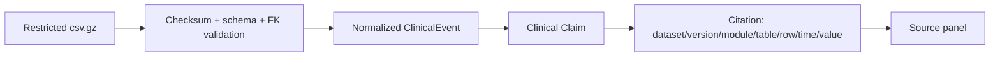

# Architecture Diagram — P-194

Đây là sơ đồ tóm tắt cho kiến trúc MVP. Bản mô tả đầy đủ nằm tại [ARCHITECTURE.md](../ARCHITECTURE.md).

## System context

## Agent flow

## Data lineage

Every claim shown to a doctor must resolve to a permitted source row. Missing or conflicting evidence remains visible and is never replaced by an LLM guess.

## Component decisions

| Component | MVP decision |
|---|---|
| Backend | FastAPI; all authorization is server-side |
| Agent | LangGraph nodes: authorize → retrieve → normalize → reconcile → claims → validate → cite → guard → draft |
| Structured data | MIMIC-IV 3.1 `hosp` and `icu`; raw files stay outside Git |
| Database | PostgreSQL target; SQLite only for local skeleton |
| Vector store | Disabled until a permitted text source is ingested |
| Export | Private object storage; only approved summaries are official PDFs |
