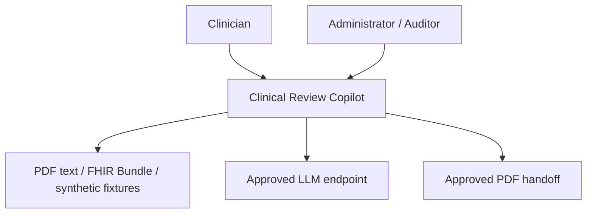
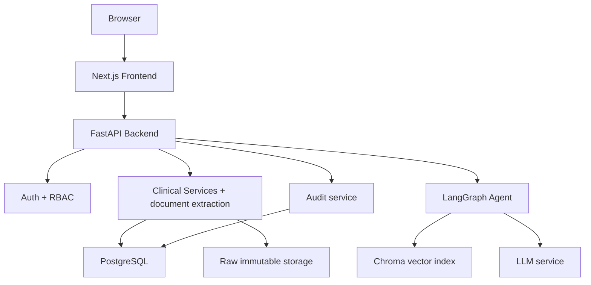
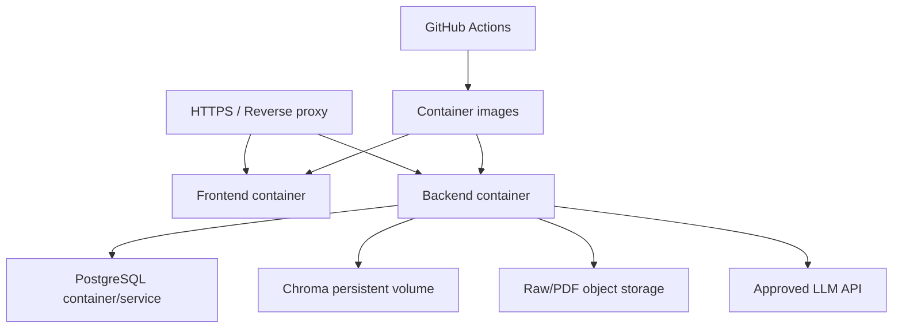
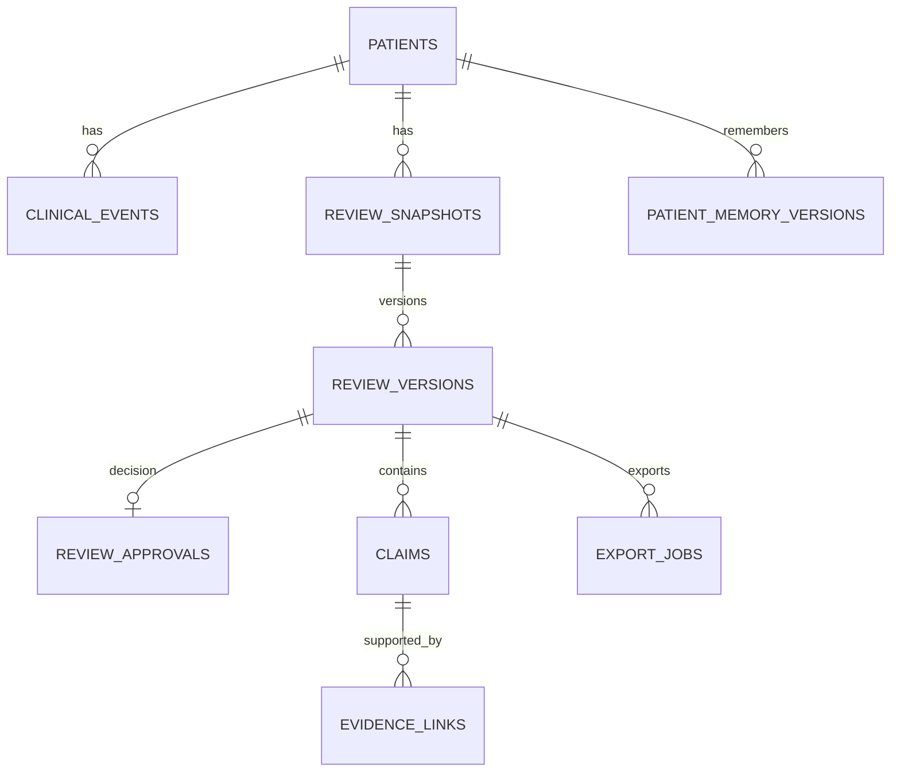
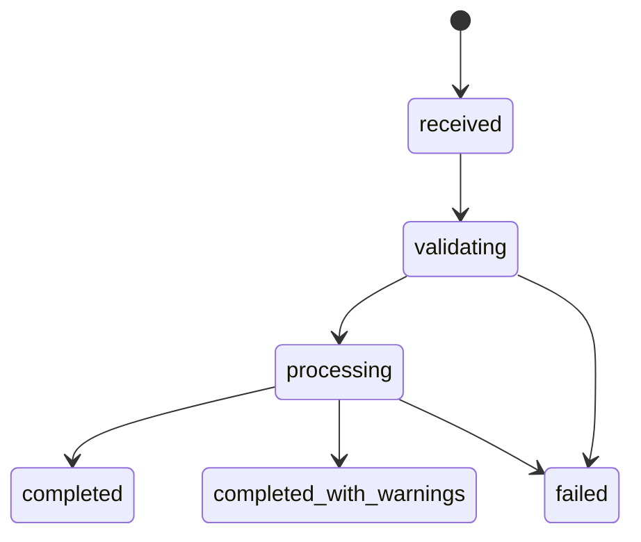
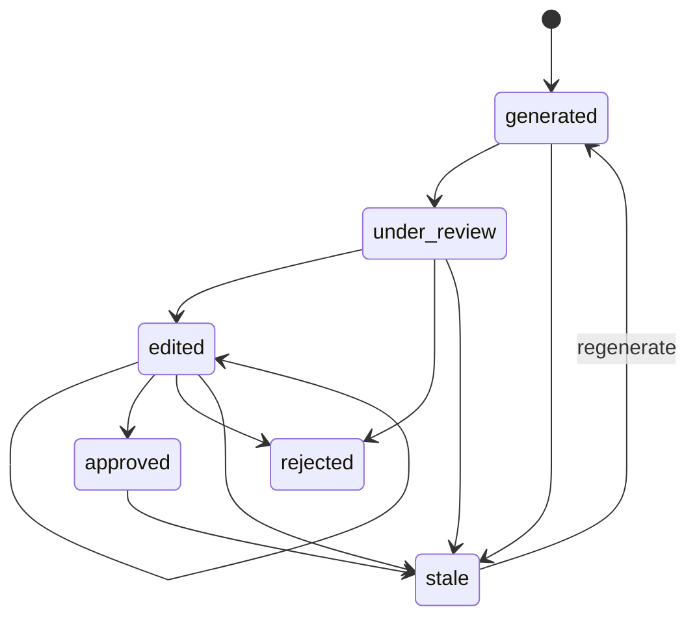
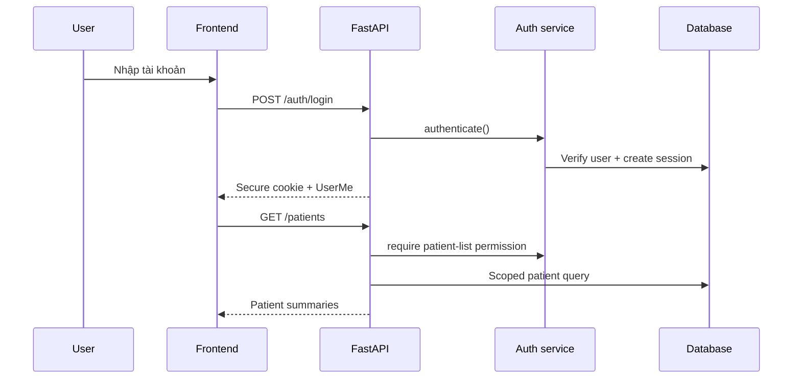
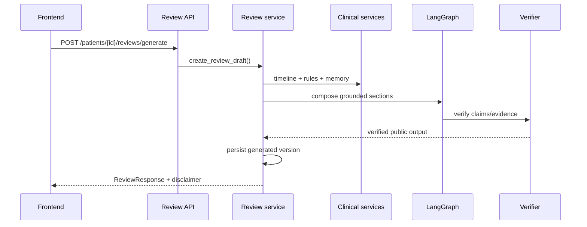
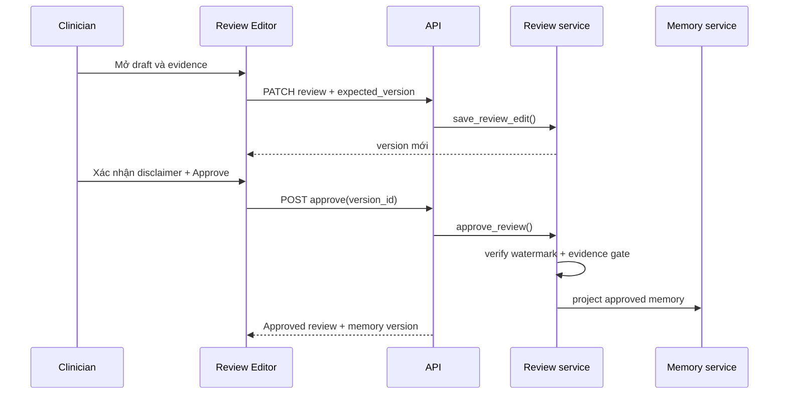
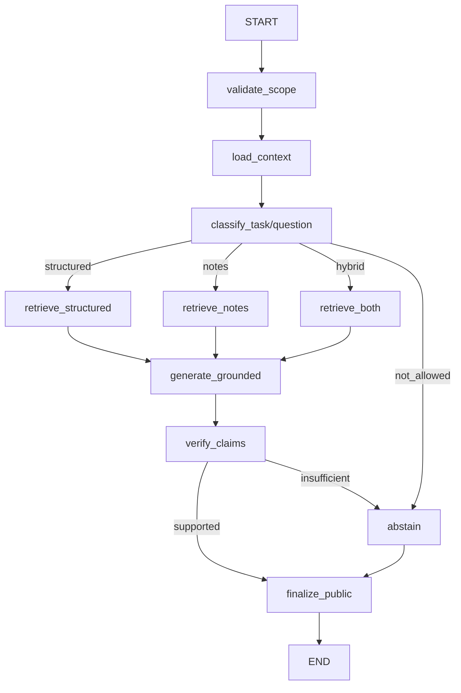

# Clinical Review Copilot — System Architecture

> Tài liệu kỹ thuật chuẩn để nhóm ba người triển khai Clinical Review Copilot trên starter repo P-194-master.

**Trạng thái:** Target architecture cho MVP sáu tuần  
**Liên quan:** [README_Clinical_Review_Copilot.md](README_Clinical_Review_Copilot.md)  
**Kiến trúc:** patient-first, evidence-first, deterministic-first, source read-only, human-in-the-loop  
**Use case đầu tiên:** đái tháo đường type 2 có thể kèm tăng huyết áp hoặc bệnh thận mạn

---

## Mục lục

1. Mục đích và phạm vi
2. Invariants an toàn
3. Kiến trúc ngữ cảnh và container
4. Kiến trúc deployment
5. Cấu trúc repository đích
6. Vai trò và phân quyền
7. Thành phần hệ thống
8. Kiến trúc dữ liệu
9. State machine
10. Luồng xử lý end-to-end
11. LangGraph agent
12. API contract
13. Danh mục schema
14. Danh mục module và hàm backend
15. Danh mục module và hàm agent
16. Danh mục frontend
17. Lỗi, concurrency, cache và idempotency
18. Bảo mật và audit PHI
19. Observability và AI logging
20. Testing và evaluation
21. Deployment và CI/CD
22. Traceability matrix
23. Thứ tự triển khai cho nhóm ba người
24. Definition of Done

---

## 1. Mục đích và phạm vi

Tài liệu này trả lời bốn câu hỏi:

1. Mỗi tính năng nằm ở component và file nào?
2. Dữ liệu đi qua hệ thống theo thứ tự nào?
3. Mỗi API, class và hàm có trách nhiệm gì?
4. Điều kiện nào phải đúng trước khi một bản tóm tắt được duyệt, lưu memory hoặc xuất PDF?

Tài liệu là target design, không khẳng định starter repo đã có sẵn các module. Ký hiệu:

| Ký hiệu | Ý nghĩa |
|---|---|
| P0 | Luồng lõi BTC yêu cầu; phải chạy end-to-end trước để làm nền tảng |
| P1 | Phần mở rộng **bắt buộc trong MVP sáu tuần**; triển khai theo các slice sau P0 nhưng phải hoàn tất trước Demo Day |
| P2 | Sau MVP hoặc pilot bệnh viện |
| Existing | File có trong starter repo |
| Modify | File có sẵn nhưng phải thay logic mẫu |
| Add | File/module nhóm bổ sung |

### 1.1. Phạm vi P0

- App deploy được.
- Login clinician/administrator.
- Tìm kiếm, chọn hoặc nhập hồ sơ mô phỏng.
- Agent sinh tóm tắt lâm sàng có cấu trúc.
- Citation/evidence cho từng claim.
- Disclaimer cố định.
- Bác sĩ xác nhận đã kiểm tra nội dung và nguồn.

### 1.2. Phạm vi P1

- Timeline và trend chart tương tác.
- Conflict detection.
- Medication interaction flags từ rule có version.
- HITL edit, approve/reject và lưu version.
- Patient memory theo bệnh nhân, chỉ từ nội dung đã duyệt.
- PDF handoff từ approved version.
- Clinical audit log và audit dashboard.
- Nhập PDF scan/ảnh qua OCR có kiểm soát, với confidence, provenance theo trang/vùng và bước clinician xác minh.

### 1.3. Non-goals

- Không chẩn đoán, kê đơn hoặc ra quyết định điều trị.
- Không để LLM tự tính số, ngày, đơn vị hoặc tương tác thuốc.
- Không tự ghi ngược HIS/LIS/EMR.
- Không lưu chain-of-thought hoặc trả reasoning nội bộ ra API.
- Không dùng dữ liệu bệnh nhân thật trong repo, AI log của BTC hoặc môi trường demo công khai.

---

## 2. Invariants an toàn

Các điều kiện sau phải được enforce trong code, không chỉ ghi trong prompt:

| ID | Invariant |
|---|---|
| INV-01 | Mọi truy vấn clinical có tenant_id và patient_id lấy từ server-side scope |
| INV-02 | patient_id trong prompt/body không cấp quyền truy cập |
| INV-03 | Structured values được lấy từ canonical store, không lấy từ nội dung LLM bịa lại |
| INV-04 | Mỗi claim hiển thị như fact phải có ít nhất một evidence link hợp lệ |
| INV-05 | Claim unsupported không đi vào approved review |
| INV-06 | Review AI sinh luôn bắt đầu ở trạng thái generated |
| INV-07 | Approve yêu cầu clinician_confirmation=true |
| INV-08 | Review stale hoặc version conflict không được approve/export |
| INV-09 | Patient memory chỉ được tạo từ approved review hoặc deterministic fact có nguồn |
| INV-10 | PDF chỉ render server-side từ approved_review_version_id |
| INV-11 | Source clinical record là read-only; mọi ghi chỉ vào application store |
| INV-12 | PHI access, evidence view, ask, edit, approve, memory và export đều được audit |
| INV-13 | Admin role không tự động có quyền đọc nội dung clinical |
| INV-14 | Agent output public không chứa scratchpad, prompt hệ thống hoặc tool trace nội bộ |
| INV-15 | Audit và AI usage log là hai luồng độc lập; AI usage log không chứa PHI |

---

## 3. Kiến trúc ngữ cảnh và container

### 3.1. System context



### 3.2. Container architecture



### 3.3. Quy tắc giao tiếp

- Frontend chỉ gọi API; không gọi trực tiếp database, vector store hoặc LLM.
- API route chỉ validate, authorize, gọi service và serialize response.
- Service chứa business rule và transaction.
- Agent gọi tool có scope; agent không tự truy vấn database bằng câu SQL sinh từ LLM.
- Database repository luôn nhận RequestContext hoặc tenant_id/patient_id rõ ràng.
- PDF exporter đọc approved version từ server, không tin nội dung HTML/text do browser gửi lên.

---

## 4. Kiến trúc deployment



### 4.1. Môi trường

| Môi trường | Dữ liệu | Auth | Mục đích |
|---|---|---|---|
| local | synthetic clean | demo accounts | phát triển |
| test | fixtures/challenge | mocked sessions | unit/integration/security |
| demo | synthetic realistic | demo accounts + secure cookie | chấm và trình diễn |
| pilot P2 | dữ liệu đã phê duyệt | hospital OIDC/SSO | đánh giá tại bệnh viện |

### 4.2. Network boundary

- Chỉ reverse proxy được public.
- PostgreSQL, Chroma và raw/PDF storage không public.
- Backend dùng TLS tới LLM endpoint nếu được gọi.
- CORS chỉ cho frontend origin đã cấu hình.
- Cookie session dùng HttpOnly, Secure ở demo HTTPS và SameSite=Lax/Strict phù hợp.

---

## 5. Cấu trúc repository đích

```text
P-194-master/
├── src/
│   ├── agents/
│   │   ├── graph.py
│   │   ├── state.py
│   │   ├── nodes/
│   │   │   ├── validate_scope.py
│   │   │   ├── load_context.py
│   │   │   ├── classify_question.py
│   │   │   ├── retrieve_evidence.py
│   │   │   ├── generate_answer.py
│   │   │   ├── verify_answer.py
│   │   │   └── finalize_response.py
│   │   └── tools/
│   │       ├── patient_timeline.py
│   │       ├── lab_trends.py
│   │       ├── medication_history.py
│   │       └── note_search.py
│   ├── api/
│   │   ├── routes.py
│   │   └── dependencies.py
│   ├── models/
│   │   └── schemas.py
│   ├── services/
│   │   ├── auth.py
│   │   ├── database.py
│   │   ├── ingestion.py
│   │   ├── normalization.py
│   │   ├── timeline.py
│   │   ├── rule_engine.py
│   │   ├── medication_safety.py
│   │   ├── retrieval.py
│   │   ├── verification.py
│   │   ├── reviews.py
│   │   ├── memory.py
│   │   ├── pdf_export.py
│   │   ├── audit.py
│   │   └── llm.py
│   ├── config.py
│   └── main.py
├── frontend/
│   ├── app/
│   │   ├── login/
│   │   ├── patients/
│   │   ├── patients/[patientId]/review/
│   │   └── admin/audit/
│   ├── components/
│   ├── hooks/
│   ├── lib/
│   └── types/
├── configs/
│   ├── disease_profiles/
│   ├── specialty_views/
│   ├── terminology/
│   ├── unit_conversions/
│   └── drug_interactions/
├── data/
│   ├── raw/
│   ├── synthetic/
│   ├── gold_labels/
│   └── fixtures/
├── migrations/
├── tests/
│   ├── test_agents/
│   ├── test_api/
│   ├── test_services/
│   ├── test_workflows/
│   └── test_security/
├── eval/
├── docs/
│   └── architecture_diagram.md
├── presentation/
├── scripts/
├── ARCHITECTURE.md
└── README.md
```

README sản phẩm có thể được chép vào README.md của repo. Tài liệu này có thể được chép vào ARCHITECTURE.md; docs/architecture_diagram.md giữ sơ đồ rút gọn phục vụ deliverable của BTC.

---

## 6. Vai trò và phân quyền

### 6.1. Role matrix

| Action | Clinician | Administrator | Auditor |
|---|:---:|:---:|:---:|
| Login/logout | Có | Có | Có |
| List patient trong scope | Có | Không mặc định | Không |
| View clinical review/evidence | Có | Không mặc định | Không |
| Ask the Chart | Có | Không | Không |
| Edit/approve/reject review | Có | Không | Không |
| Read patient memory | Có | Không | Không |
| Export approved PDF | Có | Không | Không |
| Import synthetic demo data | Theo cấu hình | Có | Không |
| Manage users/roles | Không | Có | Không |
| View clinical audit metadata | Không mặc định | Có theo policy | Có |

### 6.2. Patient scope

Mọi RequestContext gồm:

    request_id
    tenant_id
    user_id
    roles
    allowed_patient_ids hoặc assignment policy
    session_id
    source_ip_hash

Quy tắc kiểm tra:

1. Xác thực session.
2. Kiểm tra role cho endpoint.
3. Kiểm tra tenant.
4. Kiểm tra patient assignment/scope.
5. Ghi audit attempt và outcome.
6. Chỉ sau đó mới đọc clinical data.

---

## 7. Thành phần hệ thống

| Component | Trách nhiệm | Không được làm |
|---|---|---|
| Frontend | UX, local form state, hiển thị citation/status | Tự quyết định quyền hoặc approved state |
| FastAPI routes | HTTP contract, validation, dependency injection | Chứa clinical business rule |
| Auth service | Credential/session/RBAC/patient scope | Cấp quyền từ patient_id trong body |
| Ingestion | Parse adapter, raw persistence, validation | Sửa/xóa raw record |
| Document extraction | Tách PDF theo trang/block/bảng, giữ tọa độ/citation; OCR P1 có confidence và xác minh | Biến OCR hoặc bảng parse lỗi thành fact không cần xác minh |
| Normalization | Canonical code/unit/time/medication | Impute im lặng |
| Timeline | Sắp xếp event ổn định | Dùng recorded time thay clinical time tùy tiện |
| Rule engine | Lab/medication/data-gap/conflict | Chẩn đoán hoặc khuyến nghị |
| Medication safety | Match versioned interaction pairs | Để LLM tạo tương tác |
| Retrieval | SQL/vector patient-scoped search | Cross-patient search |
| LangGraph | Điều phối retrieve/generate/verify/abstain | Truy cập DB ngoài tool |
| Verification | Kiểm claim và evidence | “Sửa” claim bằng suy đoán |
| Review service | Draft/version/state/approval/stale | Ghi đè approved version |
| Memory service | Approved patient context projection | Lưu chat memory tự do |
| PDF exporter | Render approved handoff | Render client-supplied content |
| Audit service | Append clinical security events | Log raw note/full PDF |

---

## 8. Kiến trúc dữ liệu

### 8.1. Data zones

| Zone | Nội dung | Tính chất |
|---|---|---|
| Raw | PDF/ảnh/FHIR file ban đầu + checksum | immutable |
| Staging | parsed record + validation issue | tái tạo được |
| Canonical | patient, encounter, observation, medication, condition, note | normalized + provenance |
| Derived | timeline event, trend, conflict, interaction flag | rule/profile versioned |
| Evidence | claim-to-source link + minimal span | patient-scoped |
| Application | auth session, review version, approval, memory, export, audit | transactional + versioned |
| Vector | note/PDF block chunk embedding + page/block metadata | tenant/patient filtered |

### 8.2. Entity catalog

| Entity | Primary fields | Quan hệ/quy tắc |
|---|---|---|
| tenants | tenant_id, name, status | root partition |
| users | user_id, tenant_id, email, password_hash/status | password chỉ dùng demo |
| roles | role_id, code | clinician/admin/auditor |
| user_roles | user_id, role_id | many-to-many |
| sessions | session_id, user_id, token_hash, expires_at, revoked_at | raw token không lưu DB |
| user_patient_scopes | user_id, patient_id, valid_from/to | scope explicit cho demo |
| patients | patient_id, tenant_id, demographics_minimal | synthetic/de-identified |
| encounters | encounter_id, patient_id, start/end, specialty | canonical |
| observations | observation_id, patient_id, code, value, unit, effective_time | giữ raw value/unit |
| medications | medication_id, patient_id, ingredient, strength, dose, status | provenance required |
| conditions | condition_id, patient_id, code, clinical_status | không suy từ lab |
| notes | note_id, patient_id, note_type, content, authored_at | raw note access hạn chế |
| source_documents | document_id, patient_id, name, mime_type, checksum, storage_ref, extraction_status | PDF/raw attachment immutable |
| document_pages | page_id, document_id, page_number, text, render_ref, extraction_version | mở lại được đúng trang |
| document_blocks | block_id, page_id, kind, text, bbox, char_range, confidence | paragraph/table/row; OCR quality retained |
| raw_records | raw_id, batch_id, checksum, payload_ref | immutable |
| ingestion_batches | batch_id, status, counts, actor | state machine |
| validation_issues | issue_id, raw_id, severity, code | không xóa record lỗi |
| clinical_events | event_id, patient_id, event_type, event_time, payload | derived/versioned |
| claims | claim_id, patient_id, text, status, generator_version | evidence gate |
| evidence_links | claim_id, source_record_id, source_span, support_type | ít nhất một cho verified |
| review_snapshots | review_id, patient_id, status, data_watermark | logical review |
| review_versions | review_version_id, review_id, version, content, checksum | immutable versions |
| review_approvals | review_version_id, decision, actor, confirmation, at | one decision/version |
| patient_memory_versions | memory_version_id, patient_id, source_review_version_id, content | approved-only |
| drug_interaction_rules | rule_id, ingredient_a/b, severity, source, version | symmetric match |
| drug_interaction_flags | flag_id, patient_id, rule_id, medication_ids, status | reviewable |
| feedback | feedback_id, claim_id, actor, label, note | evaluation only |
| export_jobs | export_id, review_version_id, file_ref, checksum, actor | approved-only |
| audit_logs | audit_id, actor, action, patient_id, outcome, prev_hash, entry_hash | append-only |

### 8.3. Quan hệ cốt lõi



### 8.4. Data watermark

data_watermark là giá trị đại diện bản dữ liệu nguồn mới nhất đã được dùng để sinh review. Có thể là:

    max(canonical.updated_at) + canonical_count + transform_version

Backend tính lại current watermark trước approve/export:

- giống watermark của review: tiếp tục;
- khác watermark: đánh dấu stale và trả 409;
- không để frontend tự so sánh.

### 8.5. Provenance tối thiểu

Mọi event/claim/evidence cần:

- tenant_id và patient_id;
- source_system;
- source_record_id;
- clinical/effective time;
- recorded/ingested time;
- raw checksum hoặc raw reference; với PDF có document/page/block hoặc table reference;
- transform/rule/model/profile version;
- original và normalized value nếu có chuyển đổi;
- data quality flags.

---

## 9. State machine

### 9.1. Ingestion batch



| State | Ý nghĩa |
|---|---|
| received | raw payload đã lưu và có checksum |
| validating | parse/schema/identity validation đang chạy |
| processing | normalization, timeline, indexing đang chạy |
| completed | không có error chặn |
| completed_with_warnings | có quarantine/warning nhưng có record dùng được |
| failed | batch không thể tạo canonical data an toàn |

### 9.2. Review lifecycle



Transition guard:

| Transition | Guard |
|---|---|
| generated → under_review | clinician có patient scope |
| under_review → edited | expected_version khớp |
| edited/under_review → approved | confirmation=true, evidence gate pass, watermark current |
| any reviewable → rejected | actor + reason |
| any current → stale | source watermark thay đổi |
| stale → generated | chạy pipeline mới; không sửa version cũ |

### 9.3. Claim state

| State | Hiển thị |
|---|---|
| verified | có thể hiển thị như fact cùng citation |
| needs_verification | hiển thị cờ mâu thuẫn và cả hai nguồn |
| unsupported | không đưa vào approved factual section |
| not_found | dùng cho câu hỏi không tìm thấy dữ liệu |
| not_allowed | câu hỏi vượt phạm vi/an toàn |

### 9.4. Interaction flag

| State | Ý nghĩa |
|---|---|
| open | rule match mới, chưa được bác sĩ rà soát |
| reviewed | bác sĩ đã xem |
| not_applicable | bác sĩ xác định không áp dụng trong ngữ cảnh này |
| superseded | medication state/rule version mới làm flag cũ không còn current |

---

## 10. Luồng xử lý end-to-end

### 10.1. Login và patient selection



Yêu cầu:

- lỗi login dùng thông báo chung;
- session token chỉ nằm trong HttpOnly cookie;
- list patients luôn scope theo tenant/user;
- patient_view audit được ghi khi mở hồ sơ, không chỉ khi list.

### 10.2. Import và xử lý PDF/FHIR/synthetic record

1. API kiểm tra quyền import, magic bytes/MIME, số trang/kích thước và allowlist: PDF text, PDF scan/ảnh và FHIR R4 JSON.
2. Lưu raw bytes/payload, checksum và batch metadata.
3. Detect adapter; PDF/ảnh đi qua page → OCR nếu cần → block/table → section/chunk, FHIR đi qua Bundle/resource adapter.
4. Validate schema/identity/time/unit.
5. Với PDF, lưu `document_id`, page/block/table reference, bbox/char range và extraction version; scan không text layer được gắn `ocr_pending`.
6. Quarantine record lỗi hoặc table/OCR low-confidence; không xóa raw và không tự đưa thành verified fact.
7. Normalize thành canonical records.
8. Build timeline, trends, conflicts, interaction flags.
9. Chunk/index notes và PDF blocks với tenant_id + patient_id.
10. Ghi batch status, counts và audit.

### 10.3. Generate structured review



Review output sections:

- patient_overview;
- active_conditions;
- current_medications;
- recent_results;
- changes_to_review;
- trends;
- timeline;
- conflicts;
- drug_interactions;
- data_gaps;
- evidence links;
- disclaimer.

### 10.4. Ask the Chart

1. Scope được validate trước graph.
2. Classifier chọn structured, notes hoặc hybrid.
3. Tool chỉ nhận patient context từ graph state đã khóa.
4. Generate answer từ evidence packet.
5. Verifier map từng claim sang evidence.
6. Không đủ evidence: abstain/not_found.
7. Finalize bỏ nội dung nội bộ; response chỉ có answer/status/citations.
8. Ghi audit ask với question category/hash, không cần log raw PHI question.

### 10.5. HITL edit và approve



Transaction approve:

1. Lock logical review row.
2. Check current version.
3. Check actor/role/patient scope.
4. Recompute watermark.
5. Validate confirmation.
6. Validate claim evidence status.
7. Insert approval.
8. Change snapshot status.
9. Create memory version.
10. Append audit event.
11. Commit atomically.

### 10.6. Export PDF

1. Validate session, clinician role và patient scope.
2. Load approved review version.
3. Recompute/verify state; stale version bị chặn theo policy MVP.
4. Render template server-side.
5. Add disclaimer, approval actor/time, review version và citation appendix.
6. Compute checksum; save export job/file reference.
7. Audit export và download.
8. Stream PDF với filename không chứa định danh nhạy cảm.

### 10.7. Clinical audit query

- Chỉ administrator/auditor có permission audit.read.
- Filter theo time, actor, action, outcome và patient pseudonymous ID.
- Không trả raw note, raw prompt hoặc PDF content.
- Mọi lần xem audit cũng tạo audit event riêng.

---

## 11. LangGraph agent

### 11.1. Phạm vi

LangGraph dùng cho hai task:

- review_generation: diễn đạt deterministic facts và note events thành các section có cấu trúc;
- ask_chart: phân loại câu hỏi, retrieval, answer, verify, abstain.

Ingestion, unit conversion, lab delta, medication diff, conflict và drug interaction chạy ngoài agent.

### 11.2. State schema

    class ClinicalReviewState(TypedDict, total=False):
        request_id: str
        tenant_id: str
        user_id: str
        patient_id: str
        task_type: Literal["review_generation", "ask_chart"]
        question: str | None
        question_type: Literal["structured", "notes", "hybrid", "not_allowed"]
        profile_versions: list[str]
        data_watermark: str
        approved_memory: dict | None
        structured_facts: list[dict]
        note_evidence: list[dict]
        evidence_packet: list[dict]
        draft_sections: dict
        draft_answer: str | None
        claims: list[dict]
        verification_results: list[dict]
        status: Literal["running", "answered", "not_found", "conflicting", "not_allowed", "error"]
        public_response: dict
        errors: list[dict]

Không đưa raw session token, password hash hoặc toàn bộ raw note vào state/checkpoint.

### 11.3. Graph



### 11.4. Routing rules

| Question | Route |
|---|---|
| “HbA1c thay đổi thế nào?” | structured |
| “Ghi chú gần nhất có nhắc hạ đường huyết không?” | notes |
| “Thuốc đổi sau khi eGFR giảm?” | hybrid |
| “Nên ngừng thuốc nào?” | not_allowed |
| Không có evidence | abstain/not_found |

### 11.5. Tool safety

- Tool signature không nhận tenant_id/user_id từ model text; wrapper lấy từ state.
- Tool trả typed JSON và source IDs.
- limit và lookback có upper bound.
- note_search bắt buộc metadata filter tenant_id + patient_id.
- tool error được chuẩn hóa, không trả stack trace cho LLM.
- graph recursion/step limit được cấu hình.

---

## 12. API contract

Prefix: /api/v1. Tất cả response lỗi theo ErrorResponse ở mục 17.

### 12.1. Auth và user

| Method | Path | Request | Response | Permission |
|---|---|---|---|---|
| POST | /auth/login | LoginRequest | UserMe + secure cookie | public |
| POST | /auth/logout | none | 204 | authenticated |
| GET | /auth/me | none | UserMe | authenticated |

### 12.2. Patient và ingestion

| Method | Path | Request | Response | Permission |
|---|---|---|---|---|
| GET | /patients | search, page, page_size | PatientListResponse | patient.list |
| POST | /ingestions | multipart PDF/ảnh/FHIR + format? | IngestionBatchResponse | clinical.import (demo synthetic/de-identified only) |
| GET | /documents/{document_id}/pages/{page_number} | none | safe PDF page/image + blocks | clinical.read |
| GET | /ingestions/{batch_id} | none | IngestionBatchResponse | ingestion.read |
| POST | /patients/{patient_id}/process | profile/version | ProcessResponse | patient.process |

### 12.3. Review và clinical data

| Method | Path | Request | Response | Permission |
|---|---|---|---|---|
| POST | /patients/{patient_id}/reviews/generate | GenerateReviewRequest | ReviewResponse | review.generate |
| GET | /patients/{patient_id}/review | latest/version query | ReviewResponse | review.read |
| GET | /patients/{patient_id}/timeline | filters | TimelineResponse | clinical.read |
| GET | /patients/{patient_id}/trends | code/date filters | TrendsResponse | clinical.read |
| GET | /patients/{patient_id}/drug-interactions | status filter | InteractionListResponse | clinical.read |
| POST | /patients/{patient_id}/ask | AskRequest | AskResponse | ask.create |
| GET | /claims/{claim_id}/evidence | none | EvidenceResponse | evidence.read |
| POST | /claims/{claim_id}/feedback | FeedbackRequest | FeedbackResponse | feedback.create |

### 12.4. HITL, memory, export và audit

| Method | Path | Request | Response | Permission |
|---|---|---|---|---|
| PATCH | /reviews/{review_id} | ReviewEditRequest | ReviewResponse | review.edit |
| POST | /reviews/{review_id}/approve | ApprovalRequest | ReviewResponse | review.approve |
| POST | /reviews/{review_id}/reject | RejectionRequest | ReviewResponse | review.reject |
| GET | /reviews/{review_id}/versions | pagination | ReviewVersionList | review.read |
| GET | /patients/{patient_id}/memory | version? | PatientMemoryResponse | memory.read |
| GET | /reviews/{review_id}/export.pdf | review_version_id | application/pdf | review.export |
| GET | /admin/audit-logs | filters + pagination | AuditLogListResponse | audit.read |

### 12.5. HTTP status

| Status | Dùng khi |
|---:|---|
| 200/201/204 | thành công |
| 400 | file/transition không hợp lệ |
| 401 | chưa xác thực/session hết hạn |
| 403 | role không được phép |
| 404 | resource ngoài scope hoặc không tồn tại |
| 409 | expected_version/watermark/state conflict |
| 413 | file vượt giới hạn |
| 422 | Pydantic/schema validation |
| 429 | rate limit |
| 500 | lỗi nội bộ không lộ chi tiết |
| 503 | LLM/vector/storage tạm unavailable |

---

## 13. Danh mục schema

Tất cả schema đặt trong src/models/schemas.py ở MVP. Khi file quá lớn mới tách package, không cần tách sớm.

### 13.1. Auth và context

| Schema | Trường chính |
|---|---|
| LoginRequest | email, password |
| UserMe | user_id, display_name, roles, permissions, tenant_id |
| RequestContext | request_id, tenant_id, user_id, roles, session_id |
| PatientScope | patient_id, access_reason, valid_until |

### 13.2. Clinical data

| Schema | Trường chính |
|---|---|
| SourceReference | source_system, source_record_id, source_time, source_span |
| PatientSummary | patient_id, pseudonym, age/sex minimal, last_encounter |
| ObservationEvent | code, value, unit, effective_time, provenance |
| MedicationEvent | ingredient, strength, dose, frequency, status, provenance |
| TimelineEvent | event_id, type, time, title, payload, source_refs |
| TrendSeries | code, unit, points, profile_version |
| ConflictFlag | conflict_id, type, source_a, source_b, status |
| DrugInteractionFlag | flag_id, drugs, severity, description, rule_source, status |

### 13.3. Claim, review và evidence

| Schema | Trường chính |
|---|---|
| EvidenceItem | evidence_id, source_ref, snippet, support_type |
| DocumentCitation | document_id, document_name, page_number, block_id/table_id, snippet, checksum |
| VerifiedClaim | claim_id, text, status, citations, generator_version |
| ReviewSection | section_code, title, claims, clinician_text |
| ReviewResponse | review_id, patient_id, status, version, watermark, sections, flags, disclaimer |
| ReviewEditRequest | expected_version, sections, edit_reason? |
| ApprovalRequest | review_version_id, expected_version, clinician_confirmation |
| RejectionRequest | review_version_id, expected_version, reason |
| ReviewVersionSummary | version_id, number, author, status, created_at, checksum |

### 13.4. Ask, memory, export và audit

| Schema | Trường chính |
|---|---|
| AskRequest | question, lookback? |
| AskResponse | answer, status, citations, data_watermark |
| PatientMemoryResponse | memory_version_id, source_review_version_id, items, approved_at |
| ExportMetadata | export_id, review_version_id, checksum, created_at |
| AuditEvent | actor_id, action, patient_id?, resource_type/id, outcome, timestamp |
| AuditLogListResponse | items, page, page_size, total |
| ErrorResponse | code, message, request_id, details? |

---

## 14. Danh mục module và hàm backend

Các signature dưới đây là hợp đồng thiết kế. Tên có thể thay đổi khi code, nhưng trách nhiệm, guard và output không được nhập nhằng.

### 14.1. Quy ước chung

- Public function có type hints và docstring ngắn.
- Async dùng cho I/O; pure clinical calculations để sync/pure function.
- Route không gọi route khác.
- Service không phụ thuộc FastAPI Request/Response.
- Hàm đọc clinical data nhận RequestContext hoặc explicit tenant/patient scope.
- Không dùng bare except; domain error được map ở exception handler.
- Không trả internal exception string cho client.

### 14.2. src/config.py

| Hàm/class | Signature | Trách nhiệm |
|---|---|---|
| Settings | Pydantic settings class | Đọc env, validate URL/secret/limits |
| get_settings | () -> Settings | Singleton cached settings |
| validate_runtime_config | (settings) -> None | Fail fast nếu production thiếu secret/origin/database |
| is_demo_mode | (settings) -> bool | Bật demo accounts/synthetic import có kiểm soát |

Settings tối thiểu:

    app_env, api_prefix, database_url, session_secret
    session_ttl_minutes, allowed_origins
    llm_provider, llm_model, llm_api_key
    vector_store_path, raw_store_path, export_store_path
    max_upload_bytes, max_agent_steps, request_timeout_seconds
    ai_log_enabled, clinical_audit_enabled

### 14.3. src/main.py

| Hàm | Signature | Trách nhiệm |
|---|---|---|
| lifespan | (app: FastAPI) -> AsyncIterator[None] | Init/close DB, vector store, services; không print secret |
| create_app | () -> FastAPI | Tạo app, middleware, routes, exception handlers |
| add_middlewares | (app, settings) -> None | CORS, request ID, secure headers, rate limit hook |
| register_exception_handlers | (app) -> None | Map DomainError sang ErrorResponse |
| health_check | () -> HealthResponse | Liveness không lộ config/secret |
| readiness_check | () -> ReadinessResponse | DB/vector dependency status cho deploy |

### 14.4. src/api/dependencies.py

| Hàm | Signature | Trách nhiệm/guard |
|---|---|---|
| get_db | () -> AsyncIterator[DbSession] | Transaction-scoped DB session |
| get_current_session | (request, db) -> SessionRecord | Đọc cookie, hash token, kiểm tra expiry/revoked |
| get_request_context | (request, session) -> RequestContext | Tạo context server-side |
| require_roles | (*roles: RoleCode) -> Callable | Dependency factory kiểm role |
| require_permission | (permission: str) -> Callable | Kiểm permission cụ thể |
| require_patient_access | (patient_id, context, db) -> PatientScope | Tenant + assignment guard; fail 404/403 theo policy |
| require_review_access | (review_id, context, db) -> ReviewAccess | Resolve review rồi kiểm patient scope |
| get_idempotency_key | (request) -> str | Validate header cho mutation cần retry-safe |

### 14.5. src/services/database.py

| Hàm | Signature | Trách nhiệm |
|---|---|---|
| create_engine_and_session_factory | (settings) -> tuple | Tạo SQLAlchemy async engine/factory |
| transaction | (session) -> AsyncContextManager | Commit/rollback rõ ràng |
| ping_database | (session) -> bool | Readiness |
| get_current_watermark | (session, tenant_id, patient_id) -> str | Tính watermark canonical |
| advisory_lock_review | (session, review_id) -> None | Serialize approve/edit critical section |
| paginate | (query, page, page_size) -> Page | Pagination giới hạn |
| utcnow | () -> datetime | Clock injectable trong test |

Repository helpers tối thiểu:

| Hàm | Signature | Trách nhiệm |
|---|---|---|
| get_patient_scoped | (session, context, patient_id) -> Patient | Không truy xuất ngoài tenant/scope |
| list_patients_scoped | (session, context, filters) -> Page[Patient] | Patient Workspace |
| get_review_scoped | (session, context, review_id) -> Review | Resolve + isolation |
| get_claim_scoped | (session, context, claim_id) -> Claim | Evidence isolation |
| insert_immutable_version | (session, model, payload) -> Model | Không update version cũ |

### 14.6. src/services/auth.py

MVP dùng opaque session token trong secure HttpOnly cookie. Database chỉ lưu token hash. Demo password dùng Argon2id/bcrypt phù hợp; production P2 chuyển sang OIDC.

| Hàm | Signature | Trách nhiệm |
|---|---|---|
| hash_password | (plain: str) -> str | Chỉ dùng seed/demo user creation |
| verify_password | (plain: str, encoded: str) -> bool | Constant-time verifier từ thư viện chuẩn |
| authenticate_user | (session, email, password) -> User | Thông báo lỗi chung, rate-limit compatible |
| create_session | (session, user, metadata) -> SessionToken | Sinh random token; lưu hash + expiry |
| hash_session_token | (raw_token: str) -> str | Không lưu raw token |
| resolve_session | (session, raw_token: str) -> SessionRecord | Check hash, expiry, revoked, user status |
| revoke_session | (session, session_id, actor_id) -> None | Logout/revoke |
| revoke_all_user_sessions | (session, user_id, actor_id) -> int | Khi khóa tài khoản/đổi quyền |
| list_permissions | (session, user_id) -> set[str] | Role → permissions |
| has_patient_access | (session, context, patient_id) -> bool | Tenant + assignment policy |
| seed_demo_users | (session, settings) -> None | Chỉ chạy explicit demo setup, idempotent |

### 14.7. src/api/routes.py

Route signature rút gọn; tất cả route clinical dùng dependency auth/scope và gọi service.

#### Auth routes

| Hàm | Signature | Service gọi |
|---|---|---|
| login | (LoginRequest, Response, db) -> UserMe | authenticate_user, create_session, audit |
| logout | (Response, context, db) -> None | revoke_session, audit |
| get_me | (context) -> UserMe | list_permissions |

#### Patient/ingestion routes

| Hàm | Signature | Service gọi |
|---|---|---|
| list_patients | (filters, context, db) -> PatientListResponse | list_patients_scoped |
| import_synthetic_records | (file, format, context, db) -> IngestionBatchResponse | create_ingestion_batch |
| create_ingestion | (IngestionRequest, context, db) -> IngestionBatchResponse | create_ingestion_batch |
| get_ingestion | (batch_id, context, db) -> IngestionBatchResponse | get_ingestion_batch |
| process_patient | (patient_id, ProcessRequest, scope, db) -> ProcessResponse | process_patient_records |

#### Read/review routes

| Hàm | Signature | Service gọi |
|---|---|---|
| generate_review | (patient_id, request, scope, context, db) -> ReviewResponse | create_review_draft |
| get_patient_review | (patient_id, version?, scope, db) -> ReviewResponse | get_review |
| get_patient_timeline | (patient_id, filters, scope, db) -> TimelineResponse | query_timeline |
| get_patient_trends | (patient_id, filters, scope, db) -> TrendsResponse | query_trends |
| get_drug_interactions | (patient_id, filters, scope, db) -> InteractionListResponse | list_interaction_flags |
| ask_chart | (patient_id, AskRequest, scope, context, db) -> AskResponse | run_agent |
| get_claim_evidence | (claim_id, context, db) -> EvidenceResponse | assemble_claim_evidence |
| submit_feedback | (claim_id, FeedbackRequest, context, db) -> FeedbackResponse | save_feedback |

#### HITL/memory/export/audit routes

| Hàm | Signature | Service gọi |
|---|---|---|
| update_review | (review_id, ReviewEditRequest, access, context, db) -> ReviewResponse | save_review_edit |
| approve_review_route | (review_id, ApprovalRequest, access, context, db) -> ReviewResponse | approve_review |
| reject_review_route | (review_id, RejectionRequest, access, context, db) -> ReviewResponse | reject_review |
| list_review_versions | (review_id, page, access, db) -> ReviewVersionList | get_review_versions |
| get_patient_memory_route | (patient_id, version?, scope, db) -> PatientMemoryResponse | get_patient_memory |
| export_review_pdf | (review_id, version_id, access, context, db) -> StreamingResponse | create_pdf_export |
| list_audit_logs | (filters, context, db) -> AuditLogListResponse | query_audit_events |

### 14.8. src/services/ingestion.py

| Hàm | Signature | Trách nhiệm |
|---|---|---|
| create_ingestion_batch | (stream, filename, format_hint, context, db) -> Batch | Size/type check, raw save, batch create |
| compute_checksum | (bytes_or_stream) -> str | SHA-256/idempotency |
| detect_format | (filename, content_type, sample) -> InputFormat | Không chỉ tin extension |
| get_adapter | (format: InputFormat) -> SourceAdapter | Adapter registry |
| parse_pdf_text | (stream, document_ref) -> Iterator[DocumentBlock] | PyMuPDF/pdfplumber: trang, block, bảng, bbox/char range |
| detect_text_layer | (pdf) -> TextLayerStatus | Chuyển scan sang OCR queue/policy, không OCR im lặng |
| parse_pdf_table | (page, block) -> TableParseResult | Parse bảng đơn giản; fail thì giữ text + quality flag |
| create_document_citation | (block, snippet) -> DocumentCitation | File/page/block/table reference, checksum |
| parse_json | (stream) -> Iterator[RawRecord] | Internal JSON adapter |
| parse_fhir_bundle | (payload) -> Iterator[RawRecord] | FHIR R4 demo subset |
| parse_xml | (stream) -> Iterator[RawRecord] | XML demo schema; disable external entities |
| validate_raw_record | (record, schema) -> list[ValidationIssue] | Schema/type/required fields |
| persist_raw_record | (db, batch, record, checksum) -> RawRecordRef | Immutable persistence |
| quarantine_record | (db, raw_ref, issues) -> None | Giữ lỗi để sửa/replay |
| process_ingestion_batch | (batch_id, context, db) -> BatchResult | Parse → validate → normalize → index |
| replay_ingestion_batch | (batch_id, transform_version, context, db) -> Batch | Tái xử lý từ raw, không sửa raw |
| get_ingestion_batch | (batch_id, context, db) -> Batch | Tenant-scoped status |

**OCR P1 — deliverable bắt buộc:** `ocr_document_page(page_image) -> OcrResult` chỉ chạy sau khi `detect_text_layer` đánh dấu scan. Result phải giữ engine/model/version, word bounding boxes và confidence. Nếu confidence hoặc validation không đạt ngưỡng cấu hình, canonical record có `needs_verification`; reviewer phải thấy ảnh/trích đoạn để sửa/xác nhận. P0 không phụ thuộc OCR về mặt thứ tự xây dựng, nhưng MVP chỉ hoàn thành khi P1/OCR pass acceptance test.

### 14.9. src/services/normalization.py

Các hàm normalize nên pure và unit-test được.

| Hàm | Signature | Trách nhiệm |
|---|---|---|
| normalize_patient_identifier | (source_system, raw_id, tenant_id) -> str | Stable internal ID/pseudonym |
| normalize_datetime | (value, source_tz) -> datetime | Timezone-aware; giữ original |
| normalize_code | (system, code, display, terminology) -> NormalizedCode | Map hoặc flag unmapped |
| convert_unit | (code, value, from_unit, to_unit, table) -> ConvertedValue | Decimal, versioned conversion |
| normalize_observation | (raw, context) -> ObservationEvent | Numeric/unit/provenance |
| normalize_medication_name | (raw_name, terminology) -> MedicationConcept | Ingredient/brand mapping |
| normalize_dose | (raw_dose, strength, frequency) -> Dose | Không suy khi thiếu |
| normalize_medication | (raw, context) -> MedicationEvent | State + provenance |
| normalize_condition | (raw, context) -> ConditionEvent | Active/history/uncertain |
| normalize_note | (raw, context) -> ClinicalNote | Author/time/type/provenance |
| deduplicate_records | (records, key_fn) -> DedupResult | Giữ duplicate audit |
| link_encounter | (event, encounters) -> EncounterLink | Explicit rule + unmatched flag |
| normalize_record | (raw_record, context) -> CanonicalRecord | Dispatcher |

### 14.10. src/services/timeline.py

| Hàm | Signature | Trách nhiệm |
|---|---|---|
| choose_clinical_time | (record) -> datetime | specimen/effective/start priority |
| timeline_sort_key | (event) -> tuple | Stable order khi cùng time |
| to_timeline_event | (canonical_record) -> TimelineEvent | Unified envelope |
| build_patient_timeline | (patient_id, records, profile) -> list[TimelineEvent] | Pure ordered timeline |
| query_timeline | (db, context, patient_id, filters) -> TimelineResponse | Scoped query + pagination |
| get_data_coverage | (events) -> DataCoverage | start/end/count/source coverage |
| compute_timeline_watermark | (events, versions) -> str | Deterministic cache/version key |

### 14.11. src/services/rule_engine.py

| Hàm | Signature | Trách nhiệm |
|---|---|---|
| calculate_delta | (old: Decimal, new: Decimal) -> Delta | Absolute/relative/direction |
| detect_lab_changes | (observations, profile) -> list[ClinicalEvent] | Consecutive changes + source pair |
| detect_sustained_trend | (series, min_points, tolerance) -> Trend | Increase/decrease/stable |
| compare_medication_states | (previous, current) -> list[MedicationChange] | added/confirmed stopped/dose/frequency/etc. |
| detect_new_conditions | (conditions) -> list[ConditionChange] | New active vs history/uncertain |
| detect_data_gaps | (timeline, profile, as_of) -> list[DataGap] | “Không tìm thấy trong dữ liệu” |
| detect_conflicts | (records, conflict_rules) -> list[ConflictFlag] | Hiển thị cả sources |
| prioritize_events | (events, disease_profile, specialty_view) -> list[ClinicalEvent] | Ưu tiên, không xóa provenance |
| run_rule_engine | (patient_context, configs) -> DerivedClinicalResult | Orchestrator deterministic |

### 14.12. src/services/medication_safety.py

| Hàm | Signature | Trách nhiệm |
|---|---|---|
| load_interaction_rules | (path_or_store, version) -> InteractionRuleSet | Validate source/version/date |
| canonical_pair | (ingredient_a, ingredient_b) -> tuple[str, str] | Symmetric lookup key |
| get_current_medications | (events, as_of) -> list[MedicationState] | Chỉ current/uncertain rõ ràng |
| find_drug_interactions | (medications, rule_set) -> list[DrugInteractionFlag] | Deterministic pair matching |
| persist_interaction_flags | (db, context, patient_id, flags) -> list[Flag] | Version + medication refs |
| list_interaction_flags | (db, context, patient_id, filters) -> Page[Flag] | Scoped read |
| review_interaction_flag | (db, context, flag_id, decision, note) -> Flag | State transition + audit |

Guard: nếu tên thuốc không normalize được, tạo terminology/data-quality flag; không cố match bằng LLM.

---

### 14.13. src/services/retrieval.py

| Hàm | Signature | Trách nhiệm |
|---|---|---|
| chunk_note | (note, strategy) -> list[NoteChunk] | Theo section/sentence/event; overlap có kiểm soát |
| index_note_chunks | (chunks, embedding_client, vector_store) -> int | Metadata tenant/patient/note bắt buộc |
| delete_patient_note_index | (context, patient_id, note_ids?) -> int | Scoped maintenance |
| retrieve_structured | (db, context, patient_id, query_plan) -> list[EvidenceItem] | Parameterized SQL/repository |
| retrieve_notes | (vector_store, context, patient_id, query, limit) -> list[EvidenceItem] | Hard metadata filter |
| retrieve_hybrid | (services, context, patient_id, query_plan) -> EvidencePacket | Merge + dedupe + rank |
| deduplicate_evidence | (items) -> list[EvidenceItem] | source/span key |
| cap_evidence_packet | (items, token_budget) -> EvidencePacket | Không mất citation metadata |
| verify_patient_scope_metadata | (items, context, patient_id) -> None | Fail closed nếu item sai scope |

### 14.14. src/services/verification.py

| Hàm | Signature | Trách nhiệm |
|---|---|---|
| extract_atomic_claims | (draft_section_or_answer) -> list[Claim] | Structured output; một claim/mệnh đề |
| match_claim_to_evidence | (claim, evidence_packet) -> list[EvidenceMatch] | Candidate mapping |
| verify_numeric_fields | (claim, canonical_store) -> VerificationResult | Exact Decimal/unit/date check |
| verify_medication_fields | (claim, canonical_store) -> VerificationResult | Ingredient/strength/dose/state |
| verify_text_claim | (claim, evidence) -> VerificationResult | Entailment/LLM judge có source constraint |
| aggregate_verification | (results) -> ClaimStatus | verified/needs_verification/unsupported |
| assemble_claim_evidence | (db, context, claim_id) -> EvidenceResponse | Minimal authorized spans |
| enforce_evidence_gate | (claims) -> list[VerifiedClaim] | Loại unsupported khỏi factual section |
| verify_agent_output | (draft, evidence, context) -> VerifiedOutput | Full pipeline |
| build_abstention | (reason, available_evidence) -> AskResponse | not_found/not_allowed/conflicting |

### 14.15. src/services/reviews.py

| Hàm | Signature | Trách nhiệm |
|---|---|---|
| build_review_input | (db, context, patient_id, profile) -> ReviewInput | Timeline, rules, flags, memory, watermark |
| compose_structured_sections | (review_input) -> dict | Deterministic section skeleton |
| create_review_draft | (db, context, patient_id, request) -> ReviewResponse | Agent compose + verify + persist generated v1 |
| get_review | (db, context, patient_id, version?) -> ReviewResponse | Scoped current/specific version |
| save_review_edit | (db, context, review_id, request) -> ReviewResponse | Lock, expected_version, immutable new version |
| validate_review_transition | (current_state, target_state, actor) -> None | State machine guard |
| validate_approval_preconditions | (review, version, request, current_watermark) -> None | Confirmation/evidence/not stale |
| approve_review | (db, context, review_id, request) -> ReviewResponse | Atomic approval + memory + audit |
| reject_review | (db, context, review_id, request) -> ReviewResponse | Reason + immutable decision |
| get_review_versions | (db, context, review_id, page) -> Page | Version history |
| mark_review_stale | (db, review_id, new_watermark) -> Review | Không sửa old content |
| mark_stale_reviews_for_patient | (db, tenant_id, patient_id, watermark) -> int | Sau ingestion/process |
| compute_review_checksum | (normalized_content) -> str | Stable integrity/version reference |
| save_feedback | (db, context, claim_id, request) -> FeedbackResponse | Evaluation signal, không auto-train |

Review content edit policy:

- clinician được sửa wording/sections nhưng không sửa source_record_id tùy ý;
- xóa claim được phép nhưng lưu diff/version;
- thêm factual claim mới phải chọn evidence hợp lệ hoặc ở mục clinician_note không gắn nhãn AI-verified;
- approved version immutable.

### 14.16. src/services/memory.py

Patient memory là projection có version, không phải hội thoại tự do.

| Hàm | Signature | Trách nhiệm |
|---|---|---|
| get_patient_memory | (db, context, patient_id, version?) -> PatientMemoryResponse | Approved-only scoped read |
| project_memory_items | (approved_review_version, previous_memory) -> list[MemoryItem] | Whitelist fields + provenance |
| validate_memory_item | (item) -> None | Source review approved; citation hiện hữu |
| create_memory_version | (db, context, patient_id, source_review_version) -> MemoryVersion | Atomic append-only version |
| compare_memory_versions | (old, new) -> MemoryDiff | Added/changed/resolved |
| build_agent_memory_context | (memory, token_budget) -> dict | Minimal context; label approved_memory |
| invalidate_memory_cache | (tenant_id, patient_id) -> None | Sau version mới |

Memory items cho MVP:

- active problems đã duyệt;
- allergies đã xác nhận;
- current medications đã xác nhận;
- monitoring issues;
- unresolved conflicts;
- clinician handoff notes;
- source review version, approver và approved_at.

### 14.17. src/services/pdf_export.py

| Hàm | Signature | Trách nhiệm |
|---|---|---|
| validate_exportable_review | (review, version, current_watermark) -> None | Approved + correct version + policy stale |
| build_handoff_document | (review_version, approval, evidence) -> PdfDocumentModel | Server-side document model |
| render_pdf | (document_model) -> bytes | ReportLab/template; deterministic metadata |
| sanitize_pdf_text | (text) -> str | Control chars/font-safe; không thay clinical meaning |
| compute_pdf_checksum | (pdf_bytes) -> str | Integrity |
| persist_export | (db, storage, metadata, pdf_bytes) -> ExportJob | File ref + actor/version/checksum |
| create_pdf_export | (db, context, review_id, version_id) -> PdfExportResult | Full guard/render/audit |
| stream_pdf | (export_result) -> StreamingResponse | Safe filename/cache headers |

PDF gồm:

1. Patient pseudonymous header.
2. Coverage và data watermark.
3. Approved structured summary.
4. Changes/trends/conflicts/interactions reviewed state.
5. Clinician handoff note.
6. Citation appendix.
7. Disclaimer.
8. Reviewer, time, review version và checksum rút gọn.

### 14.18. src/services/audit.py

| Hàm | Signature | Trách nhiệm |
|---|---|---|
| redact_audit_metadata | (metadata) -> dict | Remove raw PHI/secrets/prompt |
| compute_audit_entry_hash | (previous_hash, canonical_event) -> str | Tamper-evident chain |
| append_audit_event | (db, event: AuditEvent) -> AuditRecord | Append-only |
| audit_success | (context, action, resource, metadata?) -> None | Convenience helper |
| audit_denied | (request_context?, action, resource_hint, reason) -> None | Không làm lộ resource |
| query_audit_events | (db, context, filters, page) -> Page[AuditRecord] | audit.read permission |
| verify_audit_chain | (db, tenant_id, range) -> AuditIntegrityReport | Evaluation/admin check |
| apply_retention_policy | (db, policy, now) -> RetentionResult | P2/policy-controlled; không ad-hoc delete |

Required action codes:

    auth.login.success / auth.login.failure / auth.logout
    patient.list / patient.view
    ingestion.create / ingestion.complete / ingestion.fail
    evidence.view / ask.submit
    review.generate / review.edit / review.approve / review.reject / review.stale
    memory.read / memory.write
    pdf.export / pdf.download
    role.change / session.revoke
    audit.view

Nếu clinical audit bắt buộc nhưng append audit thất bại:

- PHI read/mutation/export phải fail closed ở demo/pilot;
- health/readiness phải báo degraded;
- login failure audit có thể dùng emergency security logger không chứa PHI để tránh khóa toàn hệ thống.

### 14.19. src/services/llm.py

Starter repo đã có LLM factory; mở rộng nhưng giữ provider abstraction.

| Hàm | Signature | Trách nhiệm |
|---|---|---|
| get_llm | (settings, purpose) -> ChatModel | Model/temperature/timeouts theo purpose |
| invoke_structured | (model, messages, output_schema, metadata) -> BaseModel | Validate JSON/Pydantic |
| build_safe_messages | (system_template, evidence_packet, user_question?) -> list | Note được đánh dấu là data |
| estimate_request_cost | (usage, pricing_config) -> CostEstimate | Demo/eval |
| sanitize_trace_metadata | (metadata) -> dict | Không PHI trong AI usage log |
| handle_model_timeout | (error) -> DomainError | Retry bounded/503 |

Purpose config:

| Purpose | Temperature | Output |
|---|---:|---|
| note_extraction | 0 | structured events |
| claim_composition | thấp | structured sections |
| ask_answer | thấp | answer + proposed citations |
| verification | 0 | per-claim status |

### 14.20. Cross-service orchestrator

Hàm process_patient_records có thể đặt trong reviews.py hoặc một service orchestration riêng nếu code lớn:

    async def process_patient_records(
        db: DbSession,
        context: RequestContext,
        patient_id: str,
        profile_versions: list[str],
    ) -> ProcessResult

Thứ tự:

1. validate scope;
2. read canonical records;
3. build timeline;
4. run deterministic rules;
5. run medication safety;
6. index new notes;
7. compute watermark;
8. mark prior reviews stale;
9. invalidate caches;
10. audit.

---

## 15. Danh mục module và hàm agent

### 15.1. src/agents/state.py

| Class/type | Trách nhiệm |
|---|---|
| ClinicalReviewState | Internal graph state ở mục 11.2 |
| QuestionType | structured/notes/hybrid/not_allowed |
| AgentStatus | running/answered/not_found/conflicting/not_allowed/error |
| EvidencePacket | Typed list evidence đã scope |
| PublicAgentResponse | Output cho API; không internal trace |

Reducers:

| Hàm | Signature | Trách nhiệm |
|---|---|---|
| merge_evidence | (left, right) -> list | Dedupe theo source/span |
| append_errors | (left, right) -> list | Bounded diagnostic codes |

### 15.2. src/agents/graph.py

| Hàm | Signature | Trách nhiệm |
|---|---|---|
| build_clinical_graph | (services, settings) -> CompiledGraph | Nodes/edges/checkpointer policy |
| route_question | (state) -> str | structured/notes/hybrid/not_allowed |
| route_after_verification | (state) -> str | finalize/abstain |
| run_agent | (initial_state, config) -> PublicAgentResponse | Step/timeout limit, public output only |
| build_run_config | (context, patient_id, task_type) -> dict | request metadata không PHI |

Không dùng persistent LangGraph memory như patient memory. Nếu dùng checkpointer cho retry/debug, TTL ngắn, không chứa raw PHI và key có tenant/patient/request.

### 15.3. Agent nodes

| File/hàm | Signature | Trách nhiệm |
|---|---|---|
| validate_scope.py: validate_scope_node | (state, runtime) -> StateUpdate | So scope với runtime context; model không tham gia |
| load_context.py: load_context_node | (state, runtime) -> StateUpdate | Load profiles, watermark, approved memory |
| classify_question.py: classify_question_node | (state, runtime) -> StateUpdate | Rule-first, LLM fallback có schema |
| retrieve_evidence.py: retrieve_structured_node | (state, runtime) -> StateUpdate | Gọi scoped tools |
| retrieve_evidence.py: retrieve_notes_node | (state, runtime) -> StateUpdate | Vector metadata filters |
| retrieve_evidence.py: retrieve_hybrid_node | (state, runtime) -> StateUpdate | Merge/dedupe/cap |
| generate_answer.py: generate_grounded_node | (state, runtime) -> StateUpdate | Chỉ dùng evidence packet |
| verify_answer.py: verify_claims_node | (state, runtime) -> StateUpdate | Per-claim verification |
| verify_answer.py: abstain_node | (state, runtime) -> StateUpdate | Safe not_found/not_allowed |
| finalize_response.py: finalize_response_node | (state, runtime) -> StateUpdate | Whitelist public fields |

### 15.4. Agent tools

Tool chỉ là adapter mỏng quanh service; không chứa LLM.

| File/tool | Input | Output |
|---|---|---|
| patient_timeline.py: get_patient_timeline_tool | date/type filters | TimelineEvent list + citations |
| lab_trends.py: get_lab_trend_tool | code, lookback | TrendSeries + source IDs |
| medication_history.py: get_medication_history_tool | ingredient?, lookback | Medication events/diffs |
| medication_history.py: get_interaction_flags_tool | status? | Versioned interaction flags |
| note_search.py: search_patient_notes_tool | query, limit, date range | Minimal note spans + metadata |
| note_search.py: get_note_evidence_tool | note_id, span_id | Authorized minimal span |

Runtime wrapper injects context/patient_id:

    scoped_tool(input_from_model, runtime_context)

Không expose patient_id như tham số tự do cho model khi graph đã khóa patient.

---

## 16. Danh mục frontend

### 16.1. Pages

| Page | Trách nhiệm | Permission |
|---|---|---|
| /login | Credential form, generic error, redirect | public |
| /patients | List/search/import synthetic/status | patient.list/import |
| /patients/[patientId]/review | Review workspace end-to-end | clinical/review scope |
| /admin/audit | Filtered audit table | audit.read |

### 16.2. Components

| Component | Props chính | Hành vi |
|---|---|---|
| LoginForm | onSubmit, loading, error | Không lưu password |
| PatientTable | patients, filters, pagination | Select scoped patient |
| SyntheticImportDialog | acceptedFormats, maxSize | Progress + batch link |
| ReviewHeader | patient, coverage, status, watermark | Stale/generated/approved badge |
| DisclaimerBanner | text, confirmation state | Fixed visible warning |
| StructuredSummary | sections, onCitationClick | Citation per claim |
| ChangesPanel | changes | Source-linked changes |
| InteractiveTimeline | events, filters | Filter/click event → evidence |
| TrendChart | series, selectedCode | Hover/click point → evidence |
| SafetyFlagsPanel | conflicts, interactions | Side-by-side sources/review state |
| AskTheChart | patientId, onAsk | Status + citations + abstention |
| EvidenceDrawer | evidenceId/open | Minimal source span, provenance |
| ReviewEditor | version, sections, expectedVersion | Edit/save diff |
| ApprovalControls | status, confirmed, stale | Approve/reject guards |
| PatientMemoryPanel | memoryVersion, items | Label approved memory |
| PdfExportButton | reviewVersion, disabledReason | Approved-only |
| AuditTable | filters, events, pagination | Metadata only |

### 16.3. frontend/lib/api.ts

| Hàm | Signature | Endpoint |
|---|---|---|
| apiFetch | (path, options) -> Promise<T> | Base client, credentials include, ErrorResponse |
| login | (credentials) -> Promise<UserMe> | POST /auth/login |
| logout | () -> Promise<void> | POST /auth/logout |
| getMe | () -> Promise<UserMe> | GET /auth/me |
| listPatients | (filters) -> Promise<PatientPage> | GET /patients |
| createIngestion | (file, patientId?, format?) -> Promise<Batch> | POST /ingestions |
| generateReview | (patientId, request) -> Promise<Review> | POST reviews/generate |
| getReview | (patientId, version?) -> Promise<Review> | GET patient review |
| getTimeline | (patientId, filters) -> Promise<Timeline> | GET timeline |
| getTrends | (patientId, filters) -> Promise<Trends> | GET trends |
| getInteractions | (patientId, filters) -> Promise<Flags> | GET drug-interactions |
| askChart | (patientId, question) -> Promise<AskResponse> | POST ask |
| getEvidence | (claimId) -> Promise<Evidence> | GET evidence |
| saveReview | (reviewId, request) -> Promise<Review> | PATCH review |
| approveReview | (reviewId, request) -> Promise<Review> | POST approve |
| rejectReview | (reviewId, request) -> Promise<Review> | POST reject |
| getMemory | (patientId) -> Promise<Memory> | GET memory |
| downloadPdf | (reviewId, versionId) -> Promise<Blob> | GET export.pdf |
| listAuditLogs | (filters) -> Promise<AuditPage> | GET admin/audit-logs |

### 16.4. Frontend hooks/state

| Hook | Trách nhiệm |
|---|---|
| useCurrentUser | Load /auth/me; route guard |
| usePatients | Search/pagination/cache scoped list |
| useReview | Load/revalidate review |
| useReviewEditor | Local draft, dirty state, expected_version |
| useEvidenceDrawer | Selected claim/event/point và lazy evidence |
| usePatientTimeline | Filter state and fetch |
| usePatientTrends | Metric/date selection |
| useAskChart | Submit/cancel/error/status |
| useApproval | confirmation + approve/reject mutation |
| useAuditLogs | Admin filters/pagination |

Frontend guards chỉ cải thiện UX. Backend vẫn là nguồn sự thật cho permission, state và stale/version checks.

---

## 17. Lỗi, concurrency, cache và idempotency

### 17.1. Domain errors

| Error code | HTTP | Trường hợp |
|---|---:|---|
| AUTH_INVALID | 401 | login/session không hợp lệ |
| AUTH_FORBIDDEN | 403 | thiếu role/permission |
| RESOURCE_NOT_FOUND | 404 | không tồn tại hoặc ngoài scope |
| PATIENT_SCOPE_DENIED | 404/403 | policy chống enumeration |
| INVALID_TRANSITION | 409 | review state không cho action |
| VERSION_CONFLICT | 409 | expected_version cũ |
| REVIEW_STALE | 409 | source watermark đã đổi |
| EVIDENCE_REQUIRED | 409 | approval còn unsupported factual claim |
| CONFIRMATION_REQUIRED | 409 | clinician chưa xác nhận disclaimer |
| EXPORT_NOT_ALLOWED | 409 | review chưa approved/sai version |
| FILE_TOO_LARGE | 413 | upload vượt giới hạn |
| UNSUPPORTED_FORMAT | 422 | adapter không hỗ trợ |
| LLM_UNAVAILABLE | 503 | timeout/provider error |
| AUDIT_UNAVAILABLE | 503 | fail-closed sensitive action |

Response:

    {
      "code": "VERSION_CONFLICT",
      "message": "Bản tóm tắt đã được cập nhật. Hãy tải lại trước khi lưu.",
      "request_id": "req_...",
      "details": {"current_version": 4}
    }

Không trả stack trace, SQL, prompt, API key hoặc str(exception) cho client.

### 17.2. Concurrency

- Review dùng integer version + expected_version.
- Approval dùng DB row/advisory lock.
- Approved review version immutable.
- Ingestion checksum + idempotency key tránh duplicate batch.
- Memory version được tạo trong cùng transaction approval.
- PDF export idempotency key là tenant + review_version_id + template_version; có thể reuse file cùng checksum.

### 17.3. Cache

| Cache | Key |
|---|---|
| Review read | tenant + patient + review/version + permission scope |
| Timeline | tenant + patient + filters + data watermark |
| Trends | tenant + patient + metric + range + data watermark |
| Memory | tenant + patient + memory version |
| Retrieval | tenant + patient + normalized query hash + watermark |

Invalidate khi:

- ingestion/process tạo watermark mới;
- review edit/approve/reject;
- memory version mới;
- role/patient assignment thay đổi.

Không cache raw session token, password hoặc cross-patient result.

### 17.4. Retry

- GET có thể retry bounded.
- LLM timeout retry tối đa theo config, có backoff.
- Mutation chỉ retry khi có idempotency key.
- Audit append không retry vô hạn trong request.
- Không retry automatic approval/export nếu chưa xác định transaction outcome; query idempotency record trước.

---

## 18. Bảo mật và audit PHI

### 18.1. Security controls

| Lớp | Kiểm soát |
|---|---|
| Browser | HttpOnly cookie, CSRF strategy, no token localStorage |
| API | auth dependencies, role/permission, patient scope, rate limit |
| Input | Pydantic, upload size/type, XML external entity disabled |
| Database | tenant filter, least privilege, parameterized queries, migrations |
| Vector | hard tenant/patient metadata filter + isolation tests |
| LLM | approved endpoint, minimal evidence, no secrets, prompt injection defense |
| Storage | non-public raw/PDF, encryption, short-lived download or streamed response |
| Logs | PHI redaction, separated AI usage/clinical audit |
| Review | version, watermark, evidence gate, confirmation |

### 18.2. Prompt injection defense

- System prompt nói note là dữ liệu không đáng tin, không phải instruction.
- Note content đặt trong structured evidence fields.
- Tool allow-list cố định; model không tạo tool/SQL.
- Output schema bắt buộc.
- Không thực thi URL/code/instruction từ note.
- Final response không reveal prompts/policies.
- Test note chứa “bỏ qua hướng dẫn” phải không thay graph route/scope.

### 18.3. Audit event fields

    audit_id
    timestamp_utc
    tenant_id
    actor_user_id hoặc anonymous/security principal
    session_id
    action
    resource_type
    resource_id pseudonymous
    patient_id pseudonymous nếu cần
    outcome
    reason_code
    request_id
    source_ip_hash
    user_agent_family
    metadata_redacted
    previous_hash
    entry_hash

Không lưu:

- password/session raw token;
- API key;
- toàn bộ clinical note;
- prompt chứa PHI;
- PDF bytes;
- chain-of-thought.

### 18.4. Required security tests

- clinician A không list/read patient của clinician B;
- đổi patient_id URL/body không vượt scope;
- claim/evidence/review/memory/PDF ID của patient khác trả denial không lộ tồn tại;
- vector retrieval không trả chunk patient khác;
- admin không có clinical role không đọc review;
- stale review không approve/export;
- unsigned/modified cookie bị từ chối;
- logout/revoke làm session vô hiệu;
- audit events đầy đủ cho success và denied attempt;
- prompt injection trong note không đổi tool scope.

---

## 19. Observability và AI logging

### 19.1. Structured application log

Allowed fields:

    timestamp, level, service, environment
    request_id, route_template, method, status
    duration_ms, error_code
    tenant_id_hash, user_id_hash, patient_id_hash
    model_name, token_count, cost_estimate

Không log raw request body clinical.

### 19.2. Metrics

| Nhóm | Metrics |
|---|---|
| API | request count, P50/P95 latency, error rate |
| Auth | login success/failure, denied scope, active/revoked sessions |
| Ingestion | batch status, quarantine rate, unmapped terminology/unit |
| Agent | latency, retrieval hit, abstention, unsupported claim, model timeout |
| Review | generated/edited/approved/rejected/stale, approval lead time |
| Memory | version count, approved-only violation count |
| PDF | export success/failure/latency |
| Audit | append failures, required-event coverage, chain integrity |

### 19.3. BTC AI logging

Giữ nguyên scripts và hooks do BTC cấp. Dùng chúng để chứng minh quá trình dùng AI khi xây sản phẩm, nhưng:

- chỉ prompt bằng synthetic/de-identified data được phép;
- không ghi API key/secret;
- không nhầm AI usage log với clinical audit;
- application LLM trace chỉ giữ metadata đã sanitize;
- prompt/output dùng cho evaluation phải được ẩn danh.

---

## 20. Testing và evaluation

### 20.1. Test pyramid

| Layer | Nội dung |
|---|---|
| Unit | normalization, unit conversion, timeline order, lab delta, medication diff, conflict, DDI |
| Service | ingestion transaction, review transition, memory approved-only, PDF guard, audit hash |
| Agent | routing, scoped tools, verification, abstention, prompt injection |
| API | status/schema/auth/error mapping/version conflict |
| Security | patient isolation, role separation, cross-resource IDs |
| E2E | login → import/select → generate → evidence → edit → approve → memory → PDF → audit |
| Evaluation | B0–B3, citation accuracy, unsupported rate, usability |

### 20.2. Test function catalog

| Test | Điều phải chứng minh |
|---|---|
| test_unit_conversion_preserves_source | canonical đúng, raw/provenance còn |
| test_timeline_uses_effective_time | clinical order đúng |
| test_missing_medication_is_not_stopped | không kết luận ngừng khi thiếu bằng chứng |
| test_conflict_keeps_both_sources | needs_verification + hai nguồn |
| test_interaction_rule_is_symmetric | A-B và B-A cùng rule |
| test_note_negation | “không hạ đường huyết” không thành positive event |
| test_pdf_text_extraction_keeps_page_block | PDF text giữ đúng document/page/block và checksum |
| test_pdf_citation_opens_exact_source | citation trỏ đúng PDF page/block, không chỉ tên file |
| test_low_confidence_ocr_is_not_verified | OCR confidence thấp không tạo factual claim |
| test_fhir_bundle_maps_to_canonical | FHIR subset map đúng Patient/Observation/MedicationRequest |
| test_cross_patient_retrieval_returns_zero | vector/SQL isolation |
| test_generated_review_has_disclaimer | P0 |
| test_every_verified_claim_has_evidence | evidence gate |
| test_unsupported_claim_cannot_be_approved | safety |
| test_edit_creates_new_version | immutable version |
| test_version_conflict_returns_409 | concurrency |
| test_stale_review_cannot_be_approved | watermark guard |
| test_confirmation_required | HITL |
| test_memory_only_from_approved_review | patient memory |
| test_cross_patient_memory_denied | isolation |
| test_pdf_only_from_approved_version | export guard |
| test_pdf_contains_approval_metadata | handoff traceability |
| test_admin_without_clinical_role_denied | role separation |
| test_required_phi_actions_are_audited | audit completeness |
| test_audit_chain_detects_tampering | integrity |
| test_agent_does_not_expose_internal_reasoning | public output |

### 20.3. Evaluation metrics/gates

| Metric | Gate đề xuất |
|---|---:|
| Numeric exactness trên synthetic clean | 100% |
| Evidence accuracy trên synthetic clean | ≥ 0,99 |
| Unsupported factual claim rate | ≤ 1% |
| Cross-patient leakage | 0 |
| Review approval guard violations | 0 |
| Memory approved-only violations | 0 |
| PDF wrong-version exports | 0 |
| Required audit event coverage | 100% |
| P95 review read từ cache | mục tiêu dự án công bố sau đo |

Không bịa latency hoặc hiệu quả người dùng trước khi chạy đo.

### 20.4. B0–B3

| Baseline | Mô tả |
|---|---|
| B0 | Hồ sơ thô/UI baseline, đo task time/usability |
| B1 | LLM trực tiếp không retrieval |
| B2 | RAG thông thường |
| B3 | Hybrid rule + scoped RAG + verifier + evidence + HITL |

---

## 21. Deployment và CI/CD

### 21.1. docker-compose services

| Service | Port/public | Volume |
|---|---|---|
| frontend | public qua proxy | none/build cache |
| backend | internal hoặc proxy | raw/export/vector nếu local |
| postgres | internal only | postgres_data |
| reverse-proxy optional | 80/443 | cert/config |

### 21.2. Backend startup

1. Validate config.
2. Connect DB.
3. Run/check migrations theo deploy policy.
4. Verify required config files/rule versions.
5. Initialize vector store.
6. Seed demo users/data chỉ khi explicit flag.
7. Mark readiness true.

### 21.3. GitHub Actions

Required jobs:

1. install pinned dependencies;
2. ruff check;
3. ruff format --check;
4. type check nếu đã cấu hình mypy;
5. pytest unit/integration/security;
6. frontend lint/typecheck/test/build;
7. Docker build;
8. secret scan/dependency scan nếu khả dụng;
9. publish/deploy chỉ từ protected branch/tag.

Không chạy ruff format ở check job vì có thể sửa source.

### 21.4. Environment variables

.env.example chỉ có placeholder:

    APP_ENV
    DATABASE_URL
    SESSION_SECRET
    ALLOWED_ORIGINS
    OPENAI_API_KEY
    LLM_MODEL
    VECTOR_STORE_PATH
    RAW_STORE_PATH
    EXPORT_STORE_PATH
    MAX_UPLOAD_BYTES
    AI_LOG_API_KEY

Không commit .env, demo password production-like, PHI hoặc vector index chứa note thật.

---

## 22. Traceability matrix

| Feature | UI | API | Service/agent | Data | Test chính |
|---|---|---|---|---|---|
| Login/RBAC | LoginForm | /auth/* | auth.py, dependencies.py | users/roles/sessions | auth + role matrix |
| Patient selection | PatientTable | GET /patients | scoped repository | user_patient_scopes | cross-patient list |
| Synthetic import | ImportDialog | POST import | ingestion.py | raw/batches/canonical | duplicate/XXE/size |
| Structured summary | StructuredSummary | generate/get review | reviews.py + graph | reviews/claims | schema/evidence |
| Citation | EvidenceDrawer | claim evidence | verification.py | evidence_links | every claim cited |
| Disclaimer/confirm | Banner/ApprovalControls | approve | reviews.py | approvals | confirmation required |
| Timeline | InteractiveTimeline | timeline | timeline.py | clinical_events | ordering/filter/source |
| Trends | TrendChart | trends | rule_engine.py | observations/events | numeric exactness |
| Conflict | SafetyFlagsPanel | review/timeline | detect_conflicts | conflict flags | both sources |
| Drug interaction | SafetyFlagsPanel | drug-interactions | medication_safety.py | rules/flags | symmetric/version |
| HITL/version | ReviewEditor | PATCH/approve/reject | reviews.py | review_versions | state/concurrency |
| Patient memory | MemoryPanel | memory | memory.py | memory_versions | approved-only/isolation |
| PDF | PdfExportButton | export.pdf | pdf_export.py | export_jobs | approved-only/content |
| Audit PHI | AuditTable | audit-logs | audit.py | audit_logs | coverage/integrity |
| Ask the Chart | AskTheChart | ask | graph + retrieval + verifier | evidence | abstention/isolation |
| Deploy | full app | health/readiness | main/config | volumes | compose smoke |

---

## 23. Thứ tự triển khai cho nhóm ba người

### 23.1. Vertical slices

| Slice | Chứng minh | Điều kiện xong |
|---|---|---|
| S0 Repo health | Template chạy | health, CI, Docker backend |
| S1 Secure shell | Login + patient list | role/scope tests pass |
| S2 Data foundation | Import → canonical → timeline | raw immutable, provenance, fixtures |
| S3 P0 review | Generate → citations → disclaimer | all verified claims cited |
| S4 Interactive clinical | trends/timeline/conflict/DDI | UI opens exact source |
| S5 HITL | edit → approve/reject/version | stale/version guards |
| S6 Memory/PDF/Audit | approved → memory → PDF → audit | E2E pass |
| S7 Evidence | benchmark/deploy/docs/demo | 10 deliverables ready |

### 23.2. Ownership

| Thành viên | Sở hữu | Review chéo |
|---|---|---|
| 1 — Data & Backend | schema, DB, ingestion, normalization, timeline, rules, DDI, review persistence | member 2 kiểm clinical logic; member 3 API contract |
| 2 — AI, Safety & Eval | profiles, RAG, LangGraph, verifier, memory policy, isolation/eval | member 1 provenance; member 3 citation UX |
| 3 — Product, Frontend & DevOps | auth UX, patient/review UI, editor, charts, PDF/audit UX, CI/deploy/demo | member 1 backend; member 2 safety status |

### 23.3. Scope control

Nếu trễ:

1. Giữ một input chính và tối thiểu hai format demo; không cố hoàn thiện mọi adapter.
2. Giữ 10–20 DDI rule có nguồn; không mở rộng knowledge base.
3. Giữ một Specialty View.
4. Giảm animation/dark-mode polish trước khi giảm test an toàn.
5. Không cắt auth, patient isolation, citation, disclaimer, confirmation, version/stale guard.
6. Không cắt P1: nếu trễ, giảm số rule, số profile, dữ liệu và độ bóng bẩy giao diện; vẫn phải giữ một vertical slice hoàn chỉnh cho từng năng lực P1, gồm OCR scan có xác minh.

---

## 24. Definition of Done

### 24.1. P0 Done

- [ ] App deploy có live URL và health/readiness.
- [ ] Clinician/admin login/logout hoạt động.
- [ ] Role và patient scope được enforce ở backend.
- [ ] Chọn hoặc import được hồ sơ mô phỏng.
- [ ] Agent sinh structured review.
- [ ] Từng verified claim mở được evidence đúng patient.
- [ ] Unsupported question/claim biết abstain.
- [ ] Disclaimer luôn hiển thị.
- [ ] Clinician confirmation được lưu server-side.
- [ ] Cross-patient leakage test bằng 0.

### 24.2. P1 Done

- [ ] Import được ít nhất một PDF scan/ảnh synthetic; OCR lưu engine/version, bounding boxes, confidence và citation tới đúng trang/vùng.
- [ ] OCR confidence thấp hoặc parse/validation lỗi tạo `needs_verification`, không trở thành verified claim trước khi clinician xác nhận.
- [ ] Timeline/trend tương tác mở đúng source.
- [ ] Conflict giữ cả hai nguồn.
- [ ] Drug interaction đến từ rule có source/version.
- [ ] Edit tạo review version mới.
- [ ] Approve/reject tuân state machine.
- [ ] Stale/version conflict chặn approve/export.
- [ ] Patient memory chỉ đến từ approved review.
- [ ] PDF chỉ đến từ approved review version.
- [ ] Required clinical actions có audit event.
- [ ] Audit dashboard không lộ raw PHI.

### 24.3. Engineering/Deliverables Done

- [ ] README và architecture phản ánh code đang chạy.
- [ ] Ruff/format/typecheck/test pass.
- [ ] Frontend lint/typecheck/build pass.
- [ ] Docker Compose chạy từ máy sạch.
- [ ] eval/results/report.md có số thật và failure analysis.
- [ ] AI logging của BTC hoạt động nhưng không chứa PHI/secret.
- [ ] JOURNAL.md và WORKLOG.md cập nhật đủ ba người.
- [ ] Video tối đa năm phút, pitch deck và live URL sẵn sàng.
- [ ] Không có placeholder credential, .env, PHI hoặc dữ liệu bệnh nhân thật trong Git.

---

## Kết luận kiến trúc

Luồng cốt lõi của hệ thống là:

> **Xác thực và khóa patient scope → nhập/chuẩn hóa dữ liệu nguồn bất biến → deterministic rules cho dữ liệu cấu trúc → scoped NLP/RAG cho ghi chú → fact/evidence verification → AI draft → bác sĩ chỉnh và xác nhận → approved version → patient memory/PDF → audit đầy đủ.**

Mọi module và hàm đều phục vụ chuỗi này. Tính năng không củng cố patient isolation, evidence, HITL hoặc khả năng demo trong sáu tuần không được đưa vào critical path.
