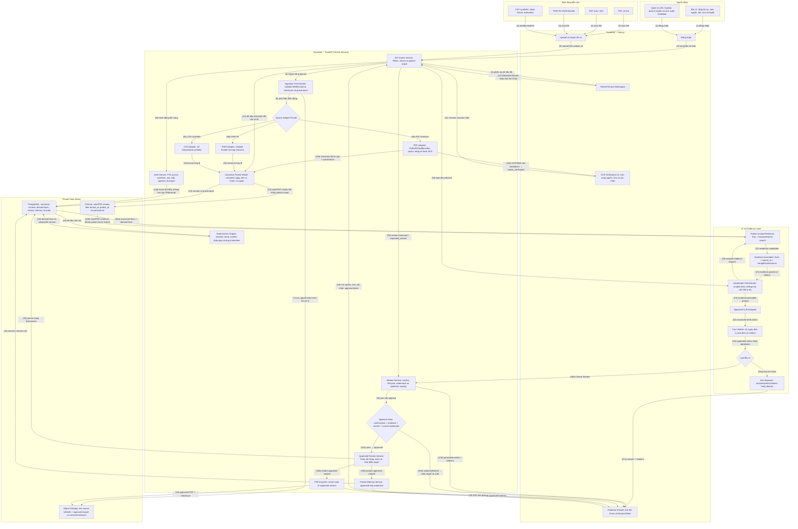
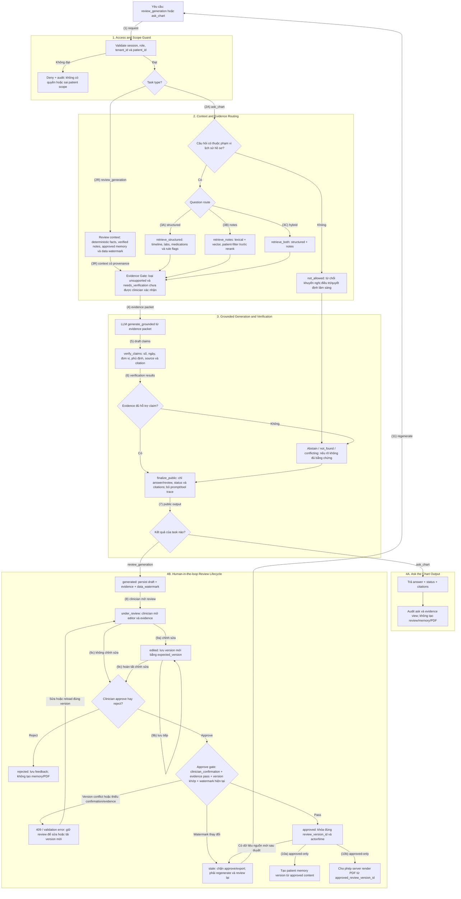
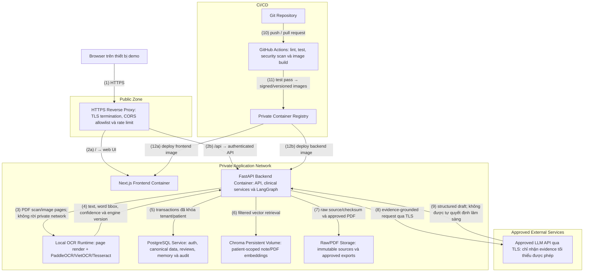

# Clinical Review Copilot — Architecture Diagrams

Ba sơ đồ dưới đây mô tả kiến trúc MVP gồm cả P0 và P1. Các nguyên tắc xuyên suốt là `patient-first`, `evidence-first`, `deterministic-first`, dữ liệu nguồn bất biến và `human-in-the-loop`.

## 1. System Overview Diagram

Sơ đồ này thể hiện luồng tổng thể từ nhập hồ sơ đến tạo bằng chứng, sinh bản nháp, bác sĩ duyệt và chỉ sau đó mới tạo patient memory hoặc PDF bàn giao.

## 2. Agent Flow Diagram

Sơ đồ này tách rõ `review_generation` và `ask_chart`. Ask the Chart kết thúc bằng câu trả lời có citation hoặc abstain; chỉ review mới đi vào quy trình bác sĩ duyệt.

## 3. Deployment Diagram

Sơ đồ deployment giữ đúng network boundary: chỉ reverse proxy public. OCR chạy cục bộ trong backend ở MVP để PDF/ảnh không bị gửi sang dịch vụ OCR bên ngoài.

### Deployment assumptions của MVP

- Chỉ `HTTPS Reverse Proxy` có cổng public; frontend, backend, PostgreSQL, Chroma và raw storage đều ở private network.
- Browser gọi `/` và `/api` qua cùng reverse proxy; frontend container không truy cập trực tiếp database, vector store hoặc LLM.
- OCR P1 chạy cục bộ trong backend. Nếu sau này tách OCR/ingestion thành worker riêng, phải bổ sung durable job queue/broker thay vì vẽ worker đứng một mình.
- Backend chỉ gửi evidence tối thiểu, được phép và đã khóa patient scope tới LLM endpoint qua TLS.
- PDF export được render phía server từ đúng `approved_review_version_id`; client không gửi nội dung tùy ý để xuất.

## Các invariant được ba diagram bảo vệ

| ID | Invariant |
|---|---|
| INV-01 | Mọi truy cập lâm sàng đều qua Auth/RBAC và tenant/patient scope trước khi xử lý. |
| INV-02 | Raw PDF/FHIR/CSV được lưu bất biến cùng checksum trước khi parse/normalize. |
| INV-03 | PDF, FHIR và CSV đi qua adapter riêng; CSV chỉ dùng synthetic fixture/seed. |
| INV-04 | OCR/table low-confidence mang `needs_verification` và không trở thành verified fact trước khi clinician xác nhận. |
| INV-05 | Timeline, trend, conflict, data gap và drug interaction chạy bằng deterministic code/rule trước LLM. |
| INV-06 | Retrieval lọc tenant/patient trước rerank; citation quay lại đúng file/trang/block hoặc FHIR resource. |
| INV-07 | Ask the Chart trả answer/citation/abstain và audit, không đi vào quy trình approve. |
| INV-08 | Review phải qua lifecycle, evidence gate, clinician confirmation, version check và current watermark. |
| INV-09 | Review `stale`, version conflict hoặc unsupported claim bị chặn approve/export. |
| INV-10 | Patient memory và PDF chỉ được tạo từ đúng approved review version. |
| INV-11 | Chỉ reverse proxy public; OCR và kho dữ liệu bệnh nhân ở private network. |
| INV-12 | PHI access, evidence view, ask, edit, approve/reject, memory và export đều được audit. |
