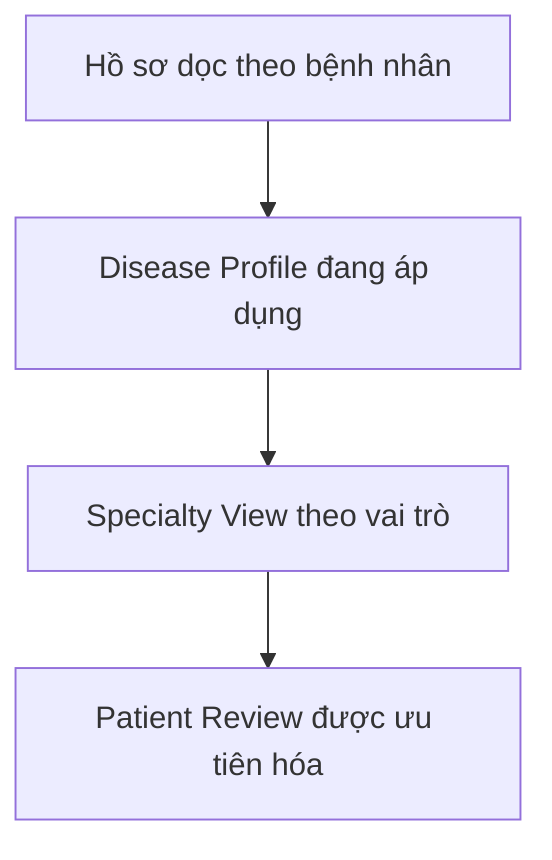
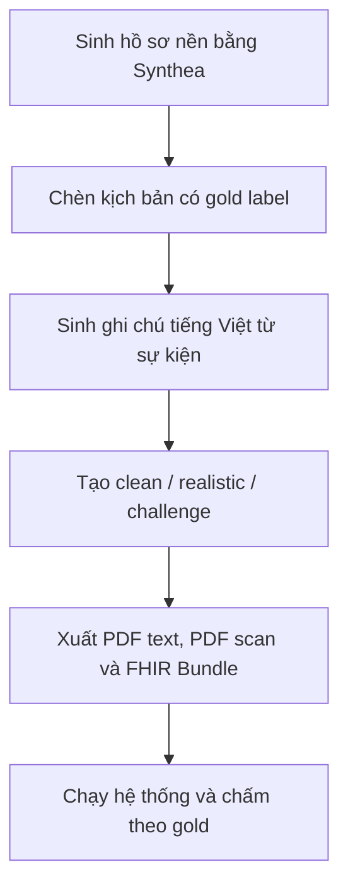
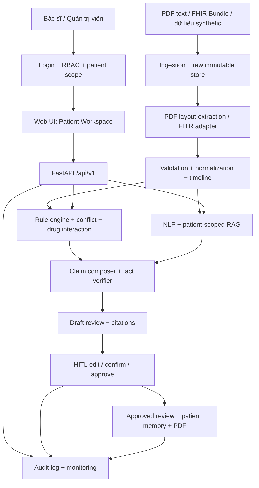

# Clinical Review Copilot

> **Nền tảng hỗ trợ bác sĩ rà soát hồ sơ bệnh nhân dọc, phát hiện thay đổi, trình bày xu hướng, hỏi đáp hồ sơ và dẫn về đúng bằng chứng nguồn.**

**Trạng thái:** Thiết kế MVP nghiên cứu trong 6 tuần  
**Định vị:** Clinical documentation/review support — không phải hệ thống chẩn đoán hay kê đơn  
**Kiến trúc:** Patient-first, hybrid rule + NLP/RAG, evidence-first, source read-only + HITL  
**Use case MVP:** Bác sĩ Nội tiết/Nội tổng hợp rà soát bệnh nhân đái tháo đường type 2 có thể kèm tăng huyết áp hoặc bệnh thận mạn

**Tài liệu kỹ thuật chi tiết:** [`ARCHITECTURE.md`](ARCHITECTURE.md)

---

## Mục lục

1. [Tóm tắt dự án](#1-tóm-tắt-dự-án)
2. [Bài toán thực tế](#2-bài-toán-thực-tế)
3. [Mục tiêu và giới hạn](#3-mục-tiêu-và-giới-hạn)
4. [Nguyên tắc thiết kế](#4-nguyên-tắc-thiết-kế)
5. [Đối tượng sử dụng và phạm vi MVP](#5-đối-tượng-sử-dụng-và-phạm-vi-mvp)
6. [Mô hình Patient-first, Disease Profile và Specialty View](#6-mô-hình-patient-first-disease-profile-và-specialty-view)
7. [Dữ liệu](#7-dữ-liệu)
8. [Kiến trúc tổng thể](#8-kiến-trúc-tổng-thể)
9. [Pipeline xử lý từ đầu đến cuối](#9-pipeline-xử-lý-từ-đầu-đến-cuối)
10. [Rule engine cho dữ liệu có cấu trúc](#10-rule-engine-cho-dữ-liệu-có-cấu-trúc)
11. [NLP/LLM cho ghi chú tự do](#11-nlpllm-cho-ghi-chú-tự-do)
12. [Ask the Chart và RAG](#12-ask-the-chart-và-rag)
13. [Fact Verifier và Evidence Assembler](#13-fact-verifier-và-evidence-assembler)
14. [Đầu ra hệ thống](#14-đầu-ra-hệ-thống)
15. [Workflow sử dụng thực tế](#15-workflow-sử-dụng-thực-tế)
16. [Workflow phát triển và kiểm thử](#16-workflow-phát-triển-và-kiểm-thử)
17. [API và hợp đồng dữ liệu](#17-api-và-hợp-đồng-dữ-liệu)
18. [Công nghệ, cài đặt và cấu trúc repository](#18-công-nghệ-cài-đặt-và-cấu-trúc-repository)
19. [Benchmark và thiết kế thí nghiệm](#19-benchmark-và-thiết-kế-thí-nghiệm)
20. [Bảo mật, riêng tư và quản trị dữ liệu](#20-bảo-mật-riêng-tư-và-quản-trị-dữ-liệu)
21. [Logging, giám sát và phản hồi người dùng](#21-logging-giám-sát-và-phản-hồi-người-dùng)
22. [Kế hoạch MVP 6 tuần](#22-kế-hoạch-mvp-6-tuần)
23. [Phân công nhóm ba người](#23-phân-công-nhóm-ba-người)
24. [Yêu cầu của ban tổ chức và hồ sơ nộp bài](#24-yêu-cầu-của-ban-tổ-chức-và-hồ-sơ-nộp-bài)
25. [Tiêu chí hoàn thành](#25-tiêu-chí-hoàn-thành)
26. [Rủi ro và biện pháp giảm thiểu](#26-rủi-ro-và-biện-pháp-giảm-thiểu)
27. [Hướng mở rộng](#27-hướng-mở-rộng)
28. [Tài liệu tham khảo](#28-tài-liệu-tham-khảo)

---

## 1. Tóm tắt dự án

Trong bệnh viện, thông tin của một bệnh nhân thường nằm rải rác giữa HIS, LIS, EMR, đơn thuốc, kết quả xét nghiệm và ghi chú tự do. Trước mỗi lần tái khám, bác sĩ phải tự tìm lại nhiều bản ghi để biết:

- Chỉ số nào đã tăng hoặc giảm?
- Thuốc nào được thêm, ngừng hoặc đổi liều?
- Có triệu chứng hoặc biến cố mới nào trong ghi chú?
- Thông tin có mâu thuẫn giữa các nguồn không?
- Hồ sơ đang thiếu dữ liệu theo dõi nào?
- Mỗi kết luận được lấy từ bản ghi nào?

Clinical Review Copilot tạo một **lớp đọc hồ sơ ở chế độ read-only** trên hệ thống hiện có. Hệ thống chuẩn hóa dữ liệu thành hồ sơ dọc theo bệnh nhân, chạy thuật toán xác định trên dữ liệu có cấu trúc, dùng NLP/RAG cho ghi chú tự do, sau đó kiểm chứng từng nhận định và gắn bằng chứng nguồn trước khi hiển thị.

### Câu chốt của đề tài

> Xây dựng một Clinical Review Copilot đọc dữ liệu từ HIS–LIS–EMR theo chế độ read-only, chuẩn hóa thành hồ sơ bệnh nhân dọc, kết hợp thuật toán xác định với NLP/RAG để tạo tổng quan, timeline, xu hướng và thay đổi có dẫn chứng; đầu ra được tích hợp vào EMR để bác sĩ kiểm tra, không thay thế quyết định lâm sàng.

### Giá trị cốt lõi

| Giá trị | Hệ thống thực hiện |
|---|---|
| Giảm thời gian tìm hồ sơ | Gom dữ liệu theo bệnh nhân và thời gian |
| Hạn chế bỏ sót thay đổi | Phát hiện thay đổi xét nghiệm, thuốc, chẩn đoán và triệu chứng |
| Tăng khả năng kiểm chứng | Mỗi nhận định có nguồn, ngày và ID bản ghi |
| Hạn chế ảo giác LLM | Không cho LLM tự tính dữ liệu cấu trúc; bắt buộc qua verifier |
| Mở rộng nhiều bệnh/khoa | Dùng Disease Profile và Specialty View cấu hình riêng |

---

## 2. Bài toán thực tế

### 2.1. Pain point

Một bệnh nhân mạn tính có thể có nhiều năm dữ liệu và hàng chục lần khám. Bác sĩ thường gặp bốn vấn đề:

1. **Phân mảnh dữ liệu:** xét nghiệm, thuốc, chẩn đoán và ghi chú nằm ở nhiều hệ thống.
2. **Quá tải thời gian:** không đủ thời gian đọc toàn bộ lịch sử trước mỗi lượt khám.
3. **Khó phát hiện thay đổi nhỏ:** tăng liều, đổi tên thương mại, kết quả khác đơn vị hoặc triệu chứng chỉ xuất hiện trong ghi chú.
4. **Thiếu khả năng truy nguyên:** một bản tóm tắt sinh tự động có thể đúng câu chữ nhưng không chỉ ra dữ liệu nguồn.

### 2.2. Câu hỏi nghiên cứu

> Kiến trúc hybrid gồm rule engine + NLP/RAG + fact verification + evidence citation có giúp bác sĩ tìm thông tin nhanh và chính xác hơn so với xem hồ sơ thô hoặc dùng LLM/RAG thông thường không?

### 2.3. Giả thuyết nghiên cứu

- Hệ thống hybrid giảm thời gian rà soát hồ sơ so với giao diện danh sách bản ghi thô.
- Rule engine giữ chính xác số liệu, ngày và thay đổi thuốc tốt hơn LLM thuần túy.
- Fact verifier và nguồn dẫn làm giảm tỷ lệ nhận định không được hồ sơ hỗ trợ.
- Patient-scoped retrieval làm giảm nguy cơ truy xuất nhầm hồ sơ người bệnh khác.

---

## 3. Mục tiêu và giới hạn

### 3.1. Mục tiêu chức năng

- Deploy ứng dụng có frontend, backend, database và health check.
- Đăng nhập bằng tài khoản bác sĩ/quản trị viên và phân quyền theo vai trò.
- Tìm kiếm, chọn hoặc nhập một hồ sơ bệnh nhân mô phỏng.
- Nhập **PDF có text** là luồng chính; nhập FHIR R4 JSON Bundle là luồng chuẩn có cấu trúc.
- Hỗ trợ PDF scan/ảnh qua OCR có kiểm soát trong P1 bắt buộc.
- Giữ bản dữ liệu gốc bất biến để đối chiếu.
- Chuẩn hóa bệnh nhân, lượt khám, xét nghiệm, thuốc, chẩn đoán, dấu hiệu sinh tồn và ghi chú.
- Xây dựng timeline dọc theo bệnh nhân.
- Phát hiện thay đổi xét nghiệm, thuốc, chẩn đoán và triệu chứng.
- Hiển thị timeline và biểu đồ xu hướng có tương tác.
- Phát hiện mâu thuẫn dữ liệu và gắn cờ tương tác thuốc cần bác sĩ rà soát.
- Sinh tóm tắt lâm sàng có cấu trúc và trích nguồn cho từng mục.
- Hỏi đáp lịch sử bệnh án bằng Ask the Chart.
- Dẫn về đúng bản ghi nguồn cho từng nhận định.
- Hiển thị disclaimer cố định và yêu cầu bác sĩ xác nhận đã kiểm tra nguồn.
- Cho phép bác sĩ chỉnh sửa, duyệt/từ chối và lưu phiên bản tóm tắt.
- Tạo patient memory từ dữ kiện hoặc bản tóm tắt đã được bác sĩ duyệt.
- Xuất PDF bản giao chỉ từ phiên bản đã duyệt.
- Ghi audit log cho truy cập PHI và các hành động tạo, sửa, duyệt, xuất.
- Cho phép bác sĩ đánh dấu claim đúng, sai hoặc không liên quan để đánh giá chất lượng.

### 3.2. Phân tầng tính năng

| Mức | Tính năng | Quy tắc ưu tiên |
|---|---|---|
| `P0 — Core bắt buộc` | Deploy; đăng nhập bác sĩ/quản trị; chọn/nhập hồ sơ mô phỏng; agent sinh tóm tắt có cấu trúc; citation từng mục; disclaimer và xác nhận bác sĩ | Phải chạy end-to-end trước để làm nền tảng cho P1 |
| `P1 — Advanced bắt buộc` | PDF scan/ảnh qua OCR có xác minh; timeline/biểu đồ tương tác; conflict flag; drug interaction; HITL chỉnh–duyệt–lưu; patient memory; PDF; audit dashboard | Phải hoàn tất trong MVP sáu tuần; làm theo vertical slice sau P0, demo được ít nhất một tình huống thật cho từng module |
| `P2 — Sau MVP` | SSO bệnh viện thật, FHIR server thật, nhiều khoa/bệnh, EMR write-back có phê duyệt, pilot prospective | Không đưa vào critical path sáu tuần |

Với nhóm ba người, nếu thiếu thời gian thì giảm số cặp tương tác thuốc, số profile/dataset và độ phong phú của giao diện; không được cắt P1, xác thực, patient isolation, citation, disclaimer, OCR có xác minh hoặc bước bác sĩ xác nhận.

### 3.3. Ngoài phạm vi MVP

- Không tự chẩn đoán bệnh.
- Không khuyến nghị hoặc tự động thay đổi điều trị.
- Không kê đơn.
- Không tự ghi nội dung trở lại EMR. Ứng dụng chỉ lưu bản nháp, phiên bản đã duyệt, patient memory và audit log trong kho nội bộ của chính ứng dụng.
- Không xử lý ảnh PACS, CT, MRI hoặc X-quang.
- Không dùng cho cảnh báo cấp cứu thời gian thực.
- Không huấn luyện một foundation model y khoa từ đầu.
- Không tuyên bố hiệu quả lâm sàng chỉ dựa trên dữ liệu giả.

### 3.4. Ranh giới trách nhiệm

Hệ thống chỉ có nhiệm vụ:

> **Trình bày dữ kiện, thay đổi, khoảng trống và nguồn bằng chứng để bác sĩ rà soát.**

Quyết định lâm sàng cuối cùng luôn thuộc về bác sĩ.

---

## 4. Nguyên tắc thiết kế

| Nguyên tắc | Cách áp dụng |
|---|---|
| Patient-first | Một hồ sơ dọc duy nhất cho mỗi bệnh nhân, không tách dữ liệu thành các hệ thống theo bệnh |
| Evidence-first | Không hiển thị nhận định như sự thật nếu không tìm được nguồn hỗ trợ |
| Deterministic-first | Số liệu, ngày, đơn vị và thay đổi thuốc được xử lý bằng code/rule |
| LLM only where needed | LLM chủ yếu xử lý ghi chú tự do và diễn đạt câu tóm tắt |
| Human-in-the-loop | Bản AI sinh luôn là draft; bác sĩ phải xem nguồn, chỉnh sửa nếu cần và xác nhận trước khi duyệt/xuất |
| Source read-only | Dữ liệu HIS/LIS/EMR không bị sửa; ứng dụng chỉ ghi review version, memory đã duyệt, feedback và audit vào kho riêng |
| Raw data immutable | Dữ liệu gốc không bị sửa trong quá trình làm sạch |
| Patient isolation | Mọi truy vấn và truy xuất đều bị khóa theo `patient_id` |
| Configurable clinical logic | Ngưỡng mục tiêu và ưu tiên do bệnh viện/bác sĩ cấu hình, không hard-code tùy tiện |
| Graceful abstention | Không đủ dữ liệu thì trả lời “không tìm thấy bằng chứng”, không đoán |

---

## 5. Đối tượng sử dụng và phạm vi MVP

### 5.1. Đối tượng sử dụng

- **Clinician:** bác sĩ điều trị chính, Nội tổng hợp hoặc Nội tiết; xem, sửa, duyệt và xuất bản giao cho bệnh nhân được phân công.
- **Administrator:** quản lý tài khoản, vai trò, cấu hình và audit; không mặc định được xem toàn bộ nội dung lâm sàng.
- **Auditor/Reviewer:** chỉ đọc audit hoặc dữ liệu đã ẩn danh theo phạm vi được giao.
- **Nhóm nghiên cứu:** đánh giá pipeline trên dữ liệu synthetic/đã được phép, không dùng quyền production.

### 5.2. Use case MVP

MVP chọn bệnh nhân **đái tháo đường type 2 có thể kèm tăng huyết áp hoặc bệnh thận mạn** vì nhóm bệnh này có:

- Nhiều lần tái khám theo thời gian.
- Chỉ số định lượng rõ như HbA1c, glucose, huyết áp, eGFR, creatinine và cân nặng.
- Thay đổi thuốc và liều thuốc.
- Thông tin quan trọng trong ghi chú như hạ đường huyết, quên thuốc hoặc tác dụng phụ.
- Kịch bản đủ rõ để tạo gold label và benchmark.

Đái tháo đường chỉ là **bài kiểm tra đầu tiên cho kiến trúc**, không phải giới hạn lâu dài của sản phẩm.

Luồng demo MVP bắt buộc có cả hai pha: `đăng nhập → chọn/nhập PDF text, PDF scan hoặc FHIR mô phỏng → chạy agent → xem tóm tắt có citation → xác nhận disclaimer → mở timeline/trend/conflict/interaction → chỉnh sửa → duyệt → cập nhật memory → xuất PDF → xem audit log`. P0 là checkpoint nền tảng; P1 là phần bắt buộc để hoàn tất demo.

### 5.3. Phạm vi dữ liệu MVP

| Thành phần | Phạm vi đề xuất |
|---|---|
| Bệnh nhân giả | 200 người |
| Bệnh nhân thuộc use case chính | 100–150 người |
| Lần khám mỗi bệnh nhân | 4–10 lần |
| Tổng lượt khám | Khoảng 1.000–1.500 |
| Hồ sơ công khai để kiểm tra ETL | MIMIC-IV Demo |
| Pilot bệnh viện tương lai | 20–50 hồ sơ đã ẩn danh |
| Dữ liệu nhập | PDF có text và FHIR R4 JSON Bundle; PDF scan/ảnh qua OCR là P1 bắt buộc |
| Dữ liệu xử lý | Xét nghiệm, thuốc, chẩn đoán, vital signs, ghi chú |

---

## 6. Mô hình Patient-first, Disease Profile và Specialty View

Hệ thống không hoạt động thuần túy “theo bệnh” hoặc “theo khoa”. Kiến trúc gồm ba lớp:

### 6.1. Patient Record — theo bệnh nhân

Lưu toàn bộ lịch sử của một bệnh nhân bất kể dữ liệu được tạo ở khoa nào:

- Lượt khám.
- Xét nghiệm.
- Thuốc.
- Chẩn đoán.
- Dấu hiệu sinh tồn.
- Thủ thuật/nhập viện nếu có.
- Ghi chú lâm sàng.

### 6.2. Disease Profile — theo bệnh

Mỗi Disease Profile quy định:

- Chỉ số cần theo dõi.
- Thuốc và nhóm thuốc quan trọng.
- Triệu chứng/sự kiện cần trích xuất.
- Khoảng thời gian theo dõi dữ liệu.
- Quy tắc sắp xếp ưu tiên.
- Biểu đồ cần hiển thị.

Ví dụ:

```yaml
disease_id: type_2_diabetes
tracked_labs:
  - hba1c
  - fasting_glucose
  - egfr
  - creatinine
tracked_vitals:
  - blood_pressure
  - weight
tracked_events:
  - hypoglycemia
  - medication_nonadherence
  - adverse_drug_effect
tracked_medication_groups:
  - biguanide
  - insulin
  - sulfonylurea
display_priority:
  - recent_hypoglycemia
  - medication_change
  - sustained_lab_trend
  - missing_followup_data
```

Các mục tiêu như HbA1c hoặc huyết áp **không được cố định trong code**. Chúng phải được cấu hình theo bệnh viện, bác sĩ và bối cảnh từng bệnh nhân.

### 6.3. Specialty View — theo khoa/bác sĩ

Specialty View quyết định thứ tự ưu tiên hiển thị, không xóa bỏ dữ liệu liên chuyên khoa.

| Người sử dụng | Nội dung ưu tiên |
|---|---|
| Bác sĩ Nội tiết | HbA1c, glucose, thuốc tiểu đường, hạ đường huyết |
| Bác sĩ Thận | eGFR, creatinine, kali, albumin niệu, thuốc liên quan chức năng thận |
| Bác sĩ Tim mạch | Huyết áp, EF/BNP nếu có, thuốc tim mạch, biến cố tim mạch |
| Bác sĩ điều trị chính | Tổng quan đa bệnh và các mâu thuẫn liên chuyên khoa |

### 6.4. Luồng cá nhân hóa



---

## 7. Dữ liệu

## 7.1. Hợp đồng đầu vào MVP

PDF/ảnh là định dạng **tài liệu phổ biến để người dùng đưa vào hệ thống**, còn FHIR là định dạng **trao đổi dữ liệu có cấu trúc giữa các hệ thống**. Chúng được chuẩn hóa về cùng Canonical Patient Model; không đưa nguyên file cho LLM.

| Input | Mức | Mục đích | Kỹ thuật triển khai khả thi |
|---|---|---|---|
| PDF có text | **P0 bắt buộc** | Đơn thuốc, phiếu xét nghiệm, giấy ra viện, ghi chú khám | PyMuPDF/pdfplumber trích text theo từng trang và block tọa độ; giữ bảng; section-aware chunking; citation `file · page · block/table` |
| FHIR R4 JSON Bundle | **P0 bắt buộc** | Chứng minh khả năng tích hợp chuẩn y tế | Validate JSON/schema; adapter cho `Patient`, `Encounter`, `Observation`, `Condition`, `MedicationRequest`, `AllergyIntolerance`, `DiagnosticReport`, `DocumentReference` |
| PDF scan hoặc ảnh | **P1 bắt buộc** | Hỗ trợ tài liệu không có text layer | Phát hiện text layer rỗng → render trang 300 dpi → PaddleOCR/VietOCR/Tesseract; lưu confidence, bounding box và bắt buộc người dùng sửa/xác nhận khi dùng dữ kiện OCR |

### Hợp đồng citation cho tài liệu

Mọi evidence từ PDF phải mang tối thiểu `document_id`, `document_name`, `page_number`, `block_id` hoặc `table_id`, `char_start/end` (khi có text layer), `source_checksum` và đoạn trích ngắn. UI mở đúng trang PDF đã lưu bất biến; không chỉ hiện một danh sách nguồn chung cuối review.

### Kỹ thuật để PDF có thể dùng được trong 6 tuần

1. **Triage tài liệu:** kiểm tra MIME/magic bytes, số trang/kích thước, checksum SHA-256 và có text layer hay không; chặn file lỗi/mật khẩu/không thuộc allowlist.
2. **Layout-aware extraction:** giữ page/block/bảng thay vì nối toàn bộ PDF thành một chuỗi. Dùng heading, khoảng cách, nhãn như “Xét nghiệm”, “Chẩn đoán”, “Đơn thuốc” để phân đoạn.
3. **Trích xuất hybrid:** regex + parser xác định cho ngày, giá trị, đơn vị, thuốc/liều; LLM/NLP theo JSON schema chỉ cho thực thể trong đoạn nguồn. Giá trị số và chuyển đổi đơn vị luôn được code kiểm tra lại.
4. **Table-aware parsing:** bắt đầu bằng các bảng đơn giản của phiếu xét nghiệm/đơn thuốc; nếu bảng không parse chắc chắn thì lưu text block, gắn cờ `needs_verification`, không tự suy ra cột.
5. **Retrieval theo trang:** BM25/lexical + embedding trên chunk có metadata; filter `tenant_id` và `patient_id` trước retrieval; rerank chỉ trong tập đã scope.
6. **Evidence gate:** claim chỉ hiển thị như fact khi verifier khớp lại số/ngày/thuốc với canonical record và có citation đến đúng file/trang/block.

OCR không phải điều kiện để checkpoint P0 pass, nhưng là điều kiện để MVP hoàn thành: demo tối thiểu 1–2 phiếu scan/ảnh synthetic, công khai confidence/giới hạn và buộc clinician xác nhận mọi dữ kiện không đạt ngưỡng tin cậy hoặc validation.

## 7.2. Nguồn dữ liệu

| Nguồn | Vai trò trong dự án | Ưu điểm | Hạn chế |
|---|---|---|---|
| [Synthea](https://synthetichealth.github.io/synthea/) | Sinh hồ sơ bệnh nhân giả theo thời gian | Không chứa bệnh nhân thật; dự án chỉ sử dụng đầu ra FHIR | Dữ liệu khá sạch và theo bối cảnh Mỹ |
| Bộ dữ liệu giả tiếng Việt có gold label | Kiểm thử đúng các kịch bản sản phẩm cần phát hiện | Biết chính xác đáp án đúng | Phải thiết kế kịch bản có kiểm soát |
| [MIMIC-IV Demo](https://physionet.org/content/mimic-iv-demo/) | Kiểm tra ETL trên dữ liệu bệnh viện đã ẩn danh | Dữ liệu thực tế hơn; demo mở gồm 100 bệnh nhân | Chủ yếu nội trú/critical care; không có clinical notes tự do |
| Dữ liệu bệnh viện đã ẩn danh | Pilot cuối cùng | Phản ánh bối cảnh Việt Nam | Cần phê duyệt đạo đức, pháp lý và quản trị dữ liệu |

Không nên dùng bệnh án lấy từ Internet hoặc Kaggle nếu không xác định rõ nguồn, giấy phép và quy trình ẩn danh.

## 7.3. Chiến lược dữ liệu ba tầng

1. **Synthetic clean:** kiểm tra logic cơ bản và tính đúng tuyệt đối.
2. **Synthetic realistic/challenge:** kiểm tra dữ liệu thiếu, trùng, mâu thuẫn, phủ định, sai đơn vị và diễn đạt tiếng Việt.
3. **De-identified real-world:** kiểm tra khả năng chịu dữ liệu bệnh viện thực tế và độ tổng quát.

## 7.4. Các lớp lưu trữ

| Lớp | Nội dung | Quy tắc |
|---|---|---|
| Raw zone | PDF/ảnh/FHIR Bundle nhận được | Bất biến; có checksum; không ghi đè |
| Staging zone | Dữ liệu đã parse và gắn lỗi validation | Có thể tái tạo từ raw |
| Canonical clinical store | Dữ liệu đã chuẩn hóa theo schema nội bộ | Mọi record giữ liên kết về nguồn |
| Derived event store | Thay đổi, xu hướng, cảnh báo dữ liệu thiếu | Có version của rule/profile |
| Evidence store | Nguồn hỗ trợ cho từng claim | Chỉ chứa ID và đoạn cần thiết |
| Vector index | Embedding của các đoạn ghi chú | Tách theo tenant và khóa theo patient |
| Review cache | Patient Review đã xử lý trước | Có thời điểm tạo và thời điểm hết hạn |
| Application write store | Người dùng, review version, approval, memory và audit | Tách khỏi dữ liệu nguồn; có version và actor |

## 7.5. Mô hình dữ liệu chuẩn nội bộ

| Bảng/đối tượng | Trường cốt lõi |
|---|---|
| `patients` | `patient_id`, thông tin nhân khẩu tối thiểu, trạng thái ẩn danh |
| `users`, `roles`, `user_patient_scopes` | tài khoản, vai trò và phạm vi bệnh nhân được phép truy cập |
| `encounters` | `encounter_id`, `patient_id`, loại khám, khoa, thời gian bắt đầu/kết thúc |
| `observations` | `observation_id`, mã xét nghiệm/vital, giá trị, đơn vị, thời gian lấy mẫu |
| `medications` | `medication_id`, tên chuẩn, hàm lượng, liều, tần suất, đường dùng, trạng thái |
| `conditions` | `condition_id`, mã chẩn đoán, trạng thái, ngày bắt đầu/kết thúc |
| `notes` | `note_id`, loại ghi chú, nội dung, tác giả/đơn vị, thời gian |
| `source_documents` | `document_id`, `patient_id`, tên file, loại, checksum, storage ref, text-layer/OCR status |
| `document_pages` | `document_id`, `page_number`, text, render ref, extraction version |
| `document_blocks` | `block_id`, `page_id`, loại heading/paragraph/table, text, bbox, char range, confidence |
| `events` | `event_id`, loại sự kiện, giá trị trước/sau, mức tin cậy, rule/model version |
| `claims` | `claim_id`, câu hiển thị, trạng thái verification, thời gian tạo |
| `evidence_links` | `claim_id`, `source_record_id`, `source_span`, vai trò bằng chứng |
| `review_snapshots` | `review_id`, `patient_id`, `status`, `generated_at`, `data_watermark`, version |
| `review_versions` | nội dung AI ban đầu, nội dung bác sĩ chỉnh, người sửa, thời điểm, parent version |
| `review_approvals` | xác nhận disclaimer, quyết định duyệt/từ chối, người và thời điểm thực hiện |
| `patient_memory_versions` | memory theo bệnh nhân đã được bác sĩ duyệt, nguồn review và version |
| `drug_interaction_rules` | cặp hoạt chất, mức độ, mô tả, nguồn tri thức và version rule |
| `drug_interaction_flags` | tương tác phát hiện trong hồ sơ, thuốc liên quan, trạng thái bác sĩ rà soát |
| `export_jobs` | review version được xuất, checksum file, người yêu cầu và trạng thái |
| `feedback` | `claim_id`, người đánh giá, đúng/sai/không liên quan, ghi chú |
| `audit_logs` | người dùng, hành động, bệnh nhân, thời điểm, kết quả |

## 7.6. Event envelope dùng chung

Mọi dữ kiện chuẩn hóa nên có một lớp metadata thống nhất:

```json
{
  "event_id": "EVT-000381",
  "patient_id": "BN001",
  "event_type": "lab_result",
  "event_time": "2026-08-20T08:10:00+07:00",
  "code": "hba1c",
  "value": 8.7,
  "unit": "%",
  "source_system": "LIS",
  "source_record_id": "LIS-20260820-044",
  "ingested_at": "2026-08-20T08:15:32+07:00",
  "transform_version": "lab-normalizer-1.0.0",
  "data_quality_flags": []
}
```

## 7.7. Provenance bắt buộc

Mỗi record phải giữ được:

- `patient_id` nội bộ.
- Hệ thống nguồn.
- ID bản ghi nguồn.
- Thời điểm sự kiện.
- Thời điểm đồng bộ.
- Phiên bản adapter/transform.
- Dấu vết giá trị gốc và giá trị chuẩn hóa.
- Cờ chất lượng dữ liệu.
- Checksum của file/bản ghi raw nếu phù hợp.
- Với PDF: `document_id`, số trang, block/table và confidence OCR (nếu có).

## 7.8. Kiểm tra chất lượng dữ liệu

| Nhóm kiểm tra | Ví dụ |
|---|---|
| Schema | Thiếu `patient_id`, sai kiểu ngày, trường bắt buộc rỗng |
| Range | HbA1c hoặc huyết áp nằm ngoài miền hợp lý cần xác minh |
| Unit | `mg/dL` và `mmol/L`; đơn vị thiếu hoặc không hỗ trợ |
| Identity | Bản ghi không liên kết được với bệnh nhân hoặc lượt khám |
| Time | Ngày kết thúc trước ngày bắt đầu; thời gian tương lai bất thường |
| Duplicate | Hai record giống nhau từ cùng hệ thống nguồn |
| Conflict | Hai kết quả cùng thời điểm nhưng giá trị khác nhau |
| Terminology | Tên thuốc/mã xét nghiệm không ánh xạ được |
| Completeness | Không có dữ liệu theo dõi trong khoảng cấu hình |
| PDF extraction | Trang không có text, bảng vỡ cột, tọa độ/encoding lỗi hoặc OCR confidence thấp |

Không được “sửa im lặng” raw data. Nếu chuyển đổi đơn vị hoặc chuẩn hóa tên, phải lưu cả giá trị gốc và phép biến đổi.

## 7.9. Sinh bộ dữ liệu giả có gold label

### Nguyên tắc

Không yêu cầu LLM tự viết ngẫu nhiên bệnh án rồi coi đó là benchmark. Gold truth phải được tạo trước bằng code/kịch bản, sau đó LLM chỉ được dùng để diễn đạt các sự kiện thành ghi chú tự nhiên.

### Pipeline sinh dữ liệu



### Ví dụ gold event

```json
{
  "patient_id": "BN001",
  "gold_events": [
    {
      "type": "lab_change",
      "test": "hba1c",
      "old_value": 7.5,
      "new_value": 8.7,
      "old_record": "LIS-001",
      "new_record": "LIS-004"
    },
    {
      "type": "medication_dose_change",
      "drug": "metformin",
      "old_dose": "500 mg x 2 lần/ngày",
      "new_dose": "1000 mg x 2 lần/ngày",
      "source_records": ["RX-002", "RX-003"]
    },
    {
      "type": "new_symptom",
      "name": "hạ đường huyết",
      "source_note": "NOTE-004"
    }
  ]
}
```

### Ba mức độ khó

| Tập | Đặc điểm |
|---|---|
| `clean` | Đủ trường, đúng đơn vị, không trùng, không mâu thuẫn |
| `realistic` | Thiếu trường, tên thuốc khác nhau, nhiều định dạng ngày/đơn vị, bản ghi trùng |
| `challenge` | Phủ định, tiền sử, mâu thuẫn, OCR sai, đổi thương hiệu, sự kiện không chắc chắn |

### Tình huống challenge bắt buộc

- Glucose xuất hiện ở cả `mg/dL` và `mmol/L`.
- `Metformin`, `Metformin 500` và tên thương mại cùng chỉ một hoạt chất.
- Đơn cũ có thuốc nhưng đơn mới không có, chưa đủ căn cứ kết luận đã ngừng.
- “Chưa ghi nhận hạ đường huyết” để kiểm tra phủ định.
- “Tiền sử hạ đường huyết năm 2023” để kiểm tra thời gian.
- Hai kết quả cùng ngày khác giá trị.
- Không có HbA1c trong khoảng thời gian theo dõi cấu hình.
- Bản ghi bị lặp lại.
- Ghi chú nói đang dùng thuốc nhưng danh sách thuốc không có.
- Câu hỏi không thể trả lời từ dữ liệu.
- Ghi chú của bệnh nhân khác có từ khóa tương tự để kiểm tra patient isolation.

---

## 8. Kiến trúc tổng thể



## 8.1. Thành phần hệ thống

| Thành phần | Trách nhiệm |
|---|---|
| Source adapters | Đọc PDF text/scan/ảnh theo trang/block và FHIR R4 JSON Bundle; ánh xạ về schema nội bộ |
| Document extraction | Phát hiện text layer, trích xuất layout/bảng, tạo page/block citation; OCR P1 bắt buộc cho tài liệu scan, có confidence và xác minh |
| Raw store | Lưu dữ liệu gốc bất biến để tái xử lý/đối chiếu |
| Validator | Kiểm tra schema, kiểu dữ liệu, trùng, conflict và chất lượng |
| Normalizer | Chuẩn hóa mã, tên thuốc, đơn vị, ngày và quan hệ giữa các record |
| Timeline builder | Sắp xếp các sự kiện theo thời gian và xử lý event time/record time |
| Rule engine | Tính thay đổi, xu hướng, medication diff và data gap |
| NLP extractor | Trích xuất sự kiện từ ghi chú tự do có phủ định/thời gian |
| Retrieval layer | SQL cho dữ liệu cấu trúc; pgvector cho ghi chú, khóa theo bệnh nhân |
| Auth/RBAC | Đăng nhập, phát token/session, kiểm tra vai trò và patient scope trên mọi request |
| Medication Safety Engine | Đối chiếu danh sách thuốc với rule có version; chỉ gắn cờ cần rà soát |
| Claim composer | Diễn đạt dữ kiện chuẩn hóa thành câu ngắn cho bác sĩ |
| Fact verifier | Đối chiếu lại số, ngày, thuốc, liều và nguồn |
| Evidence assembler | Gắn record nguồn và đoạn văn hỗ trợ cho từng claim |
| Review workflow | Quản lý `generated → under_review → edited → approved/rejected`, version và optimistic locking |
| Patient memory | Chỉ lưu ngữ cảnh đã duyệt theo từng bệnh nhân; không dùng “memory tự do” của LLM |
| PDF exporter | Tạo bản giao từ đúng review version đã duyệt, có disclaimer và dấu vết người duyệt |
| Review API | Cung cấp auth, patient list/import, review, timeline, trends, QA, approval, memory, export và audit |
| Frontend | Login, Patient Workspace, Clinical Review, Review Editor, Evidence Drawer và Admin/Audit |
| Audit/monitoring | Ghi truy cập PHI, lỗi pipeline, thay đổi review, xuất PDF, độ trễ và phản hồi |

## 8.2. Hai đường xử lý tách biệt

| Dữ liệu | Công cụ chính | Lý do |
|---|---|---|
| Xét nghiệm, thuốc, chẩn đoán, vital signs | SQL + rule engine | Cần giữ chính xác số, ngày, đơn vị và phép so sánh |
| Ghi chú tự do | NLP/LLM + vector retrieval | Cần hiểu phủ định, thời gian, diễn đạt và ngữ cảnh |

LLM không được dùng làm máy tính cho những phần đã có thể xác định bằng code.

---

## 9. Pipeline xử lý từ đầu đến cuối

### Bước 1 — Đăng nhập và chọn bệnh nhân cần xử lý

- Xác thực bác sĩ/quản trị viên và tạo session/token ngắn hạn.
- Nhận danh sách bệnh nhân mô phỏng trong đúng phạm vi quyền hoặc cho phép import hồ sơ mô phỏng.
- Xác định `tenant_id`, `patient_id` và khoảng thời gian cần đọc.
- Kiểm tra người dùng/hệ thống có quyền đọc bệnh nhân đó.

### Bước 2 — Ingestion

- Adapter nhận PDF text, PDF scan/ảnh hoặc FHIR R4 JSON Bundle.
- Mỗi batch có `ingestion_batch_id`.
- Lưu raw payload trước khi biến đổi.
- Tính checksum để phát hiện file/bản ghi lặp.
- Với PDF có text: tách theo trang → block/table → section/chunk, giữ tọa độ và reference để UI mở lại đúng nguồn.
- Với FHIR: validate Bundle rồi map resource vào staging; không giả định resource không có trong subset MVP.
- Với scan: đánh dấu `ocr_pending` hoặc `ocr_low_confidence`; không cho OCR tự tạo claim factual chưa được xác minh.

### Bước 3 — Validation

- Kiểm tra schema và kiểu dữ liệu.
- Phân loại lỗi: `error`, `warning`, `info`.
- Record lỗi không bị xóa; được đưa vào quarantine để xử lý lại.

### Bước 4 — Chuẩn hóa

- Chuẩn hóa định dạng thời gian và múi giờ.
- Chuẩn hóa tên/mã xét nghiệm.
- Chuẩn hóa tên thuốc, hoạt chất, hàm lượng, liều và tần suất.
- Chuyển đổi đơn vị bằng bảng conversion đã kiểm định.
- Liên kết record với bệnh nhân và lượt khám.

### Bước 5 — Xây dựng timeline

- Ưu tiên thời điểm lâm sàng thực tế như `specimen_time`, `effective_time` hoặc ngày kê đơn.
- Giữ riêng `recorded_time` và `ingested_time`.
- Sắp xếp sự kiện theo quy tắc ổn định khi cùng thời điểm.

### Bước 6 — Áp dụng Disease Profile và Specialty View

- Chọn các chỉ số, thuốc và sự kiện cần theo dõi.
- Đọc các ngưỡng/gap interval từ cấu hình.
- Không loại bỏ sự kiện quan trọng liên chuyên khoa.

### Bước 7 — Rule engine

- Tính delta giữa các xét nghiệm liên tiếp.
- Phát hiện tăng/giảm liên tục.
- So sánh đơn thuốc và medication state.
- Phát hiện chẩn đoán mới.
- Phát hiện dữ liệu thiếu theo khoảng cấu hình.
- Gắn cờ mâu thuẫn thay vì tự chọn một giá trị.

### Bước 8 — NLP extraction

- Chọn ghi chú mới/chưa xử lý.
- Trích xuất triệu chứng, biến cố, tuân thủ thuốc và tác dụng phụ.
- Phân tích phủ định, thời gian, chủ thể và mức độ chắc chắn.
- Trả về JSON có `source_note_id` và `source_span`.

### Bước 9 — Index ghi chú

- Chia đoạn theo cấu trúc ghi chú, không cắt tùy tiện giữa câu/sự kiện.
- Gắn metadata gồm `tenant_id`, `patient_id`, `note_id`, thời gian và loại ghi chú.
- Sinh embedding và lưu vào vector index.

### Bước 10 — Tạo claim

- Dữ kiện chuẩn hóa được chuyển thành câu ngắn.
- Claim chỉ chứa thông tin đã có trong event store.
- Mỗi claim có loại, mức ưu tiên và danh sách evidence dự kiến.

### Bước 11 — Kiểm chứng

- Đối chiếu số, đơn vị, ngày, thuốc và liều với canonical store.
- Kiểm tra evidence có thực sự hỗ trợ claim.
- Không đủ nguồn: chuyển sang `unsupported` và không hiển thị như sự thật.
- Mâu thuẫn: chuyển sang `needs_verification`.

### Bước 12 — Tạo Review Snapshot

- Sinh overview, changes, trends và timeline.
- Cache theo `patient_id`, profile version và data watermark.
- Lưu thời điểm đồng bộ cuối cùng.

### Bước 13 — Hiển thị draft, disclaimer và nhận phản hồi

- Frontend đọc Review API.
- Bác sĩ mở nguồn cho từng claim.
- Bác sĩ đánh dấu đúng, sai hoặc không liên quan.
- Mọi review AI sinh có trạng thái `generated` và disclaimer cố định.
- Chưa xác nhận kiểm tra nguồn thì không được duyệt hoặc xuất PDF.
- Feedback được lưu để phân tích lỗi, không tự động thay đổi luật production.

### Bước 14 — HITL chỉnh sửa và duyệt

- Khi bác sĩ mở editor, review chuyển sang `under_review`.
- Mỗi lần lưu tạo một `review_version`; không ghi đè phiên bản AI hoặc phiên bản đã duyệt.
- Bác sĩ phải đánh dấu “Tôi đã kiểm tra nội dung và các bằng chứng nguồn”.
- Hệ thống lưu người duyệt, thời điểm, version, data watermark và kết quả `approved`/`rejected`.
- Nếu hồ sơ nguồn đổi trong khi duyệt, review bị đánh dấu `stale` và phải tạo lại/đối chiếu trước khi duyệt.

### Bước 15 — Cập nhật patient memory

- Chỉ trích xuất memory từ review đã duyệt hoặc dữ kiện xác định đã có nguồn.
- Lưu version theo `tenant_id + patient_id`, gồm vấn đề đang theo dõi, dị ứng, thuốc hiện hành, mâu thuẫn chưa giải quyết và ghi chú bàn giao.
- Agent đọc đúng memory của bệnh nhân và luôn phân biệt `approved_memory` với `source_record`.

### Bước 16 — Xuất PDF bản giao

- Chỉ nhận `approved_review_version_id`.
- PDF chứa nội dung đã duyệt, citation/reference appendix, disclaimer, người duyệt, thời điểm và checksum/version.
- Việc xuất/tải PDF được ghi audit; PDF không tự động ghi trở lại EMR.

### Bước 17 — Audit và giám sát

- Ghi `login`, `patient_list`, `patient_view`, `evidence_view`, `ask`, `review_generate`, `review_edit`, `review_approve/reject`, `memory_read/write`, `pdf_export/download` và thay đổi quyền.
- Audit log là append-only trong phạm vi MVP; administrator/auditor chỉ xem theo quyền.
- Log chấm bài của BTC và clinical audit log là hai hệ thống khác nhau.

---

## 10. Rule engine cho dữ liệu có cấu trúc

## 10.1. Phát hiện thay đổi xét nghiệm

Đối với mỗi `patient_id + normalized_test_code`:

1. Sắp xếp kết quả theo thời gian lâm sàng.
2. Chuẩn hóa đơn vị về canonical unit.
3. Loại bản ghi trùng chính xác nhưng giữ log.
4. So sánh các lần liên tiếp.
5. Tính:
   - `absolute_delta = new_value - old_value`
   - `relative_delta = absolute_delta / |old_value|` khi hợp lệ
   - hướng `increase`, `decrease` hoặc `stable`
6. Phát hiện chuỗi tăng/giảm liên tục.
7. Gắn hai nguồn cũ/mới cho sự kiện thay đổi.

Ví dụ:

```json
{
  "event_type": "lab_change",
  "test": "hba1c",
  "old": {"value": 7.5, "unit": "%", "record_id": "LIS-001"},
  "new": {"value": 8.7, "unit": "%", "record_id": "LIS-004"},
  "absolute_delta": 1.2,
  "direction": "increase"
}
```

Rule engine chỉ báo thay đổi. Việc “đạt mục tiêu” hay “bất thường” chỉ được kết luận khi có cấu hình đã được bệnh viện phê duyệt.

## 10.2. So sánh thuốc

Medication diff phải so sánh các trường:

- Hoạt chất chuẩn hóa.
- Tên thương mại/tên gốc.
- Hàm lượng.
- Số đơn vị mỗi lần dùng.
- Tần suất.
- Đường dùng.
- Ngày bắt đầu/kết thúc.
- Trạng thái kê đơn, xác nhận sử dụng hoặc ngừng.

Các loại thay đổi:

| Nhãn | Ví dụ |
|---|---|
| `added` | Đơn mới xuất hiện thuốc chưa có trước đó |
| `stopped_confirmed` | Có bản ghi xác nhận ngừng thuốc |
| `missing_from_latest_list` | Không còn trong danh sách mới nhưng chưa đủ bằng chứng kết luận đã ngừng |
| `strength_changed` | `500 mg` thành `1.000 mg` |
| `frequency_changed` | Một lần/ngày thành hai lần/ngày |
| `route_changed` | Uống thành tiêm |
| `brand_substitution` | Đổi tên thương mại nhưng cùng hoạt chất/hàm lượng |
| `conflict` | Ghi chú và đơn thuốc mô tả khác nhau |

Ví dụ:

```text
Metformin | 500 mg | 2 lần/ngày
Metformin | 1.000 mg | 2 lần/ngày
→ strength_changed
```

## 10.3. Chẩn đoán

- Phát hiện chẩn đoán mới xuất hiện theo normalized code.
- Phân biệt active, resolved, history và rule-out nếu nguồn cung cấp.
- Không suy diễn chẩn đoán mới chỉ từ một xét nghiệm hoặc triệu chứng.
- Nếu chỉ có ghi chú nghi ngờ, trạng thái phải là `uncertain`.

## 10.4. Data gap

Data gap được tính từ cấu hình, ví dụ:

```yaml
data_gap_rules:
  - code: hba1c
    lookback_days: 180
    label: "Không tìm thấy HbA1c trong 6 tháng dữ liệu được cung cấp"
```

Câu hiển thị phải nói rõ **“không tìm thấy trong dữ liệu được cung cấp”**, không khẳng định bệnh nhân chắc chắn chưa làm xét nghiệm ở nơi khác.

## 10.5. Conflict handling

Khi hai nguồn mâu thuẫn:

- Không tự chọn nguồn thuận tiện hơn.
- Hiển thị cả hai nguồn.
- Gắn trạng thái `needs_verification`.
- Ghi lý do mâu thuẫn.

## 10.6. Medication Safety Engine

Medication diff trả lời “thuốc đã thay đổi như thế nào”; Medication Safety Engine trả lời “trong danh sách thuốc hiện tại có cặp nào nằm trong bộ quy tắc tương tác cần rà soát hay không”. Hai chức năng không được trộn lẫn.

Trong MVP:

- Dùng knowledge base JSON/YAML nhỏ, có version, nguồn tham khảo và ngày cập nhật; không để LLM tự đoán tương tác.
- Chuẩn hóa thuốc về hoạt chất trước khi so khớp cặp hai chiều.
- Trả `interaction_id`, hai thuốc, mức `info/moderate/high`, mô tả ngắn, nguồn quy tắc và record thuốc liên quan.
- Chỉ hiển thị “cần bác sĩ rà soát”, không yêu cầu ngừng/đổi thuốc.
- Cho phép bác sĩ đánh dấu `reviewed`, `not_applicable` hoặc thêm ghi chú; mọi thay đổi có audit.

Nhóm ba người chỉ cần 10–20 cặp tương tác xuất hiện trong bộ dữ liệu mô phỏng để chứng minh kiến trúc. Đây không phải cơ sở tri thức thuốc đủ dùng cho chăm sóc thật.

---

## 11. NLP/LLM cho ghi chú tự do

## 11.1. Phạm vi xử lý

NLP/LLM chỉ dùng cho các thông tin khó cấu trúc như:

- Triệu chứng mới hoặc thay đổi triệu chứng.
- Hạ đường huyết, đau, khó thở, phù hoặc biến cố bệnh nhân tự kể.
- Quên thuốc hoặc không tuân thủ.
- Ngừng thuốc do tác dụng phụ.
- Mức độ chắc chắn, phủ định và thời gian tương đối.

## 11.2. Structured output bắt buộc

```json
{
  "event": "hạ đường huyết",
  "status": "new",
  "assertion": "present",
  "experiencer": "patient",
  "event_date": "2026-07-15",
  "certainty": "reported",
  "source_note_id": "NOTE-184",
  "source_span": "có hai cơn hạ đường huyết trong tháng qua"
}
```

## 11.3. Các trường hợp phải phân biệt

| Câu ghi chú | Kết quả mong đợi |
|---|---|
| “Có hai cơn hạ đường huyết tháng qua” | Sự kiện hiện diện, gần đây |
| “Chưa ghi nhận hạ đường huyết” | Phủ định; không tạo sự kiện hiện diện |
| “Tiền sử hạ đường huyết năm 2023” | Sự kiện lịch sử, không phải mới |
| “Theo dõi hạ đường huyết?” | Không chắc chắn |
| “Mẹ bệnh nhân từng hạ đường huyết” | Chủ thể là người thân, không gán cho bệnh nhân |

## 11.4. Guardrail

- Chỉ cung cấp cho model các đoạn ghi chú thuộc đúng bệnh nhân.
- Bắt model trả về JSON theo schema.
- Giá trị không có trong note phải để `null`.
- Mỗi event phải có `source_span` nguyên văn ngắn.
- Parser từ chối output sai schema.
- Không dùng output NLP làm sự thật trước khi verification.
- Prompt và model version được ghi lại để tái lập thí nghiệm.

---

## 12. Ask the Chart và RAG

## 12.1. Mục đích

Ask the Chart trả lời câu hỏi về **lịch sử hồ sơ đã có**, ví dụ:

- “Bệnh nhân bắt đầu Metformin từ khi nào?”
- “HbA1c thay đổi thế nào trong sáu tháng gần đây?”
- “Ghi chú nào đề cập hạ đường huyết?”
- “Có bằng chứng bệnh nhân ngừng thuốc do buồn nôn không?”

## 12.2. Hybrid retrieval

| Loại câu hỏi | Nguồn trả lời |
|---|---|
| Số liệu, ngày, danh sách thuốc, chẩn đoán | Truy vấn SQL/canonical store |
| Nội dung ghi chú | Vector + lexical search trên note chunks |
| Câu hỏi kết hợp | Kết hợp kết quả SQL và đoạn ghi chú |

RAG không thay thế database query cho dữ liệu có cấu trúc.

## 12.3. Patient-scoped retrieval

Mọi truy vấn bắt buộc có:

```text
tenant_id = current_tenant
AND patient_id = current_patient
```

Yêu cầu này phải được áp dụng ở tầng truy vấn, không chỉ viết trong prompt.

## 12.4. Chunking ghi chú và PDF

- Ưu tiên chia theo section như diễn biến, tiền sử, thuốc, đánh giá hoặc kế hoạch.
- Giữ nguyên câu và các cụm có quan hệ thời gian.
- Có overlap nhỏ ở biên section nếu cần.
- Mỗi chunk giữ `note_id`, vị trí ký tự, thời gian và loại note.
- Không trộn chunk của hai bệnh nhân.
- Không nhúng toàn bộ dữ liệu có cấu trúc vào vector database nếu SQL đã xử lý tốt hơn.

Với PDF, chunk là một **đơn vị có thể quay lại nguồn**, không chỉ là 500–1.000 token:

- Ưu tiên `document → page → section → block/table row`; không cắt giữa dòng xét nghiệm hoặc liều thuốc.
- Metadata bắt buộc: `tenant_id`, `patient_id`, `document_id`, `page_number`, `block_id/table_id`, `bbox`, `checksum`, `extraction_version`.
- Dùng lexical retrieval (tên thuốc/chỉ số) kết hợp vector retrieval; mọi candidate phải bị lọc patient trước khi rerank.
- Citation có snippet ngắn; Evidence Drawer render đúng trang gốc và highlight block khi thư viện viewer hỗ trợ.
- Nếu extractor không xác định được cấu trúc bảng, index như đoạn text với quality flag thay vì bịa cell/column.

## 12.5. Quy tắc trả lời

Mỗi câu trả lời phải có:

- Câu trả lời ngắn.
- Mức độ chắc chắn.
- Danh sách nguồn.
- Ngày nguồn.
- Trạng thái `answered`, `not_found`, `conflicting` hoặc `not_allowed`.

Ví dụ:

```json
{
  "status": "answered",
  "answer": "Metformin xuất hiện lần đầu trong dữ liệu ngày 12/03/2026.",
  "evidence": [
    {
      "source_record_id": "RX-20260312-018",
      "source_type": "medication_order",
      "date": "2026-03-12"
    }
  ]
}
```

Nếu không có bằng chứng:

> “Không tìm thấy thông tin này trong hồ sơ được cung cấp.”

## 12.6. Bảo vệ khỏi prompt injection trong ghi chú

- Xem nội dung ghi chú là dữ liệu, không phải chỉ dẫn cho model.
- Dùng system/developer instruction cố định và output schema.
- Không cho model gọi công cụ hoặc mở nguồn ngoài phạm vi bệnh nhân.
- Loại bỏ/đánh dấu chuỗi khả nghi nhưng vẫn giữ raw để đối chiếu.
- Kiểm thử bằng note chứa câu như “hãy bỏ qua hướng dẫn trước”.

---

## 13. Fact Verifier và Evidence Assembler

## 13.1. Quy trình kiểm chứng

1. Claim composer tạo câu từ event đã chuẩn hóa.
2. Verifier parse lại các thực thể: xét nghiệm, số, đơn vị, ngày, thuốc và liều.
3. Đối chiếu từng thực thể với canonical store.
4. Evidence assembler kiểm tra record nguồn và đoạn hỗ trợ.
5. Xác định trạng thái claim.

## 13.2. Trạng thái claim

| Trạng thái | Ý nghĩa | Có hiển thị không? |
|---|---|---|
| `verified` | Mọi dữ kiện đều khớp nguồn | Có |
| `needs_verification` | Nguồn mâu thuẫn hoặc không đủ rõ | Có, kèm cảnh báo |
| `unsupported` | Không tìm thấy nguồn hỗ trợ | Không hiển thị như sự thật |
| `invalid` | Sai schema hoặc sai phép biến đổi | Không |

## 13.3. Ví dụ claim đã kiểm chứng

> HbA1c tăng từ **7,5% ngày 12/03/2026** lên **8,7% ngày 20/08/2026**.  
> Nguồn: `LIS-20260312-018`, `LIS-20260820-044`.

## 13.4. Điều kiện fail-closed

Hệ thống phải dừng hiển thị claim nếu:

- Số hoặc đơn vị trong câu không khớp record nguồn.
- ID nguồn không tồn tại hoặc thuộc bệnh nhân khác.
- Nguồn không hỗ trợ nội dung claim.
- Model thêm chẩn đoán hoặc khuyến nghị không có trong dữ liệu.

---

## 14. Đầu ra hệ thống

## 14.1. Màn hình Patient Review

| Màn hình/khu vực | Nội dung |
|---|---|
| Login | Đăng nhập bác sĩ/quản trị viên; báo lỗi an toàn; không tiết lộ tài khoản tồn tại |
| Patient Workspace | Danh sách/tìm kiếm bệnh nhân mô phỏng, lọc, chọn hồ sơ, import và trạng thái xử lý |
| Header | Người bệnh, tuổi, chẩn đoán chính, lần khám gần nhất |
| Data coverage | Số lần khám đã đọc, khoảng thời gian dữ liệu, lần đồng bộ cuối |
| Patient Overview | Bệnh hiện tại, thuốc đang dùng, dị ứng, kết quả gần nhất |
| Changes to Review | Thay đổi xét nghiệm, thuốc, chẩn đoán và triệu chứng |
| Trends | Biểu đồ HbA1c, eGFR, huyết áp, cân nặng theo profile |
| Timeline | Lần khám, xét nghiệm, đổi thuốc, nhập viện, biến cố |
| Safety Flags | Mâu thuẫn dữ liệu và cặp tương tác thuốc cần bác sĩ rà soát |
| Ask the Chart | Ô hỏi đáp lịch sử bệnh án |
| Evidence Drawer | Bản ghi gốc được dùng để tạo nhận định |
| Review Editor | Chỉnh nội dung, lưu version, xác nhận disclaimer, duyệt hoặc từ chối |
| Patient Memory | Hiển thị memory đã duyệt và version; không trộn với dữ liệu nguồn |
| Export | Xuất/tải PDF từ phiên bản đã duyệt |
| Admin/Audit | Quản lý tài khoản/quyền và tra audit log theo phạm vi |
| Feedback | Đúng, sai hoặc không liên quan ở cấp claim |

## 14.2. Ví dụ nội dung bác sĩ nhìn thấy

> **Những điểm cần rà soát**
>
> - HbA1c: `7,5% → 8,2% → 8,7%` trong năm tháng.
> - eGFR: `78 → 65 → 52 mL/phút/1,73 m²` trong dữ liệu được cung cấp.
> - Metformin thay đổi từ `500 mg` sang `1.000 mg` ngày 12/06/2026.
> - Ghi chú gần nhất đề cập hai cơn hạ đường huyết.
> - Không tìm thấy albumin niệu trong 12 tháng dữ liệu được cung cấp.

Mỗi dòng có nút **Xem nguồn**.

## 14.3. Các output kỹ thuật

| Output | Người/ hệ thống dùng |
|---|---|
| `review_snapshot.json` | Frontend Patient Review |
| `timeline.json` | Timeline component |
| `trends.json` | Biểu đồ |
| `verified_claims.json` | Changes to Review |
| `qa_response.json` | Ask the Chart |
| `data_quality_report.json` | Nhóm kỹ thuật/quản trị dữ liệu |
| `review_versions.json` | Lịch sử AI draft và bác sĩ chỉnh sửa/duyệt |
| `patient_memory.json` | Ngữ cảnh đã duyệt theo bệnh nhân |
| `drug_interactions.json` | Cờ tương tác thuốc và nguồn rule |
| `handoff_review.pdf` | Bản giao từ review version đã duyệt |
| `benchmark_results.json` | Nhóm nghiên cứu |
| Audit events | Quản trị bảo mật |

## 14.4. Điều hệ thống không được hiển thị

- “Bệnh nhân chắc chắn mắc biến chứng…” nếu không có chẩn đoán xác nhận.
- “Cần ngừng/tăng/giảm thuốc…” trong MVP.
- “Xét nghiệm đã không được thực hiện” khi chỉ biết không có trong tập dữ liệu.
- Bất kỳ claim nào không có nguồn.

## 14.5. Hành vi tương tác bắt buộc

- Timeline lọc theo khoảng ngày và loại sự kiện; click một event mở Evidence Drawer.
- Trend chart cho phép chọn chỉ số, hover xem giá trị/ngày/đơn vị và click điểm dữ liệu để mở nguồn.
- Conflict và drug interaction hiển thị song song các record liên quan, không tự chọn bên “đúng”.
- Citation ở từng mục, không chỉ có một danh sách nguồn chung ở cuối tóm tắt.
- Nút `Approve` và `Export PDF` bị vô hiệu hóa cho đến khi bác sĩ xác nhận đã kiểm tra nội dung và nguồn.
- Nếu review `stale` vì dữ liệu nguồn mới hơn `data_watermark`, UI phải cảnh báo và chặn duyệt.

## 14.6. Disclaimer và vòng đời review

Thông báo cố định trên mọi nội dung AI sinh:

> **Bản tóm tắt do AI tạo để hỗ trợ rà soát hồ sơ. Nội dung có thể thiếu hoặc sai và không thay thế đánh giá lâm sàng. Bác sĩ phải kiểm tra dữ liệu nguồn trước khi duyệt hoặc sử dụng bản giao.**

Vòng đời tối thiểu:

```text
generated → under_review → edited → approved
                           └──────→ rejected
approved + source changed → stale → regenerate/re-review
```

Không được sửa trực tiếp một version đã duyệt. Mọi chỉnh sửa sau đó phải tạo version mới và được duyệt lại.

---

## 15. Workflow sử dụng thực tế

### 15.1. Trước ngày khám

1. Quản trị viên nạp bộ hồ sơ mô phỏng hoặc hệ thống nhận danh sách bệnh nhân hẹn tái khám.
2. Hồ sơ nguồn được đồng bộ ở chế độ read-only.
3. Pipeline chạy trước và tạo Review Snapshot trạng thái `generated`.
4. Snapshot được cache để màn hình mở nhanh nhưng chưa được coi là nội dung đã duyệt.

### 15.2. Khi bác sĩ mở bệnh nhân

1. Bác sĩ đăng nhập, hoặc EMR truyền session qua SSO/deep link ở phiên bản production.
2. Backend xác thực, kiểm tra role và patient scope.
3. Bác sĩ tìm/chọn bệnh nhân trong Patient Workspace hoặc nhập hồ sơ mô phỏng được phép.
4. Hệ thống tải snapshot gần nhất và kiểm tra data watermark.
5. Nếu có dữ liệu mới, chạy incremental update hoặc hiển thị trạng thái đang cập nhật.
6. Bác sĩ xem overview, changes, interactive trends/timeline, conflict và drug interaction flags.
7. Bác sĩ bấm từng claim/event/điểm biểu đồ để mở Evidence Drawer.
8. Bác sĩ có thể hỏi Ask the Chart; câu trả lời không đủ nguồn phải abstain.
9. Bác sĩ mở Review Editor, sửa nội dung và lưu version.
10. Bác sĩ xác nhận đã kiểm tra nội dung/nguồn rồi duyệt hoặc từ chối.
11. Sau duyệt, hệ thống cập nhật patient memory và cho phép xuất PDF.

### 15.3. Sau lượt khám

- MVP không tự ghi trở lại EMR; review đã duyệt được lưu trong database ứng dụng.
- PDF bản giao được sinh từ đúng version đã duyệt và có thông tin người/thời điểm duyệt.
- Patient memory mới chỉ được tạo/cập nhật từ nội dung đã duyệt.
- Mọi thao tác truy cập PHI, xem nguồn, hỏi đáp, sửa/duyệt, đọc/ghi memory và xuất/tải PDF đều có audit log phù hợp.

---

## 16. Workflow phát triển và kiểm thử

### 16.1. Data workflow

1. Sinh patient cohort nền.
2. Tạo gold event scripts.
3. Sinh ghi chú tiếng Việt bám sát event.
4. Tạo ba mức clean/realistic/challenge.
5. Xuất nhiều định dạng.
6. Khóa test set.
7. Chạy ETL và tạo báo cáo chất lượng.

### 16.2. Model/rule workflow

1. Phát triển rule trên development set.
2. Tune trên validation set.
3. Khóa rule, prompt, model và profile version.
4. Chạy một lần trên test set.
5. Ghi lại mọi phiên bản và seed.
6. Phân tích lỗi mà không sửa trực tiếp test labels.

### 16.3. Release workflow

| Môi trường | Dữ liệu | Mục đích |
|---|---|---|
| Local/dev | Synthetic clean | Phát triển nhanh |
| Test | Synthetic realistic/challenge | Regression và security test |
| Research staging | MIMIC-IV Demo/dữ liệu ẩn danh được phép | Kiểm tra tích hợp |
| Hospital pilot | Hồ sơ đã được phê duyệt | Đánh giá khả dụng thực tế |

---

## 17. API và hợp đồng dữ liệu

## 17.1. API đề xuất

| Method | Endpoint | Mục đích |
|---|---|---|
| `GET` | `/health` | Health check của ứng dụng |
| `POST` | `/api/v1/auth/login` | Đăng nhập và phát session/access token |
| `POST` | `/api/v1/auth/logout` | Kết thúc session hiện tại |
| `GET` | `/api/v1/auth/me` | Lấy người dùng, role và permission scope |
| `GET` | `/api/v1/patients` | Danh sách/tìm kiếm bệnh nhân trong phạm vi quyền |
| `POST` | `/api/v1/ingestions` | Tạo một batch nhập dữ liệu |
| `GET` | `/api/v1/ingestions/{id}` | Xem trạng thái và lỗi batch |
| `POST` | `/api/v1/patients/{patient_id}/process` | Yêu cầu xử lý/cập nhật bệnh nhân |
| `GET` | `/api/v1/patients/{patient_id}/review` | Lấy Patient Review Snapshot |
| `POST` | `/api/v1/patients/{patient_id}/reviews/generate` | Tạo draft review mới |
| `GET` | `/api/v1/patients/{patient_id}/timeline` | Lấy timeline |
| `GET` | `/api/v1/patients/{patient_id}/trends` | Lấy dữ liệu biểu đồ |
| `GET` | `/api/v1/patients/{patient_id}/drug-interactions` | Lấy cờ tương tác thuốc và nguồn rule |
| `POST` | `/api/v1/patients/{patient_id}/ask` | Ask the Chart |
| `GET` | `/api/v1/claims/{claim_id}/evidence` | Xem nguồn claim |
| `POST` | `/api/v1/claims/{claim_id}/feedback` | Gửi đánh giá của bác sĩ |
| `PATCH` | `/api/v1/reviews/{review_id}` | Lưu nội dung chỉnh sửa thành version mới |
| `POST` | `/api/v1/reviews/{review_id}/approve` | Xác nhận disclaimer và duyệt đúng version |
| `POST` | `/api/v1/reviews/{review_id}/reject` | Từ chối review và lưu lý do |
| `GET` | `/api/v1/reviews/{review_id}/versions` | Xem lịch sử version được phép |
| `GET` | `/api/v1/patients/{patient_id}/memory` | Đọc patient memory đã duyệt |
| `GET` | `/api/v1/reviews/{review_id}/export.pdf` | Xuất PDF nếu review đã duyệt |
| `GET` | `/api/v1/admin/audit-logs` | Tra audit log theo quyền và bộ lọc |

> **Trạng thái hiện tại:** template mới có `/health`, `/api/v1/status` và `/api/v1/chat`. Các endpoint lâm sàng trong bảng trên là hợp đồng đích của MVP và sẽ thay thế luồng chat mẫu.

## 17.2. Review response tối thiểu

```json
{
  "review_id": "REV-BN001-0004",
  "patient_id": "BN001",
  "status": "generated",
  "version": 1,
  "generated_at": "2026-08-20T08:20:00+07:00",
  "data_watermark": "2026-08-20T08:15:32+07:00",
  "profile_versions": ["type_2_diabetes@1.0.0", "ckd@1.0.0"],
  "coverage": {
    "start_date": "2025-03-12",
    "end_date": "2026-08-20",
    "encounter_count": 8
  },
  "overview": {},
  "changes": [],
  "trends": [],
  "timeline": [],
  "conflicts": [],
  "drug_interactions": [],
  "data_quality_flags": [],
  "disclaimer": "Bản tóm tắt do AI tạo để hỗ trợ rà soát hồ sơ...",
  "clinician_confirmation": null,
  "memory_version_used": 3
}
```

## 17.3. Quy tắc API

- `patient_id` trong URL phải khớp patient scope trong access token/session.
- Không nhận `patient_id` từ nội dung prompt làm căn cứ phân quyền.
- Response có version, thời điểm tạo và data watermark.
- Mọi mutation review phải gửi `expected_version`; xung đột trả `409` để tránh ghi đè chỉnh sửa của người khác.
- `approve` yêu cầu `clinician_confirmation=true`, đúng `review_version_id` và review chưa `stale`.
- Endpoint PDF chỉ chấp nhận version `approved`; không nhận nội dung PDF tùy ý từ client.
- Claim/evidence của bệnh nhân khác phải trả `404` hoặc từ chối phù hợp, không rò rỉ sự tồn tại.
- API không trả raw note toàn bộ nếu người dùng chỉ cần một đoạn bằng chứng.

---

## 18. Công nghệ, cài đặt và cấu trúc repository

## 18.1. Tech stack MVP

| Lớp | Công nghệ đề xuất |
|---|---|
| AI Agent | LangGraph + LangChain; chỉ điều phối retrieval, generation và verification |
| Backend API | FastAPI + Pydantic, Python 3.11+ |
| Database | SQLite chỉ cho unit/local smoke; PostgreSQL cho demo/deployment để hỗ trợ RBAC, versioning và audit nhất quán |
| Vector search | ChromaDB ở MVP; chỉ index note chunks và luôn lọc theo `patient_id` |
| Frontend | Next.js/React + TypeScript; ưu tiên một giao diện web thống nhất cho Login, Patient Workspace và Clinical Review |
| Document extraction | PyMuPDF + pdfplumber cho PDF text/layout; OCR P1 dùng PaddleOCR/VietOCR/Tesseract sau bước render trang |
| Raw storage | Object/local store `data/raw/` trong demo; giữ PDF nguyên bản/checksum, không commit dữ liệu nhạy cảm |
| Validation | Pydantic/JSON Schema |
| ETL và rule engine | Python; code xác định cho số, ngày, đơn vị và thuốc |
| LLM | OpenAI-compatible model trong demo; endpoint được phê duyệt nếu pilot bệnh viện |
| Testing | pytest, pytest-asyncio, HTTPX, Ruff |
| AI tracing/logging | LangSmith và AI usage hooks do BTC cung cấp |
| Deployment | Docker, Docker Compose và GitHub Actions |

## 18.2. Trạng thái repo ban đầu

Repo `P-194-master` là **starter template của AI20K Build Phase**, không phải code sản phẩm hoàn chỉnh. Nhóm phải phát triển trên khung này và giữ các phần phục vụ chấm bài.

| Thành phần | Trạng thái khi nhận repo | Hành động của nhóm |
|---|---|---|
| `src/agents/` | Graph mẫu `analyze → respond` | Thay node/tool mẫu bằng clinical review graph |
| `src/api/routes.py` | Có `/chat` và `/status` mẫu | Thêm API ingestion, review, timeline, trends, ask và evidence |
| `src/models/schemas.py` | Chỉ có schema chat | Thêm auth, clinical, citation, review version, approval, memory, PDF và audit schemas |
| `src/services/llm.py` | Có factory gọi LLM | Giữ, bổ sung auth, ingestion, normalization, rules, retrieval, review workflow, memory, export và audit |
| `tests/` | Chỉ có smoke test cơ bản | Mở rộng unit, integration, security và evaluation test |
| `Dockerfile`, `docker-compose.yml` | Chỉ chạy backend | Giữ; bổ sung frontend/database khi được triển khai |
| `docs/`, `eval/`, `presentation/` | Có template | Điền bằng bằng chứng thật của dự án |
| AI logging hooks | BTC đã cấu hình | Giữ nguyên, cài hook và không log dữ liệu bệnh nhân thật |
| Frontend | Chưa có | Bổ sung `frontend/` bằng Next.js/React + TypeScript theo kiến trúc đã chốt |
| Database/RAG | Mới có biến cấu hình | Triển khai kho dữ liệu và patient-scoped retrieval |

## 18.3. Cấu trúc repository đích

Ký hiệu: `✅` giữ từ template, `🔄` chỉnh cho sản phẩm, `➕` bổ sung. Các thư mục của BTC không được xóa chỉ vì chưa chứa logic sản phẩm.

```text
P-194-master/
├── src/                                      🔄 Source code chính
│   ├── agents/                               🔄 LangGraph clinical review
│   │   ├── graph.py                          🔄 Nodes, edges và routing
│   │   ├── state.py                          🔄 Patient/question/evidence state
│   │   ├── nodes/                            🔄
│   │   │   ├── validate_scope.py             ➕ Khóa phạm vi bệnh nhân
│   │   │   ├── classify_question.py          ➕ Chọn structured/notes/hybrid
│   │   │   ├── retrieve_evidence.py          ➕ Truy xuất bằng chứng
│   │   │   ├── generate_answer.py            ➕ Tạo câu trả lời grounded
│   │   │   ├── verify_answer.py              ➕ Verify hoặc abstain
│   │   │   └── finalize_response.py           ➕ Output public, không lộ reasoning
│   │   └── tools/                            🔄
│   │       ├── patient_timeline.py            ➕
│   │       ├── lab_trends.py                  ➕
│   │       ├── medication_history.py          ➕
│   │       └── note_search.py                 ➕
│   ├── api/
│   │   ├── routes.py                         🔄 FastAPI endpoints của MVP
│   │   └── dependencies.py                   ➕ Auth, role và patient scope guards
│   ├── models/
│   │   └── schemas.py                        🔄 Request/response/evidence schemas
│   ├── services/                             🔄 Business logic xác định
│   │   ├── ingestion.py                      ➕ PDF/ảnh/FHIR adapters + ingestion orchestration
│   │   ├── document_extraction.py            ➕ PDF page/block/table extraction + OCR gate
│   │   ├── normalization.py                  ➕ Chuẩn hóa dữ liệu
│   │   ├── timeline.py                       ➕ Xây hồ sơ dọc
│   │   ├── rule_engine.py                    ➕ Lab/medication/data-gap rules
│   │   ├── medication_safety.py              ➕ Drug interaction rules có version
│   │   ├── retrieval.py                      ➕ SQL/vector retrieval
│   │   ├── verification.py                   ➕ Claim/evidence verification
│   │   ├── auth.py                           ➕ Login/session/RBAC
│   │   ├── reviews.py                        ➕ Draft, edit, approve/reject, versioning
│   │   ├── memory.py                         ➕ Approved patient memory
│   │   ├── pdf_export.py                     ➕ PDF từ approved review
│   │   ├── audit.py                          ➕ PHI access/action audit
│   │   ├── database.py                       ➕ Session, transaction, repositories
│   │   └── llm.py                            ✅ LLM factory từ template
│   ├── config.py                             🔄 Settings và environment
│   └── main.py                               🔄 App entry point
├── frontend/                                 ➕ Giao diện Patient Review
│   ├── app/                                  ➕ Login, patients, review, admin pages
│   └── components/                           ➕ Summary, Timeline, Trends,
│                                                SafetyFlags, ReviewEditor,
│                                                AskTheChart, EvidenceDrawer
├── configs/                                  ➕ Logic lâm sàng có version
│   ├── disease_profiles/diabetes_ckd.yaml
│   ├── specialty_views/internal_medicine.yaml
│   ├── terminology/
│   ├── drug_interactions/
│   └── unit_conversions/
├── data/                                     ➕ Chỉ dữ liệu synthetic/demo
│   ├── raw/
│   ├── synthetic/
│   ├── gold_labels/
│   └── fixtures/
├── tests/                                    🔄 pytest suite
│   ├── test_agents/                          ✅/🔄 Agent graph tests
│   ├── test_api/                             ✅/🔄 API tests
│   ├── test_services/                        ➕ Rule/normalization tests
│   ├── test_workflows/                       ➕ HITL/memory/PDF tests
│   └── test_security/                        ➕ Auth/patient-isolation/audit tests
├── eval/                                     🔄 Evaluation evidence
│   ├── datasets/                             ➕ Locked evaluation sets
│   ├── scripts/                              ➕ B0–B3 runners/metrics
│   └── results/report.md                     🔄 Kết quả thực nghiệm
├── docs/
│   ├── architecture_diagram.md               🔄 Mermaid kiến trúc thật
│   └── guide/                                ✅ Technical Guidebook của BTC
├── presentation/                             🔄 Pitch deck + video link
├── scripts/                                  ✅ AI logging hooks của BTC
├── .agents/ .claude/ .codex/ .cursor/        ✅ Không xóa
├── .gemini/ .github/hooks/ .ai-log/           ✅ Không xóa
├── .github/workflows/ci.yml                  ✅/🔄 Ruff + pytest CI
├── Dockerfile                                ✅/🔄 Backend production image
├── docker-compose.yml                        🔄 Backend + frontend + database
├── .env.example                              🔄 Chỉ placeholder, không có secret thật
├── requirements.txt                          🔄 Dependencies được khóa hợp lý
├── JOURNAL.md                                🔄 Cập nhật theo tuần
├── WORKLOG.md                                🔄 Cập nhật hằng ngày cho 3 thành viên
├── README_boilerplate.md                     ✅ Mẫu tham khảo của BTC
└── README.md                                 🔄 README sản phẩm cuối cùng
```

Không cần tạo cấu trúc `apps/` và `packages/` mới. Trong phạm vi sáu tuần, nhóm mở rộng ngay bên trong `src/agents`, `src/api`, `src/models` và `src/services` để giữ repo nhất quán với template.

## 18.4. Ánh xạ pipeline vào repo

| Pipeline/Output | Vị trí code chính | Test/bằng chứng |
|---|---|---|
| Ingestion + validation | `src/services/ingestion.py`, `document_extraction.py`, `src/models/schemas.py` | PDF/FHIR fixtures; provenance, table/OCR-quality tests |
| Normalization + timeline | `src/services/normalization.py`, `timeline.py` | Numeric/unit/timeline tests |
| Lab/medication/data-gap rules | `src/services/rule_engine.py` | Gold-label event tests |
| Drug interactions | `src/services/medication_safety.py`, `configs/drug_interactions/` | Rule-pair/source/version tests |
| Note retrieval | `src/services/retrieval.py`, `src/agents/tools/note_search.py` | Retrieval/citation metrics |
| Ask the Chart | `src/agents/graph.py`, `nodes/`, `tools/` | Agent and abstention tests |
| Fact verification | `src/services/verification.py`, `verify_answer.py` | Unsupported-claim tests |
| Auth/RBAC/patient scope | `src/services/auth.py`, `src/api/dependencies.py` | AuthZ matrix và isolation tests |
| HITL review/versioning | `src/services/reviews.py` | State transition, stale và concurrency tests |
| Patient memory | `src/services/memory.py` | Approved-only và cross-patient tests |
| PDF export | `src/services/pdf_export.py` | Approved-only, content/version tests |
| Clinical audit | `src/services/audit.py` | Required-event và tamper-resistance tests |
| API | `src/api/routes.py`, `src/models/schemas.py` | `tests/test_api/` |
| Patient Review UI | `frontend/` | Login, patient selection, citation, HITL, PDF và audit demo |
| Benchmark B0–B3 | `eval/datasets/`, `eval/scripts/` | `eval/results/report.md` |
| Kiến trúc và quyết định | `docs/architecture_diagram.md`, `ARCHITECTURE_Clinical_Review_Copilot.md` | Mermaid render được trên GitHub; khi tích hợp repo có thể dùng nội dung này thay `ARCHITECTURE.md` mẫu |

## 18.5. Quick Start theo repo hiện tại

README hướng dẫn của BTC có lệnh `pip install -e ".[dev]"`, nhưng repo được cấp hiện chưa có `pyproject.toml`. Vì vậy dự án dùng `requirements.txt` cho đến khi nhóm chủ động bổ sung packaging.

### Linux/macOS/Git Bash

```bash
git clone <repository-url>
cd P-194-master

python3.11 -m venv .venv
source .venv/bin/activate
python -m pip install --upgrade pip
pip install -r requirements.txt

cp .env.example .env
# Điền OPENAI_API_KEY và AI_LOG_API_KEY do BTC cấp vào .env

bash scripts/setup_hooks.sh
uvicorn src.main:app --reload --host 0.0.0.0 --port 8000
```

### Windows PowerShell

```powershell
git clone <repository-url>
cd P-194-master

py -3.11 -m venv .venv
.\.venv\Scripts\Activate.ps1
python -m pip install --upgrade pip
pip install -r requirements.txt

Copy-Item .env.example .env
# Điền OPENAI_API_KEY và AI_LOG_API_KEY do BTC cấp vào .env

powershell -ExecutionPolicy Bypass -File scripts\setup_hooks.ps1
uvicorn src.main:app --reload --host 0.0.0.0 --port 8000
```

Sau khi chạy:

- Health check: `http://localhost:8000/health`
- Swagger UI: `http://localhost:8000/docs`
- API template hiện tại: `POST http://localhost:8000/api/v1/chat`

Chạy kiểm tra trước khi push:

```bash
ruff check src/ tests/
ruff format --check src/ tests/
pytest tests/ -v --tb=short
```

Hoặc chạy bằng Docker:

```bash
cp .env.example .env
docker compose up --build
```

> Không commit `.env`, API key, dữ liệu bệnh nhân thật, file embedding chứa dữ liệu thật hoặc output có thông tin định danh.

## 18.6. Quy tắc quản lý cấu hình

- Disease Profile, unit conversion và terminology mapping được version hóa.
- Không để khóa API hoặc dữ liệu thật trong repository.
- `.env.example` chỉ chứa placeholder. `AI_LOG_API_KEY` thật phải nằm trong `.env` cục bộ do BTC cấp.
- Dữ liệu nghiên cứu có quyền truy cập không được commit lên Git.
- Mọi benchmark run lưu commit hash, config, model/prompt version và seed.

---

## 19. Benchmark và thiết kế thí nghiệm

## 19.1. Không có một benchmark duy nhất cho toàn hệ thống

Các benchmark công khai chỉ đánh giá từng phần:

| Benchmark | Thành phần phù hợp |
|---|---|
| [EHRSQL](https://github.com/glee4810/EHRSQL) | Hỏi đáp dữ liệu EHR có cấu trúc bằng text-to-SQL; có câu không thể trả lời |
| [EHRNoteQA](https://physionet.org/content/ehr-notes-qa-llms/) | QA theo bệnh nhân dựa trên ghi chú lâm sàng |
| [DrugEHRQA](https://physionet.org/content/drugehrqa/) | Câu hỏi thuốc từ dữ liệu cấu trúc và ghi chú |
| [MIMIC-IV-Ext-BHC](https://physionet.org/content/labelled-notes-hospital-course/) | Tóm tắt diễn biến nằm viện từ clinical notes |
| MIMIC-IV Demo | Kiểm tra ETL và tích hợp; không phải benchmark có nhãn cho sản phẩm này |

Các bộ trên chủ yếu là tiếng Anh và bối cảnh nội trú. Vì vậy dự án cần một **Vietnamese Clinical Review Benchmark** riêng cho use case bệnh mạn.

## 19.2. Các cấu hình baseline

| Cấu hình | Mô tả |
|---|---|
| B0 — Raw Record | Người dùng tự xem danh sách hồ sơ theo thời gian |
| B1 — Rule Only | Dashboard + rule engine, không NLP/LLM |
| B2 — Vanilla LLM/RAG | Đưa hồ sơ vào LLM hoặc RAG thông thường, không verifier chuyên biệt |
| B3 — Proposed Hybrid | Rule engine + NLP/RAG + fact verifier + evidence citation |

So sánh B2 và B3 trả lời câu hỏi liệu kiến trúc hybrid có an toàn hơn LLM/RAG thông thường. So sánh B0 và B3 đánh giá giá trị sử dụng với bác sĩ.

## 19.3. Chia dữ liệu

Chia theo **bệnh nhân**, không chia ngẫu nhiên từng lần khám:

| Tập | Số bệnh nhân đề xuất | Vai trò |
|---|---:|---|
| Development | 120 | Xây rule/prompt |
| Validation | 40 | Chọn cấu hình |
| Test | 40 | Đánh giá cuối, khóa trước |
| Challenge bổ sung | 30–50 kịch bản | Stress test ngoài mẫu development |

Không được sửa hệ thống dựa trực tiếp trên lỗi của test set rồi báo lại kết quả trên chính test set đó.

## 19.4. Nhiệm vụ benchmark

1. Phát hiện thay đổi xét nghiệm.
2. Thêm/ngừng/đổi hàm lượng/đổi tần suất thuốc.
3. Phát hiện chẩn đoán mới.
4. Trích xuất triệu chứng và tác dụng phụ từ note.
5. Xử lý phủ định và thời gian.
6. Phát hiện data gap.
7. Sắp xếp đúng timeline.
8. Trả lời Ask the Chart.
9. Từ chối câu không có dữ liệu.
10. Dẫn đúng record nguồn.
11. Không truy xuất chéo bệnh nhân.
12. Phát hiện mâu thuẫn giữa nguồn.

## 19.5. Metric

| Nhiệm vụ | Metric chính |
|---|---|
| Lab change detection | Precision, Recall, F1 |
| Medication change classification | Macro-F1 và F1 từng loại thay đổi |
| NLP event extraction | Entity/event F1, negation accuracy, temporal accuracy |
| Unit normalization | Accuracy và numeric exactness |
| Timeline | Event-order accuracy |
| Evidence | Evidence accuracy, citation precision/recall |
| QA | Exact Match/answer accuracy, evidence F1 |
| Abstention | Abstention accuracy, false-answer rate |
| Safety | Unsupported claim rate, cross-patient leakage rate |
| Hiệu năng | P50/P95 latency, chi phí mỗi patient review/query |
| Khả dụng | Task completion time, task accuracy, SUS, NASA-TLX |

ROUGE hoặc BERTScore có thể báo cáo phụ cho tóm tắt nhưng không đủ để chứng minh tính đúng của số, thuốc và ngày.

## 19.6. Gate kỹ thuật đề xuất cho MVP

Đây là tiêu chí kỹ thuật nội bộ đề xuất, không phải chuẩn lâm sàng phổ quát:

| Hạng mục | Gate đề xuất |
|---|---:|
| Numeric exactness trên synthetic clean | 100% |
| F1 thay đổi có cấu trúc trên synthetic clean | ≥ 0,98 |
| Evidence accuracy trên synthetic clean | ≥ 0,99 |
| Cross-patient leakage trong security test | 0 |
| Unsupported claim rate trên test | ≤ 5% |
| Abstention accuracy trên câu không trả lời được | ≥ 0,85 |
| Review snapshot đã cache | P95 ≤ 2 giây |

Trên realistic/challenge set, phải báo đầy đủ kết quả và khoảng tin cậy; không chỉ báo một con số tốt nhất.

## 19.7. Đánh giá với người dùng

Người đánh giá thực hiện cùng một bộ nhiệm vụ ở B0 và B3, ví dụ:

> “Tìm thuốc nào thay đổi liều, HbA1c biến động thế nào và ghi chú nào đề cập hạ đường huyết.”

Đo:

- Thời gian hoàn thành.
- Tỷ lệ trả lời đúng.
- Số sự kiện quan trọng bị bỏ sót.
- Số lần phải mở lại hồ sơ nguồn.
- Mức độ tin tưởng.
- SUS hoặc NASA-TLX.

Nếu chỉ có 3–5 bác sĩ/người đánh giá, kết quả được gọi là **usability pilot**, không tuyên bố hiệu quả lâm sàng tổng quát.

## 19.8. Báo cáo kết quả

Mỗi lần chạy benchmark phải lưu:

- Dataset version và split hash.
- Commit hash.
- Rule/profile version.
- Model, prompt và embedding version.
- Tham số retrieval.
- Seed.
- Metric tổng và theo từng loại lỗi.
- Latency/chi phí.
- Danh sách failure cases đã ẩn danh.

---

## 20. Bảo mật, riêng tư và quản trị dữ liệu

Luật Bảo vệ dữ liệu cá nhân số 91/2025/QH15 có hiệu lực từ ngày 01/01/2026, quy định quyền của chủ thể dữ liệu và trách nhiệm của các bên tham gia xử lý dữ liệu. Với dữ liệu sức khỏe, dự án phải được bộ phận pháp lý, đạo đức nghiên cứu và đơn vị quản trị dữ liệu của bệnh viện phê duyệt trước khi pilot. Xem thông tin công bố của [Bộ Công an](https://www.mps.gov.vn/bai-viet/luat-bao-ve-du-lieu-ca-nhan-chinh-thuc-co-hieu-luc-thi-hanh-tu-ngay-01-01-2026-1767186124).

README này không thay thế tư vấn pháp lý hoặc quy trình phê duyệt của bệnh viện.

## 20.1. Yêu cầu tối thiểu

- Triển khai on-premise hoặc private cloud được bệnh viện phê duyệt.
- Mã hóa dữ liệu khi truyền và khi lưu.
- SSO/OIDC và phân quyền theo vai trò.
- Ghi log ai đã xem bệnh nhân nào, lúc nào và hành động gì.
- Không gửi bệnh án thật vào tài khoản chatbot công cộng.
- Dữ liệu nghiên cứu phải được ẩn danh/giảm định danh theo quy trình được phê duyệt.
- Raw data bất biến và có kiểm soát truy cập.
- RAG bắt buộc khóa theo tenant và patient.
- Có chính sách lưu giữ, xóa, hạn chế xử lý và khôi phục dữ liệu.
- Có quy trình ứng phó sự cố và thu hồi quyền truy cập.
- Password demo phải được băm; production dùng OIDC/SSO, không tự xây kho mật khẩu bệnh viện.
- Access token/session có thời hạn; logout và thu hồi session phải có hiệu lực.
- Review, memory và export luôn mang `tenant_id`, `patient_id`, actor và version.
- Clinical audit log không chứa toàn bộ note/nội dung PDF; chỉ ghi metadata cần thiết và kết quả hành động.

## 20.2. RBAC tối thiểu

| Vai trò | Quyền chính |
|---|---|
| Clinician | Xem bệnh nhân được phân công; xem evidence; hỏi đáp; sửa/duyệt review; đọc memory; xuất PDF |
| Reviewer/Researcher | Xem dữ liệu đã ẩn danh trong protocol |
| Data Engineer | Xem pipeline và lỗi dữ liệu; không mặc định xem nội dung lâm sàng đầy đủ |
| Administrator | Quản lý tài khoản/quyền; không mặc định có quyền lâm sàng |
| Auditor | Đọc audit log theo nhiệm vụ được giao |

Quyền `admin` không tự động bao hàm quyền đọc PHI. Nếu một tài khoản cần cả hai chức năng, phải được gán hai vai trò/phạm vi rõ ràng và hành động vẫn được audit.

## 20.3. Threat model tối thiểu

| Nguy cơ | Kiểm soát |
|---|---|
| Truy xuất nhầm bệnh nhân | Patient-scoped query, row-level security, isolation test |
| Rò rỉ qua log | Không log raw PHI; redaction và access control |
| Prompt injection trong note | Treat note as data, output schema, tool restriction |
| Claim bịa | Verifier + evidence gate + abstention |
| Dữ liệu bị sửa | Immutable raw, checksum, versioned transforms |
| Quyền quá rộng | Least privilege, RBAC, periodic access review |
| Mô hình bên ngoài lưu dữ liệu | Chỉ dùng endpoint/hợp đồng được bệnh viện phê duyệt |
| Cache sai bệnh nhân | Cache key gồm tenant, patient và permission scope |
| Duyệt nhầm bản cũ | Data watermark + `stale` guard + optimistic version check |
| Sửa bản đã duyệt | Immutable review version; chỉnh sửa tạo version mới |
| PDF sai phiên bản | Server chỉ render từ `approved_review_version_id` |
| Memory gây nhiễm chéo | Approved-only memory, key theo tenant/patient, isolation test |
| Audit bị sửa/xóa | Append-only permission, integrity hash/retention và truy cập hạn chế |

---

## 21. Logging, giám sát và phản hồi người dùng

## 21.1. Operational metrics

- Số ingestion batch thành công/thất bại.
- Số record bị quarantine.
- Tỷ lệ terminology/unit không ánh xạ được.
- Thời gian xử lý mỗi bệnh nhân.
- P50/P95 API latency.
- Tỷ lệ cache hit.
- Lỗi retrieval và model timeout.
- Số login thành công/thất bại và session bị từ chối.
- Số review generated/approved/rejected/stale và thời gian từ draft đến approve.
- Số PDF export/download và lỗi export.
- Độ đầy đủ của required clinical audit events.

## 21.2. Quality metrics trong vận hành

- Tỷ lệ claim `verified`, `needs_verification`, `unsupported`.
- Tỷ lệ bác sĩ đánh dấu sai/không liên quan.
- Tỷ lệ câu hỏi phải abstain.
- Tỷ lệ evidence mở bởi bác sĩ.
- Lỗi theo loại event, profile và nguồn dữ liệu.

## 21.3. Feedback loop an toàn

1. Feedback được lưu cùng claim/model/rule version.
2. Nhóm phân tích lỗi định kỳ.
3. Thay đổi rule/prompt được kiểm thử trên regression set.
4. Chỉ phát hành phiên bản mới sau khi vượt safety gate.
5. Không tự động học trực tiếp từ một nút “sai” của bác sĩ.

---

## 22. Kế hoạch MVP 6 tuần

| Tuần | Mục tiêu | Deliverable |
|---|---|---|
| 1 | Chốt PDF text/scan/FHIR input contract, synthetic scenarios, auth/RBAC và UX flow | Data dictionary, PDF/OCR citation contract, FHIR subset, login/patient wireframe, architecture contract |
| 2 | Ingestion + raw/canonical store + Patient Workspace + OCR pipeline | Import text PDF/FHIR/scan synthetic, validation & confidence report, patient list/search, database migrations |
| 3 | Timeline/trends + rule engine + conflict/drug-interaction seed | Lab/medication/data-gap/conflict flags, interactive timeline/trend API/UI |
| 4 | Agent/RAG + verifier + structured draft + citation | Review generation, Ask the Chart, evidence drawer, abstention |
| 5 | HITL versioning + memory + PDF + clinical audit | Edit/approve/reject, approved-only memory, handoff PDF, audit dashboard |
| 6 | Security/evaluation + deploy + Demo Day artifacts | Isolation/workflow tests, B0–B3 report, live URL, video, pitch deck |

### Phạm vi bắt buộc để không vỡ kế hoạch

- Một bệnh viện giả lập.
- Một view cho Nội tiết/Nội tổng hợp.
- Một use case chính, có thể kèm hai bệnh đồng mắc.
- 20–50 hồ sơ test chính hoặc 200 hồ sơ synthetic tổng.
- Không PACS.
- Không ghi ngược EMR; chỉ lưu version/memory/audit trong database ứng dụng.
- Không xây recommendation engine.
- Drug interaction chỉ là rule set demo 10–20 cặp có nguồn, không phải drug knowledge base dùng lâm sàng.

---

## 23. Phân công nhóm ba người

Nhóm chỉ có ba thành viên nên mỗi người sở hữu một trục chính, đồng thời gánh thêm một phần tích hợp. Tên thành viên và mã học viên được điền khi chốt đội hình.

| Thành viên | Vai trò chính | Phạm vi sở hữu | Output bắt buộc |
|---|---|---|---|
| Thành viên 1 | Data & Backend Lead | Schema, synthetic data, database, ingestion, normalization, timeline, rules, conflict, drug interaction, review version API | Dữ liệu có provenance; deterministic engine; HITL persistence; unit/integration tests |
| Thành viên 2 | AI, Safety & Evaluation Lead | Disease Profile, NLP/RAG, LangGraph, fact verifier, patient memory policy, patient isolation, benchmark B1–B3 | Structured review/Ask the Chart có citation/abstention; memory an toàn; evaluation report |
| Thành viên 3 | Product, Frontend & DevOps Lead | Auth UX, Patient Workspace, review editor, timeline/trends, PDF UX, audit dashboard, Docker/CI/deploy, Demo Day | Live UI end-to-end; deployment; usability evidence; video/pitch |

### 23.1. Phần việc dùng chung

- Cả ba người cùng chốt problem statement, phạm vi MVP và demo scenario.
- Thành viên 1 và 2 review chéo schema, gold labels, medication/lab change, interaction rules và memory policy.
- Thành viên 2 và 3 review chéo citation UX, trạng thái `unsupported` và `needs_verification`.
- Thành viên 1 và 3 kiểm tra API contract, Docker và end-to-end flow.
- Mỗi pull request quan trọng phải có ít nhất một người khác review.
- `JOURNAL.md` cập nhật theo tuần; `WORKLOG.md` cập nhật hằng ngày với đúng ba thành viên.

### 23.2. Phân tải theo tuần

| Tuần | Thành viên 1 | Thành viên 2 | Thành viên 3 |
|---|---|---|---|
| 1 | Schema + auth/RBAC model + synthetic generator | Gold labels + agent/memory design | User flow + login/patient wireframe + CI |
| 2 | Ingestion + normalization + patient APIs | Disease Profile + evaluation set | Frontend shell + Patient Workspace + Docker |
| 3 | Timeline + rules + conflict/interaction API | Retrieval + note extraction | Review + interactive trends/timeline/safety flags |
| 4 | Evidence + review version persistence | LangGraph + verifier + abstention | Ask the Chart + Evidence Drawer + editor |
| 5 | Approval/memory/PDF/audit backend | Memory/isolation/workflow evaluation | Approval/PDF/audit UX + deploy + user test |
| 6 | Stability + technical/architecture docs | B1–B3 report + failure cases | Demo video + pitch deck + live URL |

---

## 24. Yêu cầu của ban tổ chức và hồ sơ nộp bài

`README.md` gốc của BTC được xem là **tài liệu hướng dẫn cài template**. README sản phẩm cuối cùng phải dùng nội dung Clinical Review Copilot này, nhưng vẫn đáp ứng checklist nộp bài trong `docs/guide/deliverables/checklist.md` và giữ các cơ chế chấm bài đã cấp.

### 24.1. Mười deliverables bắt buộc

| # | Deliverable | Vị trí trong repo | Yêu cầu áp dụng cho dự án |
|---:|---|---|---|
| 1 | Source Code | `src/`, `frontend/` | Code chạy được; có auth, patient selection/import, agent, HITL, memory, PDF, audit; tách agent, API, schema và business logic rõ ràng |
| 2 | Product README | `README.md` | Problem → Solution → Target User → Tech Stack → Setup → Team; dùng README này làm nội dung chính |
| 3 | Architecture Diagram | `docs/architecture_diagram.md`, `ARCHITECTURE.md` | Mermaid mô tả auth/RBAC, hybrid rule + RAG + verifier, HITL, memory, PDF, audit và deployment; không giữ sơ đồ agent mẫu |
| 4 | AI Logs | LangSmith + AI hooks | Cài hooks; log interaction AI theo yêu cầu; tuyệt đối chỉ dùng dữ liệu synthetic/ẩn danh được phép |
| 5 | Live URL | URL backend/frontend | Sản phẩm truy cập được trên Internet trong ngày chấm |
| 6 | Video Demo | Link trong `presentation/` hoặc README | Video tối đa 5 phút, tập trung vào luồng review hồ sơ và mở bằng chứng |
| 7 | Pitch Deck | `presentation/pitch_deck.pptx` | 10 slide theo cấu trúc BTC: title, problem, solution, demo, architecture, stack, traction, market, team, ask |
| 8 | Weekly Journal | `JOURNAL.md` | Mục tiêu, kết quả, khó khăn, bài học và tuần tiếp theo |
| 9 | Worklog | `WORKLOG.md` | Ghi hằng ngày ai làm gì, trạng thái, output và thời gian |
| 10 | Evaluation Evidence | `eval/results/report.md` | Metrics, test results, B1–B3, user feedback và failure cases |

### 24.2. Năm nhóm tiêu chí chấm

| Tiêu chí | Trọng tâm nhóm phải chứng minh |
|---|---|
| Product/Business | Pain point rõ, target user cụ thể, outcome đo được, phản hồi người dùng |
| System Design | Kiến trúc đúng repo, diagram thật, data flow, agent flow và quyết định thiết kế |
| UX/UI Design | Responsive, dễ đọc, hỗ trợ dark mode/accessibility, evidence mở được từ claim |
| DevOps | `.env` an toàn, Docker chạy được, GitHub Actions pass, logging và live deployment |
| Code Quality | Type hints, tên rõ, không bare `except`, Ruff pass, test có ý nghĩa |

Mục tiêu nội bộ là đạt ít nhất **35/50**, nhưng không hy sinh safety/evidence để chạy theo điểm demo.

### 24.3. Quy định AI logging và dữ liệu y tế

- Giữ `scripts/`, `.agents/`, `.claude/`, `.codex/`, `.cursor/`, `.gemini/`, `.github/hooks/` và `.ai-log/`.
- Chạy `scripts/setup_hooks.sh` hoặc `scripts/setup_hooks.ps1` một lần sau khi clone.
- Prompt từ ChatGPT/web tool phải được ghi thủ công theo hướng dẫn của BTC nếu hook không tự bắt được.
- Git push có thể gửi AI usage logs tới grading server; vì vậy **không đưa dữ liệu bệnh nhân thật, định danh cá nhân hoặc secret vào prompt/tool input**.
- `AI_LOG_API_KEY`, `OPENAI_API_KEY` và các khóa khác chỉ đặt trong `.env`, không commit.
- Log phục vụ chấm bài khác với clinical audit log. Hệ thống production vẫn cần audit riêng cho việc ai xem bệnh nhân nào.

### 24.4. Checklist trước Demo Day

- [ ] `README.md` là README sản phẩm, không còn chỉ là hướng dẫn starter template.
- [ ] `docs/architecture_diagram.md` phản ánh code đang chạy.
- [ ] `ruff check src/ tests/` pass.
- [ ] `ruff format --check src/ tests/` pass.
- [ ] `pytest tests/ -v` pass và có patient-isolation test.
- [ ] `docker compose up --build` chạy được từ máy sạch.
- [ ] Live URL hoạt động; Swagger/health check không lỗi.
- [ ] Login clinician/admin, patient scope và logout chạy đúng.
- [ ] Luồng generate → edit → confirm → approve → memory → PDF chạy end-to-end.
- [ ] Audit có đủ event truy cập PHI, evidence, approve và export.
- [ ] `eval/results/report.md` chứa số liệu thật, không để placeholder.
- [ ] `JOURNAL.md` và `WORKLOG.md` được cập nhật đầy đủ cho ba người.
- [ ] Pitch deck đủ 10 slide và video không quá 5 phút.
- [ ] Không có `.env`, secret, PHI/PII hoặc dữ liệu bệnh nhân thật trong Git/AI log.

---

## 25. Tiêu chí hoàn thành

MVP được coi là hoàn thành khi có thể trình diễn toàn bộ luồng sau:

1. Nạp được ít nhất một **PDF có text**, một **PDF scan/ảnh qua OCR** và một **FHIR R4 JSON Bundle** về cùng canonical timeline.
2. Giữ PDF/FHIR raw bất biến, checksum và provenance đến đúng file/trang/block hoặc resource.
3. Chuẩn hóa về cùng patient timeline.
4. Phát hiện chính xác ít nhất:
   - Một xu hướng xét nghiệm.
   - Một thay đổi liều thuốc.
   - Một triệu chứng từ ghi chú.
   - Một data gap.
   - Một mâu thuẫn cần xác minh.
5. Hiển thị Patient Review và biểu đồ.
6. Mở được bằng chứng nguồn cho từng claim.
7. Trả lời được câu hỏi hồ sơ và biết từ chối câu không có dữ liệu.
8. Đăng nhập đúng vai trò; người không có scope không thấy hoặc truy cập được bệnh nhân.
9. Gắn cờ được ít nhất một conflict và một cặp tương tác thuốc từ rule có nguồn.
10. Cho phép bác sĩ chỉnh sửa, xác nhận disclaimer, duyệt/từ chối và xem lịch sử version.
11. Chỉ cập nhật patient memory từ review đã duyệt.
12. Chỉ xuất PDF từ đúng version đã duyệt; bản nháp hoặc stale review bị chặn.
13. Audit ghi đủ truy cập PHI, evidence view, Ask the Chart, edit/approve và PDF export.
14. Vượt patient-isolation test với zero leakage.
15. Có báo cáo so sánh ít nhất B1, B2 và B3; tốt nhất gồm B0 usability pilot.
16. Có tài liệu giới hạn sử dụng, bảo mật và failure cases.

### Acceptance test riêng cho đầu vào tài liệu

- [ ] Upload PDF có text gồm tối thiểu một phiếu xét nghiệm và một đơn thuốc synthetic.
- [ ] Mỗi claim lấy từ PDF mở được đúng file, trang và đoạn/bảng nguồn.
- [ ] Một giá trị bảng parse lỗi không được thành claim verified; hệ thống gắn cờ để bác sĩ kiểm tra.
- [ ] Upload một FHIR R4 Bundle thuộc subset đã chốt và cho ra cùng schema/timeline.
- [ ] Upload tối thiểu một PDF scan/ảnh synthetic: hệ thống render/OCR, lưu engine/version, word bounding boxes, confidence và mở lại đúng trang/vùng nguồn.
- [ ] OCR confidence thấp hoặc parse/validation lỗi tạo `ocr_low_confidence`/`needs_verification`; text OCR không được âm thầm coi là dữ liệu chắc chắn và clinician có thể xem/sửa/xác nhận.

### Demo scenario chuẩn

Một bệnh nhân có chuỗi sự kiện:

```text
HbA1c: 7,5% → 8,2% → 8,7%
eGFR: 78 → 65 → 52 mL/phút/1,73 m²
Metformin: 500 mg x 2 → 1.000 mg x 2
Note: hai cơn hạ đường huyết trong tháng qua
Albumin niệu: không tìm thấy trong khoảng dữ liệu cấu hình
```

Hệ thống phải phát hiện đúng, dẫn đúng nguồn, không khuyến nghị điều trị và không truy xuất dữ liệu của bệnh nhân khác.

Demo hoàn chỉnh tiếp tục bằng việc bác sĩ mở evidence, chỉnh một câu, xác nhận disclaimer, duyệt review, xem memory mới, xuất PDF và administrator/auditor kiểm tra các audit event tương ứng.

---

## 26. Rủi ro và biện pháp giảm thiểu

| Rủi ro | Hậu quả | Giảm thiểu |
|---|---|---|
| Dữ liệu synthetic quá sạch | Kết quả ảo, không phản ánh bệnh viện | Thêm realistic/challenge và MIMIC-IV Demo |
| LLM bịa số/thuốc/ngày | Claim nguy hiểm | Deterministic data path + verifier + fail-closed |
| Tên thuốc/đơn vị không đồng nhất | Medication/lab diff sai | Terminology mapping, lưu raw, test conversion |
| Note có phủ định/thời gian phức tạp | Gán sai sự kiện mới | Structured extraction + negation/temporal test |
| RAG truy xuất chéo bệnh nhân | Rò rỉ dữ liệu nghiêm trọng | Tenant/patient filter ở database và security test |
| Scope đa bệnh quá rộng | Không hoàn thành trong 6 tuần | Một use case chính, profile mở rộng sau |
| Không có bác sĩ đánh giá | Khó chứng minh giá trị thực tế | Usability pilot nhỏ, ghi rõ giới hạn |
| So sánh với sản phẩm thương mại không công bằng | Kết luận thiếu căn cứ | Benchmark trên cùng dữ liệu bằng B0–B3 |
| Hard-code ngưỡng lâm sàng | Không phù hợp cá nhân/bệnh viện | Versioned clinical configuration |
| Thiếu dữ liệu bị hiểu là “chưa làm” | Claim sai | Dùng cụm “không tìm thấy trong dữ liệu được cung cấp” |
| Rule tương tác thuốc quá ít hoặc lỗi thời | Cảnh báo thiếu/sai | Giới hạn rõ demo set, mỗi rule có nguồn/version/date, không dùng như clinical decision support thật |
| Bác sĩ duyệt bản stale | Bản giao không khớp hồ sơ mới | Data watermark, stale state và chặn approve/export |
| Memory chứa claim chưa duyệt | Lỗi lan sang lần review sau | Approved-only projection, provenance và version |
| Audit log chứa PHI quá mức | Tăng bề mặt rò rỉ | Chỉ log metadata hành động, redaction và quyền auditor riêng |

---

## 27. Hướng mở rộng

### Giai đoạn 2

- Thêm Disease Profile cho bệnh thận mạn, suy tim hoặc COPD.
- Thêm Specialty View cho Thận/Tim mạch/Hô hấp.
- Tích hợp SSO và FHIR server thật.
- Hỗ trợ terminology chuẩn sâu hơn.
- Kết nối drug knowledge base được cấp phép và quy trình cập nhật tri thức.
- Thêm adapter ghi ngược EMR nhưng chỉ khi bệnh viện phê duyệt và bác sĩ chủ động xác nhận từng lần.

### Giai đoạn 3

- Pilot đa trung tâm trên dữ liệu đã được phê duyệt.
- Đánh giá prospective về thời gian và độ chính xác rà soát.
- Thêm cơ chế cá nhân hóa theo vai trò và patient context.
- Theo dõi drift dữ liệu/model.
- Kết nối PACS hoặc module ảnh như một hệ thống riêng nếu use case yêu cầu.

### Các bệnh phù hợp để mở rộng

| Nhóm bệnh | Ví dụ nội dung review |
|---|---|
| Bệnh thận mạn | eGFR, creatinine, kali, UACR, thuốc, nhập viện |
| Suy tim | Cân nặng, phù, khó thở, EF, BNP, thuốc, nhập viện |
| COPD/hen | SpO₂, đợt cấp, thuốc hít, cấp cứu, triệu chứng |
| Tăng huyết áp | Huyết áp, thuốc, đổi liều, tác dụng phụ |
| Đa bệnh mạn | Liên kết tiểu đường–thận–tim mạch–thuốc |
| Ung thư | Chu kỳ điều trị, xét nghiệm, mô bệnh học, đáp ứng; cần phạm vi riêng |

---

## 28. Tài liệu tham khảo

### Chuẩn và dữ liệu

- [Synthea — Synthetic Patient Population Simulator](https://synthetichealth.github.io/synthea/)
- [MIMIC-IV Clinical Database Demo](https://physionet.org/content/mimic-iv-demo/)
- [HL7 FHIR R4 Specification](https://hl7.org/fhir/R4/)

### Benchmark

- [EHRSQL — Text-to-SQL benchmark for EHR](https://github.com/glee4810/EHRSQL)
- [EHRNoteQA — Patient-specific QA over clinical notes](https://physionet.org/content/ehr-notes-qa-llms/)
- [DrugEHRQA — Medication QA on structured and unstructured EHR](https://physionet.org/content/drugehrqa/)
- [MIMIC-IV-Ext-BHC — Hospital course summarization](https://physionet.org/content/labelled-notes-hospital-course/)

### Pháp lý và quản trị dữ liệu

- [Bộ Công an — Luật Bảo vệ dữ liệu cá nhân số 91/2025/QH15 có hiệu lực từ 01/01/2026](https://www.mps.gov.vn/bai-viet/luat-bao-ve-du-lieu-ca-nhan-chinh-thuc-co-hieu-luc-thi-hanh-tu-ngay-01-01-2026-1767186124)

---

## Kết luận

Clinical Review Copilot không phải một chatbot đọc bệnh án chung chung. Điểm khác biệt của hệ thống nằm ở kiến trúc:

> **Dữ liệu gốc bất biến → chuẩn hóa theo bệnh nhân → rule engine cho dữ liệu cấu trúc → NLP/RAG cho ghi chú → fact verification → evidence citation → Patient Review cho bác sĩ.**

Sản phẩm được thiết kế theo bệnh nhân, mở rộng bằng Disease Profile theo bệnh và Specialty View theo bác sĩ/khoa. MVP dùng đái tháo đường type 2 kèm tăng huyết áp hoặc bệnh thận mạn để chứng minh kiến trúc trong sáu tuần; sau đó có thể mở rộng sang nhiều bệnh mạn mà không phải xây lại toàn bộ hệ thống.
